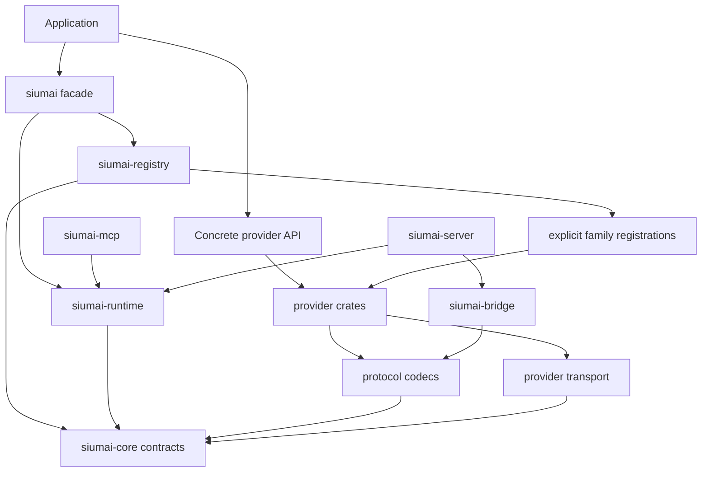
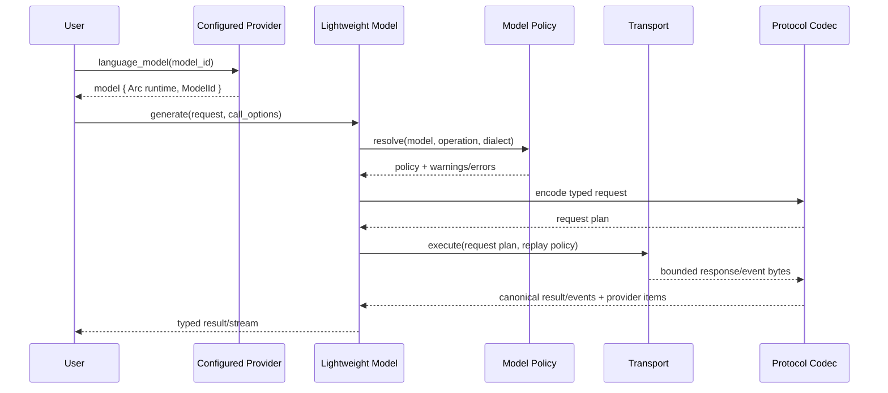
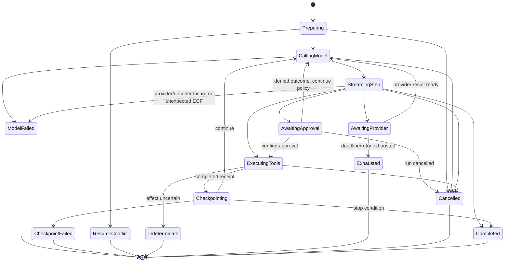

# Siumai Next Rust-First Revival Fearless Refactor - Plan

## Goal Capsule

| Field | Contract |
|---|---|
| Objective | Rebuild Siumai as a Rust-first, current, trustworthy multi-provider AI connection library: keep the convenient unified experience, replace the universal-client architecture with explicit model families and typed provider protocols, modernize flagship and Chinese-provider support, and delete compatibility, test, and documentation debt that obstructs the design. |
| Authority | The Product Contract and Key Technical Decisions in this plan are the implementation authority. Official provider documentation is authoritative for current protocol and lifecycle behavior; the local Vercel AI SDK checkout is a secondary behavioral reference, not a Rust API specification. |
| Execution profile | A deliberately breaking workspace-wide refactor for the next breaking release. Source compatibility, old package topology, old model constants, old feature names, and legacy internal boundaries are not preserved. |
| Stop conditions | Stop only when official provider behavior contradicts a requirement, a security boundary cannot be implemented safely, or a change would destroy unrelated user work. Compile failures caused by removed legacy APIs, stale tests, stale examples, or stale documents are migration work, not blockers. |
| Tail ownership | `ce-work` owns implementation, serial verification, simplification, code review, and reviewable Conventional Commits. The plan remains the authority; implementation progress is tracked outside this file. |

---

## Product Contract

### Summary

Siumai keeps a unified facade because provider switching, dynamic routing, and common generation helpers are valuable. The facade becomes a thin ergonomic layer over explicit family-model contracts rather than a universal `LlmClient` that discovers capabilities through booleans and downcasts.

A configured provider is a long-lived, clone-cheap object that owns authentication, base URL, HTTP transport, retry policy, headers, and provider resources. It synchronously returns lightweight model handles for an open model ID. Direct provider use and optional Registry resolution terminate at the same model contracts.

Stable provider-neutral behavior is modeled in core. Protocol-specific behavior remains typed and provider-owned. OpenAI Chat Completions, OpenAI Responses, Anthropic Messages, Gemini Interactions, Bedrock APIs, Realtime sessions, and asynchronous media jobs are not flattened into one request shape merely because some providers expose compatibility endpoints.

### Problem Frame

The current workspace contains several partially overlapping architectures:

- `siumai-core/src/text.rs` presents `TextModel`, `LanguageModel`, and an AI SDK-shaped `LanguageModelV4`, while production execution still arrives through blanket `ChatCapability` adaptation.
- Image and video `V4` contracts are marker traits; other families use different conventions; completion remains a stable-looking family despite being provider-specific legacy behavior.
- `siumai-core/src/compat/client.rs` and the Registry retain a universal `LlmClient`, broad capability bags, `as_*` downcasts, compatibility factories, extension factories, and family factories.
- `siumai-registry/src/registry/entry.rs` owns five independent LRU/TTL caches around clients that are expensive only because factories rebuild configuration and HTTP state for every model lookup.
- Provider identity, aliases, defaults, model catalogs, capability claims, and request behavior are spread across provider crates, Registry metadata, facade model catalogs, and a large OpenAI-compatible preset map.
- Stream parts and decoder lifecycle are duplicated across core, protocol adapters, bridge code, and server gateway code.
- Tool loops and structured-output handling are duplicated across facade, extras, agent, and server gateway paths; later streaming tool steps can fall back to non-streaming generation.
- HTTP retry, interception, error decoding, multipart handling, and direct `.send()` paths have multiple owners and inconsistent replay safety.
- `docs/` contains 524 files and about 5.8 MB of historical workstream journals, handoffs, and superseded architecture documents. Several source-scanning architecture tests alone exceed 28,000 lines and test textual layout rather than behavior.
- The last release predates current provider behavior. The repository still treats retired or retiring model generations as defaults and does not correctly model GPT-5.6, Claude Fable/Opus/Sonnet 5, Gemini 3.5/3.6, DeepSeek V4, Kimi K3, MiniMax M3/H3, or current AI Gateway family support.

### Actors

- A1. Application developers configure one provider and use a typed stable-family model directly, or explicitly opt into an experimental video job/session extension.
- A2. Multi-provider applications register configured providers and resolve `route:model` references through the unified Registry.
- A3. Framework authors accept provider-neutral family-model traits and use Siumai's generation, streaming, structured-output, and tool-loop runtime.
- A4. Provider maintainers implement a protocol engine, model-aware policy, family models, typed extensions, and behavior fixtures without implementing a universal client.
- A5. Server gateway and MCP integrators expose remote or local tools while preserving explicit execution ownership, approval, cancellation, and result fidelity.
- A6. Maintainers audit model and protocol freshness against official provider sources and can state honestly which surfaces are native, verified-compatible, experimental, or generic escape hatches.

### Requirements

**Rust-first public contracts**

- R1. The unified facade remains a first-class supported entry point, but it exposes explicit family-model values and high-level operations rather than a capability-discovering universal client. `(session-settled: user-approved - chosen over provider-only entry points because a unified interface is a valued convenience.)`
- R2. Siumai has six stable model families: language generation/streaming, one-request multi-input embedding, one-query candidate rerank, final-result image generation, final-result speech synthesis, and final-result transcription. Each has one callable, object-safe, `Send + Sync` model trait with consistent metadata, owned request/result data, `CallOptions`, error, cancellation, and async conventions; hidden multi-request batching and async job/session lifecycles are not trait primitives.
- R3. Video generation/async media jobs, Realtime/Live bidirectional sessions, streaming transcription, and streaming speech translation are experimental extension families until their cross-provider lifecycle is stable. Completion, batch jobs, files, skills, assistants/agents, music, voices, and other resources are provider extensions rather than additions to a universal model trait.
- R4. Stable contracts use Siumai names and semantics. AI SDK `V4` names, mirror modules, marker traits, and TypeScript-specific version labels are removed from the public Rust API.
- R5. Library errors are typed, matchable, non-panicking, and preserve operation, provider, model, HTTP status, provider code/type, request ID, retry-after, relevant headers, bounded response diagnostics, and error source when available. Their default `Display`, `Debug`, tracing, and serialization surfaces are sanitized; access to raw headers/body is an explicitly sensitive opt-in rather than an ambient logging surface.
- R6. Usage fields preserve `Unknown` instead of converting absent values to zero. The usage model can represent input, output, reasoning, cache read/write, orchestration, audio, and provider-specific details without changing the stable base structure for every provider addition.
- R7. Public streams use one owned, `Send`, `'static` stream carrier and one canonical lifecycle event vocabulary. The outer `Result` covers validation, encoding, and connection/handshake failure; after establishment the stream emits exactly one `Completed`, `Failed`, or `Cancelled` terminal event, and protocol EOF without a terminal is `Failed(UnexpectedEof)`. Dropping the consumer cancels local work but cannot emit to that dropped consumer; explicit cancellation travels through call options instead of a second `stream_with_cancel` method family.

**Provider construction and policy**

- R8. A configured provider is model-independent, long-lived, and clone-cheap. It owns shared HTTP/auth/runtime state, and `provider.language_model(model_id)` and sibling family constructors are synchronous and cheap.
- R9. Model acquisition performs no network call and requires no model-object LRU, TTL, or same-key singleflight. Singleflight is allowed only for measured provider-level work such as lazy initialization or credential refresh.
- R10. Model IDs are open strings/newtypes. Built-in constants are completion conveniences, never allowlists; unknown future model IDs remain callable for stable operations, receive no model-specific defaults, and produce an explicit policy warning. A syntactically valid native option may pass only when the selected protocol can encode it safely; `Unknown` never becomes an advertised `Supported` capability.
- R11. Model-dependent behavior is resolved by a `ModelPolicy` using provider, platform, model ID, operation, and protocol/dialect context. Capability results are `Supported`, `Unsupported`, or `Unknown`; provider-level boolean capability bags cannot gate execution.
- R12. `ProviderId` identifies canonical vendor/platform ownership, while `RouteId` identifies one configured Registry instance and captures account/region/deployment plus a default API mode/dialect. Provider identity, model aliases/defaults, family/mode availability, endpoint policy, model advisories, lifecycle state, source URL, and verification date have one provider-owned source; Registry owns only normalized route IDs/aliases and derives its display view.
- R13. Direct provider APIs may return concrete typed models for ergonomics. Dynamic registration uses narrow family factory traits or explicit registration closures that capture a configured provider and API mode; it never rediscovers traits with `Any`, downcasts, or an `as_*` ladder. Request middleware cannot mutate route/provider/model identity or bypass policy; rerouting is an explicit decision that restarts the complete policy/encoding pipeline.
- R14. Provider-specific options are typed in provider crates. Precedence is provider defaults < route/model defaults < runtime-step options < call options < explicit raw override; typed providers own merge semantics rather than receiving a generic recursive JSON merge. A validated opaque provider-options escape hatch remains for dynamic cross-provider workflows, but every field is sent or rejected, foreign history metadata is not treated as call configuration, and no option can override credentials, endpoint/audience, proxy/TLS/Host/redirect policy, or protected headers.

**Protocol and transport ownership**

- R15. Native protocol engines are preferred when protocol semantics differ materially. OpenAI-compatible support is one explicit Chat/Responses dialect runtime with bounded hooks for model policy, message conversion, request normalization, usage/metadata conversion, and stream conversion; it is not a URL-only preset collection or a substitute for native protocols.
- R16. OpenAI Chat Completions and Responses are separate engines. Responses items, reasoning continuation, program/program-output items, callers, stored response IDs, provider tools, and lifecycle events remain lossless.
- R17. Anthropic Messages preserves content blocks, thinking/refusal/fallback behavior, tool and cache semantics, signatures, provider tools, and model-specific request restrictions rather than flattening them into chat strings.
- R18. Gemini uses Interactions as the current native stateful engine and retains GenerateContent as an explicit adapter. Direct Gemini and Vertex policies can differ, including function-call IDs, sampling rules, media, and hosted tools.
- R19. Bedrock exposes an explicit API selection policy across supported platform APIs rather than assuming Converse is the only route. Model lifecycle and behavior are scoped by Bedrock platform, region, and model/deployment identifier.
- R20. Realtime/Live uses a session contract for bidirectional JSON/binary events, interruption, reconnection, expiration, resume tokens, and close semantics; it is not implemented as language-model text streaming.
- R21. A single provider transport deep module owns HTTP client reuse, endpoint validation, credential audience, auth application, request replay classification, retry budget, backoff/jitter, timeouts, sanitized observability, response/resource limits, error capture, download/redirect/proxy/DNS/SSRF safety, SSE, WebSocket connect policy, backpressure, and cancellation. Its `EndpointPolicy` distinguishes official, public custom, and explicitly authorized local/private endpoints; downloaded response resources never inherit provider credentials.
- R22. Retry is opt-in by operation and proven replay safety. Once a request may have reached the remote service, it retries only when the method is semantically idempotent or the provider supports a stable per-logical-call idempotency key and the body is rebuildable; receiving no response or no first stream event is not evidence that a POST is safe to replay. Non-idempotent POST, multipart streams, tool side effects, and async job creation default to one attempt, including around credential refresh.
- R23. Protocol crates own wire codecs and stateful decoders. A decoder consumes raw events and emits zero or more canonical events, then has exactly one finish/flush path. Bridge and server gateway code reuse these codecs rather than maintaining equivalent converter traits.

**Current provider support**

- R24. Each `{provider, platform, family, api_mode}` support claim records two orthogonal dimensions: fidelity is `native`, `verified-compatible`, or `generic-compatible`, while public API stability is `stable` or `experimental`; optional region/deployment scope may narrow either. A named built-in profile requires an official source, a fidelity-specific current verification date, typed dialect policy where behavior differs, and offline wire/error/stream tests; one native family cannot inflate another mode's claim, and a native protocol implementation may still expose an experimental Siumai contract.
- R25. OpenAI support targets Responses first and current GPT-5.6 behavior, including current reasoning modes/efforts, prompt caching, persisted reasoning, programmatic tool calling, provider tools, and Realtime extensions. Retired Assistants-specific defaults and deprecated realtime/audio model assumptions are removed.
- R26. Anthropic support targets current Fable 5, Opus 5, and Sonnet 5 behavior, including adaptive thinking, refusal, fallback, usage, tool evolution, prompt caching, and unknown-future-model defaults. Retired Claude generations are not defaults.
- R27. Google support targets current Gemini 3.5/3.6 behavior, Interactions `steps`, current thinking/sampling semantics, current function-call identity rules, Live sessions, speech, and translation where officially supported. Vertex remains a distinct platform policy.
- R28. Bedrock, xAI, and AI Gateway support their current native control planes and family surfaces. AI Gateway's remote catalog is authoritative for routed model metadata; static generated mega-lists are not introduced.
- R29. Chinese providers are first-class: DeepSeek V4 reasoning replay and strict tool behavior; Kimi current model/tool policies; DashScope/Qwen Chat/Responses plus native embedding/video/search semantics; MiniMax current Anthropic-oriented thinking and native media jobs; ARK Responses; and verified GLM, Qianfan, Hunyuan, and SiliconFlow compatibility profiles. Unsupported native surfaces remain honestly labeled rather than inferred.
- R30. Alibaba/DashScope, MiniMax, AI Gateway, and similar multi-family services are composite providers: each family may use a different underlying protocol while sharing one configured provider identity and runtime.
- R31. Unverified, inactive, duplicate, or URL-only named presets are removed. Their users retain the generic OpenAI-compatible builder and can define an explicit custom profile.
- R32. Model lifecycle data records active/deprecated/retired/rolling-alias state, replacement, platform scope, source, and `verified_at`. It is advisory and provider-owned; CI validates structure and staleness policy but does not scrape provider websites or generate Rust by parsing TypeScript unions.

**Unified runtime and trust boundaries**

- R33. `generate`, `stream`, structured output, `ToolLoop`, agent facade, and server gateway projection share one step engine. Every streaming model step is genuinely streaming, and the complete run emits one terminal event. Native/opaque history carries provider/platform/protocol/model provenance: same-protocol continuation is lossless, cross-protocol continuation automatically projects only portable neutral content, defaults to `Strict` rejection on required-state loss, and requires explicit `BestEffort` plus structured loss diagnostics otherwise.
- R34. Plain `generate`/`stream` performs one model call and never executes local tools. Only an explicit tool-loop API can execute local tools.
- R35. Model-visible `ToolSpec` is separate from local `ToolBinding`. Every call has `ExecutionOwner::Local` or `ExecutionOwner::Provider`; `Denied`, `ExecutionFailed`, and `Cancelled` are distinct typed outcomes, are never disguised as successful JSON, and continue or stop only through an explicit run policy.
- R36. Tool execution has deterministic ordering, configurable bounded concurrency, total/step/first-chunk/inter-chunk/per-tool timeouts, and structured cancellation. A `RunBudget` bounds model steps, tool calls, argument/result/snapshot bytes, pending approvals, known token/cost, and wall time; transport and MCP have corresponding bounded frames, pages, schemas, results, notifications, queues, and in-flight work. Side-effecting tools are sequential unless explicitly declared safe for concurrency.
- R37. External approval consumes an immutable `ApprovalClaims` exactly once. Claims bind version, issuer/audience, authenticated subject/tenant, route, provider/model, execution owner, run lineage, checkpoint, frozen binding identity, call ID, canonical arguments, tool/catalog fingerprint, expiry, nonce, and key ID; verification atomically consumes replay state and executes that frozen binding without a second name lookup. The server gateway defaults to no local tool execution, and externally portable continuation state uses an opaque server handle or authenticated encryption when it contains sensitive data.
- R38. The runtime exposes a versioned serializable `RunSnapshot`/continuation contract at quiescent boundaries and records each tool execution as `Prepared`, `Dispatched`, `Completed`, or `Indeterminate`. Snapshots bind engine version, route/model/protocol, relevant options, approval policy, and tool/catalog fingerprints. Checkpointed completed tools are not replayed; a side-effecting tool that may have executed without a completed checkpoint becomes `Indeterminate` and is never silently replayed unless its binding supplies a stable idempotency key and explicit recovery policy. Concurrent resume is unsupported without a store-provided lease/CAS hook, and the library does not claim general exactly-once execution.
- R39. MCP tool integration preserves service lifetime, pagination, `list_changed`, namespaces, definition fingerprints, progress/cancel, `isError`, structured content, multimodal content, inert resource links, and metadata. Raw resources/prompts/sampling/elicitation capabilities are default-off and host-allowlisted; stdio commands and side-effect policy come only from trusted application configuration. It is a separate optional package/module, not a lossy JSON adapter inside a general extras crate.
- R40. Structured output has one schema/request-shaping/final-validation owner. Partial output is explicitly unvalidated; refusal, filtering, missing output, transport failure, and provider error cannot be repaired into success. Repair is default-off and, when enabled, is a bounded additional model step that inherits cancellation/deadline, consumes run/usage budget, executes no tools, and applies only to parse/schema failure.

**Breaking cleanup and maintenance**

- R41. `LlmClient`, `ClientWrapper`, legacy capability traits, generic capability/downcast APIs, broad provider factories/facets, `SiumaiBuilder`, compatibility provider wrappers, completion-family core APIs, and duplicate aliases are deleted from production code and exports. `(session-settled: user-directed - chosen over preserving source compatibility; all breaking changes and deletion of obsolete code are authorized.)`
- R42. The package graph is redrawn so contracts do not depend upward on transport, providers, Registry, facade, server gateway, or agent integrations. Registry does not depend on built-in providers.
- R43. Source-scanning and textual architecture tests are deleted. Public APIs are validated by compiling real usage; dependency boundaries use `cargo metadata`; protocol behavior uses table-driven wire fixtures and shared family/provider contract suites.
- R44. Superseded ADRs, alignment inventories, completed workstream journals/handoffs, obsolete migration notes, stale examples, and stale provider documentation are deleted. The maintained documentation set is small and current.
- R45. The workspace declares and tests an MSRV compatible with the chosen Rust 2024 APIs and dependencies, uses serial `cargo nextest` lanes, and publishes crates in dependency order only after the reduced feature matrix, docs, examples, clippy, and package checks pass.

### Key Flows

- F1. Direct provider use
  - **Trigger:** A1 builds a provider and requests a model ID.
  - **Steps:** `build()` synchronously validates static URL/header/credential shape and returns `ConfigError` on failure; the provider creates shared runtime state; the synchronous family constructor creates a lightweight model handle; dynamic credentials resolve or refresh with provider-level singleflight at request time while individual waiters remain cancellable.
  - **Outcome:** No Registry, capability discovery, async model factory, or client cache participates; configuration and request-time authentication failures remain distinct.
  - **Covered by:** R1-R14
- F2. Dynamic Registry resolution
  - **Trigger:** A2 resolves `route:model` or a named route alias.
  - **Steps:** Registry splits on the first `:`, preserves the model remainder, selects the mode-bound family constructor captured by that configured route, creates a lightweight model, and applies identity-preserving middleware once. Registry snapshots are immutable; replacement creates a new snapshot while existing models retain their old provider runtime.
  - **Outcome:** Multiple accounts, deployments, regions, and API modes of one canonical provider can coexist; the returned object implements the same family contract as F1, and Registry contains no credentials or provider package imports.
  - **Covered by:** R1, R8-R13, R42
- F3. Provider-neutral language call
  - **Trigger:** A3 calls `generate` or `stream` on any language model.
  - **Steps:** The runtime applies neutral request middleware, model policy, provider encoding/hooks, auth/signing, then transport; response processing reverses the provider/policy-neutral projection. A reroute restarts the pipeline rather than mutating identity mid-flight.
  - **Outcome:** Common semantics are uniform without erasing provider-native items, and established streams terminate exactly once through canonical events.
  - **Covered by:** R2-R7, R14-R23
- F4. Native protocol extension
  - **Trigger:** A1 uses OpenAI Responses, Anthropic thinking/cache, Gemini Interactions/Live, Bedrock routing, or another typed provider feature.
  - **Steps:** Provider-owned typed options select the native engine; model policy validates model/platform restrictions; protocol codec preserves native request and result items.
  - **Outcome:** Unsupported combinations fail explicitly, unknown combinations warn or pass through according to policy, and the common facade remains usable.
  - **Covered by:** R11, R14-R20, R24-R32
- F5. Verified compatible provider
  - **Trigger:** A1 selects a named Kimi, GLM, Qianfan, Hunyuan, SiliconFlow, or other verified compatibility profile.
  - **Steps:** The profile supplies identity, endpoint, auth, model policy, and bounded dialect hooks; the shared compatible engine performs the call; provider-specific metadata remains available.
  - **Outcome:** The profile is more trustworthy than a base-URL alias without becoming a duplicate provider runtime.
  - **Covered by:** R12, R15, R24, R29-R32
- F6. Tool-loop run and resume
  - **Trigger:** A5 runs an explicit tool loop, receives local/provider tool calls, approval waits, or deferred results, and may resume from a snapshot.
  - **Steps:** One step engine owns history, stream events, tool ownership, approval, execution, checkpointing, usage, stopping, cancellation, and typed terminal state.
  - **Outcome:** Direct, agent, MCP, and server gateway projections have identical run semantics. Completed receipts do not replay; denied, failed, cancelled, conflicting resume, and indeterminate side effects remain distinct outcomes rather than an unprovable exactly-once promise.
  - **Covered by:** R33-R40
- F7. Realtime/Live session
  - **Trigger:** A1 opens a provider realtime session.
  - **Steps:** A typed session factory obtains any ephemeral token, opens the supported transport, maps bidirectional JSON/binary events, handles interruption and provider-supported cursor/resume with duplicate suppression, and closes deterministically.
  - **Outcome:** Session lifecycle is explicit and separate from text streaming; when continuity cannot be proven, reconnect starts a new session lineage rather than presenting a seamless resume.
  - **Covered by:** R3, R20-R23, R25, R27-R28
- F8. Provider freshness maintenance
  - **Trigger:** A6 audits a provider or a staleness gate expires.
  - **Steps:** Maintainer checks official lifecycle/protocol sources first, updates the provider-owned profile/policy and behavior fixtures, then uses the local AI SDK reference as a secondary delta signal.
  - **Outcome:** Siumai can accept future model IDs immediately while named support claims remain dated, sourced, and testable.
  - **Covered by:** R10-R12, R24-R32, R43-R45
- F9. Cross-provider continuation
  - **Trigger:** A3 switches a later language-model step to another provider or protocol.
  - **Steps:** The runtime projects portable neutral history, checks provenance-bearing native items and pending provider-owned state, and applies the selected strict or best-effort loss policy before the next call.
  - **Outcome:** Portable text/tool outcomes continue safely; required reasoning signatures, pending provider tools, approvals, or deferred state block switching unless an explicit migration exists, and every permitted loss is reported structurally.
  - **Covered by:** R6-R7, R16-R18, R33, R38
- F10. Stable non-language invocation
  - **Trigger:** A1 calls embedding, rerank, image, speech, or transcription through direct or Registry APIs.
  - **Steps:** One provider request owns its natural scalar/batch input and binary/result data, applies `CallOptions`, provider limits, cancellation/deadline, and typed partial/error semantics without a library-level hidden batching loop.
  - **Outcome:** Each stable family has a proved primitive contract; streaming/session/job variants remain explicit experimental extensions.
  - **Covered by:** R2-R3, R5-R14, R21-R24

### Acceptance Examples

- AE1. Direct ergonomic construction
  - **Covers:** R1-R10
  - **Given:** A configured OpenAI provider and `gpt-5.6` as a model ID.
  - **When:** The caller obtains a language model and calls the high-level generate helper.
  - **Then:** Model acquisition is synchronous, performs no network request, shares provider runtime state, and the call uses the same canonical language contract exposed by Registry.
- AE2. Unknown future model pass-through
  - **Covers:** R10-R12, R24, R32
  - **Given:** A syntactically valid model ID absent from the local advisory catalog.
  - **When:** The provider supports open model IDs and the caller sends a valid common request.
  - **Then:** Acquisition succeeds, policy reports `Unknown`, only protocol-level defaults apply, safely encodable explicit native options pass with a warning, unencodable options fail, and no static allowlist blocks or advertises the model.
- AE3. Registry without model cache
  - **Covers:** R8-R13, R42
  - **Given:** Many concurrent resolutions of the same registered provider/model reference.
  - **When:** All callers resolve it.
  - **Then:** Each receives a cheap model handle sharing one configured provider runtime; no LRU, TTL, async mutex, or model-construction singleflight is involved.
- AE4. Typed unsupported family
  - **Covers:** R2-R3, R13
  - **Given:** A provider registration exposes language but not image.
  - **When:** Registry resolves an image model.
  - **Then:** It returns a matchable `UnsupportedFamily` error without creating a generic client or probing a capability bag.
- AE5. Lossless language stream
  - **Covers:** R5-R7, R16-R23
  - **Given:** A stream with response start, reasoning, text, tool input deltas, citations, usage, refusal, provider opaque items, and a terminal event.
  - **When:** It crosses protocol decoder, model, runtime, and optional server gateway projection.
  - **Then:** Ordering, IDs, metadata, unknown values, and terminal semantics are preserved; only pre-establishment transport failure is an outer error; post-establishment transport/provider/decoder failure is a typed terminal event; finish runs at most once.
- AE6. Replay-safe retry
  - **Covers:** R5, R21-R22
  - **Given:** One replayable GET, one provider-supported idempotency-keyed generation POST, and one non-replayable multipart/job-creation POST are fully read by a fake server before the connection fails without a response.
  - **When:** Transport evaluates retry policy.
  - **Then:** Only operations with proven replay safety retry within one budget, every attempt of the logical POST reuses its key, retry-after is honored, and absence of a first response/event does not make the unkeyed POST replayable.
- AE7. OpenAI Responses fidelity
  - **Covers:** R14-R16, R25
  - **Given:** A GPT-5.6 request using persisted reasoning, prompt caching, a programmatic tool, and a provider tool.
  - **When:** The response is generated and replayed into a follow-up turn.
  - **Then:** Reasoning/program/caller/item identity and cache/usage metadata survive without conversion to plain assistant text.
- AE8. Current Anthropic refusal
  - **Covers:** R5-R7, R17, R26
  - **Given:** A current Claude model returns HTTP 200 with `stop_reason=refusal` after provisional streamed text.
  - **When:** The Anthropic decoder finishes.
  - **Then:** The result is a refusal terminal state, invalid provisional text is not presented as a successful answer, usage remains correct, and prohibited legacy sampling/thinking fields were omitted from the request.
- AE9. Gemini Interactions and Live
  - **Covers:** R18, R20, R27
  - **Given:** A stateless Interactions tool continuation and a Live session that emits out-of-order transcript data and a GoAway/resume token.
  - **When:** Both flows run.
  - **Then:** Interactions replays required `steps` and thought/function-call identity; Live keeps independent session ordering, reconnect, and close semantics.
- AE10. DeepSeek V4 reasoning replay
  - **Covers:** R11, R15, R29
  - **Given:** A multi-turn DeepSeek V4 tool conversation.
  - **When:** The next request is encoded.
  - **Then:** Required assistant `reasoning_content` is replayed for every applicable turn, unsupported vision is not advertised, and retired aliases are not chosen as defaults.
- AE11. Composite Chinese provider
  - **Covers:** R24, R29-R32
  - **Given:** One configured DashScope provider used for chat/Responses, embedding, search citations, and Wan video.
  - **When:** Each family is requested.
  - **Then:** The provider shares identity/runtime but selects the correct protocol and typed policy per family; native search/media metadata is not forced through Chat Completions.
- AE12. Tool approval and snapshot integrity
  - **Covers:** R33-R40
  - **Given:** A tenant-bound local side-effecting tool waits for external approval, its arguments or route are modified, two callers concurrently replay the approval, the process crashes after remote effect but before checkpoint, and the run later resumes.
  - **When:** The engine verifies and resumes the run.
  - **Then:** Cross-tenant/route/checkpoint use is rejected, one approval is atomically consumed once, a checkpointed completion is not replayed, and an uncheckpointed dispatched side effect becomes `Indeterminate` unless an explicit idempotent recovery policy resolves it.
- AE13. Server gateway trust boundary
  - **Covers:** R34-R39
  - **Given:** A remote client declares a tool with the same name as a server-owned privileged tool and submits continuation state containing tool arguments and provider opaque data.
  - **When:** The server gateway receives a normal generate request and then an explicitly configured tool-loop route.
  - **Then:** The normal route never executes local code; the tool-loop route executes only the frozen server-bound definition under trusted host-supplied identity, and externally portable continuation state is opaque or confidential rather than merely signed plaintext.
- AE14. MCP rich-result lifecycle
  - **Covers:** R35-R39
  - **Given:** An MCP service publishes paginated tools, repeats a cursor, changes one definition, emits unbounded progress, and returns `isError` with structured, media, resource-link, and metadata content.
  - **When:** Siumai discovers and executes the tool.
  - **Then:** The service remains alive until bounded explicit close, repeated/unbounded input reaches a typed limit, changes invalidate stale approval/fingerprints, resource links remain inert, progress/cancel work, and the result is not flattened to an ordinary success JSON value.
- AE15. Honest support and documentation cleanup
  - **Covers:** R24-R32, R41-R45
  - **Given:** A named provider profile, a generic custom profile, obsolete architecture tests, and historical workstream documents.
  - **When:** The release checks run.
  - **Then:** The named profile has a source/date/fidelity/stability claim and behavior fixtures; the custom profile remains usable without a named support claim; source-scanning tests and superseded documents are absent; current examples compile.
- AE16. Route identity and mode selection
  - **Covers:** R8-R14, R42
  - **Given:** Two Azure deployments and one OpenAI account register separate Chat and Responses routes under canonical OpenAI ownership.
  - **When:** Registry resolves each `route:model` reference and a new Registry snapshot replaces one route.
  - **Then:** All instances coexist without fake provider IDs, each uses its captured deployment/mode, model IDs containing `:` remain intact, and previously resolved handles keep their original runtime.
- AE17. Cross-provider continuation loss policy
  - **Covers:** R6-R7, R16-R18, R33, R38
  - **Given:** One OpenAI Responses history contains portable text plus encrypted reasoning/provider-tool state, and one Gemini history contains signed thought/function state.
  - **When:** A later step switches to Anthropic or OpenAI.
  - **Then:** Strict mode permits only portable projection and rejects required-state loss or pending provider state; explicit best-effort mode reports every dropped item and never fabricates equivalent reasoning/tool content.
- AE18. Stable family primitives
  - **Covers:** R2-R3, R5-R14, R21-R24
  - **Given:** Representative real-provider fixtures for language, multi-input embedding, rerank, final image, speech synthesis, and transcription.
  - **When:** Each direct and erased model executes success, invalid input, provider limit, partial provider response where applicable, cancellation, deadline, and binary ownership cases.
  - **Then:** The six callable traits require no hidden multi-request batching or job polling, share `CallOptions`/error/usage conventions, and leave streaming/session/create-poll-materialize variants experimental.
- AE19. Stream establishment and terminal algebra
  - **Covers:** R5-R7, R21-R23, R33
  - **Given:** Validation failure, handshake failure, an established stream that disconnects without protocol terminal, a provider failure event, explicit cancellation, and consumer drop.
  - **When:** The call and stream are observed.
  - **Then:** Pre-establishment failures are outer errors; every observed established stream ends once as completed/failed/cancelled; unexpected EOF never assembles success; consumer drop cancels owned work without promising an unobservable terminal event.

### Success Criteria

- The primary README can demonstrate direct provider construction, Registry resolution, streaming, typed provider options, structured output, and an explicit tool loop without importing a compatibility namespace.
- All six stable family traits are independently callable and object-safe; no stable family is a marker or a blanket adapter over a legacy capability trait.
- `provider.language_model(id)` and sibling constructors are synchronous, cheap, and share provider runtime state.
- Registry has one provider record store, no built-in provider dependencies, no per-family model cache, and no credentials/request policy.
- `LlmClient`, capability bags/downcasts, compatibility factories, generic builders, old V4 mirror APIs, and duplicate runtime owners are absent from production/public code.
- Current flagship and Chinese-provider behavior listed in R25-R30 has offline protocol and negative-capability coverage.
- Every named provider/profile has an honest tier, official source, verification date, and provider-owned policy; arbitrary model IDs and custom compatibility profiles remain available.
- One transport owns retry and diagnostics; one stream decoder contract owns lifecycle; one step engine owns tool/structured-output runtime semantics.
- Tool approval, server gateway local-execution defaults, cancellation, snapshot resume, and MCP lifecycle pass adversarial tests.
- Maintained architecture/provider/migration/release documentation replaces the 500-plus historical workstream corpus.
- Workspace format, serial nextest lanes, clippy, rustdoc, examples, feature combinations, package contents, and MSRV checks pass.

### Scope Boundaries

**In scope**

- A full breaking redesign of public traits, provider construction, Registry, facade, package boundaries, feature flags, runtime, and provider integrations.
- Deletion or replacement of obsolete source, packages, tests, examples, fixtures that assert obsolete behavior, documents, ADRs, workstream logs, scripts, and generated/parity artifacts.
- Current protocol behavior and model-policy updates for OpenAI, Anthropic, Gemini/Vertex, Bedrock, xAI, AI Gateway, DeepSeek, Kimi, DashScope/Qwen, MiniMax, ARK, GLM, Qianfan, Hunyuan, and SiliconFlow at the support depth stated in R24-R31.
- Stable non-language family migration for existing providers, plus experimental asynchronous video/resource behavior where already supported or required by the current provider contract.
- Experimental Realtime/Live, streaming transcription/translation, and asynchronous media contracts with flagship provider implementations and deterministic mock coverage.
- A versioned in-memory/serializable run snapshot contract, approval signing hooks, and MCP tool lifecycle.

**Deferred**

- A built-in distributed workflow scheduler, durable snapshot database, or general exactly-once guarantee. Siumai provides quiescent snapshots, completed-receipt replay prevention, indeterminate-effect handling, and optional lease/CAS/idempotency hooks; durable coordination and executor idempotency remain application responsibilities.
- A universal provider-agent/assistant abstraction over Qianfan application runs, OpenAI stored workflows, vendor knowledge bases, or other hosted stateful applications. These remain typed provider resources.
- A universal async batch-job trait until at least three provider contracts demonstrate compatible lifecycle and result semantics.
- Native Tencent TC3 file/thread/group-chat APIs while the provider is migrating surfaces; verified Chat/Embedding compatibility remains supported.
- Hard-coded pricing as a stable API. AI Gateway/provider model endpoints may expose current pricing as dated advisory metadata.
- Runtime-agnostic networking. The next release targets Tokio explicitly while keeping core data/model contracts free of unnecessary Tokio-specific types.

**Intentionally not preserved**

- Any source compatibility with the 0.11 beta generic client, capability traits, builders, Registry factories/handles, `siumai-spec::types::ai_sdk`, compatibility re-exports, completion family, or extras orchestration/workflow APIs.
- Retired model aliases as defaults, undocumented provider capabilities, or unverified URL-only named presets.
- Historical file/module locations, package names, feature names, source-scanning tests, and documentation inventories.

### Assumptions

- The release is the next breaking pre-1.0 release; the exact version number is set during packaging rather than treated as an architectural input.
- Official provider docs and lifecycle pages are available during provider implementation. Live credentials are not required for default CI; credentialed smoke tests are opt-in.
- The local `repo-ref/ai` checkout remains useful for behavioral deltas and fixtures but does not dictate Rust naming, trait versioning, caching, or package boundaries.
- The user authorized autonomous execution, deletion of obsolete artifacts, breaking changes, and reviewable intermediate commits, so no compatibility migration layer is required.

---

## Planning Contract

### Key Technical Decisions

- KTD1. **Keep the unified interface as a facade, not as a universal object.** `(session-settled: user-approved - chosen over deleting the unified interface.)` Direct provider models, Registry models, and helpers meet at family traits; the facade performs construction/routing/ergonomic projection only. Governs R1-R4, R13-R14, R33.
- KTD2. **Use one fearless API reset.** `(session-settled: user-directed - chosen over a staged compatibility migration.)` Old public and internal APIs are deleted after their replacement path is wired; deprecation shims do not become a second permanent architecture. Governs R41-R45.
- KTD3. **Treat official provider documentation as primary and the AI SDK as secondary prior art.** This prevents a locally current AI SDK model union from overriding newer official retirements or platform-specific behavior, while retaining its useful wire fixtures and edge-case history. Governs R12, R24-R32.
- KTD4. **Stabilize six invocation families only after representative wire proofs; keep job/session lifecycles experimental.** Each stable family must prove its primitive request/result/partial/error/cancellation semantics against at least one real provider before the public traits freeze. Video generation remains experimental because its create/poll/materialize lifecycle is an asynchronous job rather than a one-shot model invocation; Realtime/Live, streaming transcription, and streaming translation are also experimental sessions/streams. Completion, batch, files, skills, assistants, and hosted applications remain provider resources. Governs R2-R4, R20, R30.
- KTD5. **Configure providers once, separate route identity, and construct models synchronously.** Models hold an `Arc` to immutable/shared provider runtime plus `ModelId`; async auth refresh occurs at request time. `ProviderId` is canonical ownership, while Registry `RouteId` selects one configured instance and default mode. This deletes Registry's model cache and fixes the root cause instead of optimizing repeated client reconstruction. Governs R8-R13, R21-R22.
- KTD6. **Use object-safe family model traits and explicit dynamic registration.** `async_trait` is acceptable as the single future-boxing boundary because network I/O dominates allocation cost and Registry requires `dyn`; streams use one boxed `Send + 'static` carrier. Direct providers may expose concrete models, while Registry registration stores narrow family constructors. Governs R2, R7, R13.
- KTD7. **Separate family availability from model capability.** Registration says which family factories a provider exposes; `ModelPolicy` says whether a model/operation/protocol combination is supported, unsupported, or unknown. Neither is a universal runtime capability bag. Governs R10-R14, R24, R32.
- KTD8. **Prefer native protocols, then verified dialect profiles, then a generic escape hatch.** A dedicated provider/protocol exists only when authentication, endpoints, wire semantics, resource lifecycle, or typed capabilities justify it. Compatible vendors share one engine and bounded hooks rather than copying it. Governs R15-R20, R24-R31.
- KTD9. **Redraw package ownership around dependency direction.** `siumai-core` absorbs the durable neutral types/traits currently mirrored in `siumai-spec`; a provider transport package owns HTTP/WS/retry/security; protocol crates own codecs; provider crates own configured runtimes/models/policies; `siumai-runtime` owns high-level execution; Registry depends only on core; facade aggregates optional providers; MCP and server gateway integration are optional focused packages. Governs R21-R23, R33-R45.
- KTD10. **Use one canonical lifecycle stream and explicit history projection.** The stable event vocabulary has one post-establishment terminal algebra, while opaque provider items preserve provenance and same-protocol round trips. Cross-protocol continuation projects only portable content and reports/rejects loss explicitly; no native item is silently reinterpreted. Governs R5-R7, R16-R23, R33.
- KTD11. **Keep typed provider options primary with provider-owned merge semantics.** Common requests contain only stable cross-provider semantics. Provider extension traits/builders merge a fixed precedence stack and insert validated provider options; dynamic JSON remains an explicit checked escape hatch whose fields are sent or rejected. Governs R11, R14-R20, R24-R31.
- KTD12. **Make tool execution an explicit trust boundary.** One engine separates tool description, frozen binding, execution owner, host-authenticated trust context, atomically consumed approval, execution log, snapshot, and provider-deferred state. The server gateway defaults deny local execution; uncertain side effects become `Indeterminate`, and portable sensitive continuations require confidentiality as well as integrity. Governs R33-R40.
- KTD13. **Test observable contracts, not source layout.** Wire fixtures, scripted models, mock transports, compile examples, `cargo metadata`, and shared contract suites replace string scanning and mirrored upstream file inventories. Governs R24-R32, R43-R45.

### High-Level Technical Design

The following diagrams define ownership and flow, not exact Rust signatures.

Target dependency rules:

1. Core has no dependency on transport, protocols, providers, Registry, facade, runtime, MCP, or server packages.
2. Transport depends downward on core and owns network behavior; core never re-exports transport implementation details.
3. Protocol codecs depend on core and may use narrowly scoped codec helpers, but do not own configured clients, auth, retry, Registry, or facade exports.
4. Provider crates depend on core, transport, and their protocol crates. A provider owns one configured runtime and may expose several family models backed by different protocols.
5. Registry depends on core only. Built-in registration is assembled in the facade or a dedicated facade-owned module.
6. Runtime depends on core and is provider-agnostic. MCP/server integrations depend on runtime, never the reverse.

Provider support dimensions:

| Fidelity | Meaning | Release gate |
|---|---|---|
| Native | Siumai implements and tests the provider/platform's material protocol semantics and typed extensions. | Official protocol/lifecycle source, request/response/stream/error fixtures, negative capability tests, current model policy. |
| Verified-compatible | Siumai uses a shared protocol with a provider-specific identity, auth/endpoint, bounded dialect hooks, and verified behavior. | Official compatibility source, dated profile, policy tests, representative wire/error/stream fixtures. |
| Generic-compatible | User supplies endpoint/auth/profile for an arbitrary compatible service. | Generic protocol guarantees only; no named provider capability claim. |

API stability is recorded separately: stable family surfaces carry the normal semver contract, while video/jobs, Realtime/Live, streaming transcription, and streaming translation remain explicitly experimental even when their provider protocol fidelity is native.

Current provider delta and target placement, based on official sources checked on 2026-08-04:

| Provider/platform | Current critical delta | Target placement | Priority |
|---|---|---|---|
| OpenAI | Responses is primary; GPT-5.6 reasoning/cache/programmatic tools and Realtime 2.x behavior are missing or incomplete; Assistants shutdown is imminent. | Native Chat, Responses, Realtime/translation extensions. | P0 |
| Anthropic | Fable/Opus/Sonnet 5 adaptive thinking, refusal/fallback, usage, sampling restrictions, and future-model policy differ from current code. | Native Messages/resources. | P0 |
| Gemini / Vertex | Gemini 3.5/3.6, Interactions `steps`, current function IDs/thinking/sampling, Live/reconnect, speech/translation are incomplete. | Native, with distinct Gemini and Vertex platform policies. | P0 |
| Bedrock | Platform lifecycle and multiple APIs cannot be inferred from source-provider model constants; strict/schema/provider-tool/media behavior is incomplete. | Native composite platform provider. | P0 |
| xAI | Responses is primary; Grok lifecycle, 202 handling, Realtime/voice/STT, and typed media options need updates. | Native Responses plus experimental session/media extensions. | P1 |
| AI Gateway | Local implementation has only part of the current family/catalog/control plane and stale options. | Native routing/control-plane provider with remote catalog. | P0 |
| DeepSeek | Retired aliases/defaults, V4 reasoning-history replay, strict tools, cache usage, and false vision claims. | Native policy over verified compatible protocols. | P0 |
| Kimi/Moonshot | K3/K2.6/K2.7 policy, reasoning differences, dynamic/hosted tools, schema cleanup, encrypted context. | Verified-compatible profile with typed Kimi hooks. | P1 |
| DashScope/Qwen | Chat/Responses compatibility plus native search citations, embeddings, Wan media, and Assistant-to-Responses migration. | Native composite provider reusing shared dialect engines. | P0/P1 |
| MiniMax | M3/H3/Music 3.0 era, Anthropic-oriented thinking, adaptive bug, duplicate `minimax`/`minimaxi` identity, native media jobs. | Native composite provider; canonical identity `minimax`. | P0/P1 |
| ARK/Doubao | Responses/provider tools/knowledge/search and Seedream/Seedance are not captured by a URL-only chat profile. | Verified Responses dialect plus native media modules. | P1 |
| GLM | Current Chat/reasoning/tools/JSON/vision are compatible but advanced hosted resources vary. | Verified-compatible profile with typed policy; hosted resources remain extensions. | P1 |
| Qianfan | Official stable compatibility and platform lifecycle differ from source-provider IDs; hosted application runs are separate. | Verified Chat/Anthropic-compatible profile and typed platform resources only where verified. | P1 |
| Hunyuan | Current compatible Chat/Embedding is usable while native legacy surfaces are migrating. | Thin verified-compatible profile; no deep legacy TC3 abstraction in this release. | P2 |
| SiliconFlow | Compatible Chat/Anthropic plus independent embedding/rerank/media families. | Verified profile plus explicit family endpoints where tested. | P1 |
| Groq, Mistral, Cohere, Together, Fireworks, OpenRouter, Perplexity, Cerebras, DeepInfra | Current code mixes dedicated crates, duplicate profiles, and provider-wide claims. | Keep native crates only for distinct families/resources; otherwise verified profiles on shared engines. | P1/P2 |

Tool-loop state model:

### Implementation Constraints

- Keep code comments and all repository documentation in English; user-facing collaboration remains Chinese.
- Use `async_trait` consistently at the object-safe model boundary unless a measured prototype proves a simpler stable alternative. Do not expose both `async fn` and boxed-future variants as parallel public traits.
- Models and requests own or share data needed by `'static` streams; avoid self-referential stream lifetimes and `Sync` requirements on stream objects.
- Registry route IDs are normalized ASCII identifiers; references split on the first `:`, and the model remainder is preserved verbatim, including additional colons. Provider-owned model aliases never become Registry route aliases.
- The request pipeline order is neutral middleware, model policy, provider encoding/hooks, auth/signing, and transport; response projection reverses the corresponding layers. Identity changes use an explicit reroute and rerun the whole pipeline.
- Do not expose Tower generic stacks in public model traits. A provider transport may use a service internally, but request replay and provider error decoding stay explicit.
- Do not add a generalized cache, retry, workflow, schema, or code-generation framework without a demonstrated second use and a behavior test.
- Do not parse Rust source or TypeScript model unions to prove public API safety. Use compiler checks, `cargo metadata`, explicit data files, and simple schema/staleness validation.
- Preserve valuable protocol fixtures, but relocate them to the package that owns the codec. Delete fixtures only when they encode retired behavior and have a current replacement.
- Run cargo operations serially and reuse the workspace target directory. Narrow package tests precede workspace-wide gates.
- Do not silently retain legacy exports under `compat`, `experimental`, or feature aliases after their replacement is complete.

### System-Wide Impact

- **Public API:** Every construction, Registry, model, capability, request-option, streaming, tool, and extras import path can change. A concise breaking migration guide is required; compatibility code is not.
- **Package graph:** `siumai-spec`, `siumai-provider-utils`, and `siumai-extras` responsibilities are redistributed. New focused runtime/transport/MCP/server packages may replace them; final names are fixed in U1 before Rust migration begins.
- **Providers:** Every provider must separate configured runtime from model identity and declare fidelity/stability claims plus policy at family/API-mode scope. Duplicate dedicated/provider-profile entry points are reconciled.
- **Protocols:** Wire codecs receive explicit model/platform context and emit the canonical lifecycle stream. OpenAI Chat/Responses and Gemini GenerateContent/Interactions are no longer hidden modes of one generic chat adapter.
- **Registry:** Async factories, `BuildContext`, credentials/options, handles, facets, caches, global metadata store, and built-in imports disappear. Immutable configured `RouteId` registrations and route aliases are one small routing concern, separate from canonical provider identity and provider-owned model aliases.
- **Facade:** The facade becomes the default ergonomic path and built-in aggregator. Its prelude is deliberately small and does not re-export all protocol internals.
- **Runtime:** Tool execution, structured output, snapshot/resume, and streaming move to one provider-neutral owner. MCP and server adapters project that runtime rather than reimplementing it.
- **Security:** Retry replay, URL fetching, redirects, DNS rebinding, response-body bounds, approval replay, local tool execution, MCP definition drift, and stream cancellation become release gates.
- **Documentation:** Most current architecture/alignment/workstream documents are deleted. Only current architecture, provider support, migration, contributing/releasing, examples, and the canonical plan/decision record remain.
- **Publishing:** Crate dependency and feature changes require a coordinated release order and package-content checks; old crates may be unpublished/deprecated separately after the replacement release exists.

### Risks and Dependencies

- **Provider churn:** Model names and restrictions can change during implementation. Mitigation: open IDs, dated policy data, official-source recheck per provider unit, and no hard-coded pricing contract.
- **Behavior loss during type cleanup:** Opaque provider items can be accidentally dropped. Mitigation: round-trip fixtures and parity tests across direct/runtime/server gateway paths before deleting bridges.
- **Cancellation ambiguity:** Detached model/tool tasks may continue after stream drop, and an already-dispatched remote side effect may not be cancellable. Mitigation: structured task ownership, cancellation propagation, no new dispatch after cancellation, observable teardown, and an explicit `Indeterminate` outcome when remote completion cannot be established.
- **Retry side effects:** Generic retry can duplicate billing, jobs, or tool effects even before the first response/event. Mitigation: request replay classification defaults to false once remote submission is possible and requires semantic idempotency or a provider-supported logical-call key.
- **Registry ergonomics:** Explicit family registration can become verbose. Mitigation: provider crates expose one registration descriptor while Registry stores narrow typed constructors, not a reflective capability bag.
- **Large compile-break window:** Package and trait changes fan out across the workspace. Mitigation: dependency-ordered units, one flagship vertical slice, serial narrow tests, and commits only at green architectural checkpoints.
- **MCP/server gateway trust:** External approval and tool-definition drift can create privilege escalation or replay. Mitigation: default deny, server-owned binding, fingerprints, signer/verifier hooks, run lineage, and adversarial tests.
- **Credential and diagnostic leakage:** Custom endpoints, redirects, interceptors, raw errors, snapshots, and provider items can expose secrets or prompts. Mitigation: credential audience, sanitized default diagnostics/observability, protected option fields, distinct unauthenticated download policy, and canary-secret tests.
- **Resource exhaustion:** Legal SSE/MCP/tool-loop inputs can be unbounded. Mitigation: transport, run, and MCP budgets with bounded channels, typed limit terminals, backpressure, and leak-free cancellation.
- **Fixture staleness:** Existing fixtures mirror older AI SDK behavior. Mitigation: tag fixtures by provider/protocol/source date, retain useful wire cases, replace retired behavior explicitly, and avoid treating file parity as a test.
- **MSRV uncertainty:** Current dependencies may have raised MSRV. Mitigation: choose and declare MSRV after dependency audit in U1, then run a dedicated MSRV lane before release.
- **No universal live credentials:** Offline mocks cannot prove account/region rollout. Mitigation: opt-in smoke tests with redacted diagnostics and a documented provider verification checklist; named support claims still require official sources.

### Sources and References

**Repository evidence**

- `Cargo.toml` - current 27-package workspace and dependency directions.
- `siumai-core/src/text.rs`, `embedding.rs`, `image.rs`, `speech.rs`, `transcription.rs`, `rerank.rs`, `video.rs` - family traits, blanket capability adapters, and V4 markers.
- `siumai-core/src/compat/client.rs`, `siumai-core/src/traits/capabilities.rs` - universal client and provider-wide capability discovery.
- `siumai-core/src/execution/`, `siumai-core/src/streaming/` - shared transport and duplicate stream lifecycle candidates.
- `siumai-registry/src/registry/entry.rs`, `entry/factory.rs`, `registry/factories/` - async factories, facets, built-in dependencies, and five caches.
- `siumai-provider-openai-compatible/src/providers/openai_compatible/config/builtin_providers.rs` - URL-only profiles and duplicated identity/catalog data.
- `siumai-protocol-openai/src/standards/openai/utils/message_dialect.rs` - provider/model message dialect branching and DeepSeek history behavior.
- `siumai-provider-minimaxi/src/providers/minimaxi/spec.rs` - adaptive-thinking conversion bug and old media endpoints.
- `siumai-extras/src/orchestrator/`, `siumai-extras/src/server/tool_loop.rs`, `siumai-extras/src/mcp.rs` - duplicate step engines and integration lifecycle risks.
- `siumai-registry/src/registry/factories/contract_tests.rs`, `siumai/tests/facade_architecture_boundary_test.rs`, `siumai-registry/tests/factory_architecture_boundary_test.rs`, `siumai-spec/tests/*_boundary_test.rs` - more than 28,000 lines of architecture/source-shape assertions to replace.
- `docs/workstreams/`, `docs/alignment/`, `docs/adr/` - historical documentation corpus to consolidate.
- `repo-ref/ai` at `3bc0d4f40df7a77af4b181bc97dc1c54843545ab` - secondary behavior reference, current on 2026-08-01.

**Official provider and API sources checked on 2026-08-04**

- OpenAI: [latest model guide](https://developers.openai.com/api/docs/guides/latest-model), [models](https://developers.openai.com/api/docs/models), [tools](https://developers.openai.com/api/docs/guides/tools), [Realtime events](https://platform.openai.com/docs/api-reference/realtime-server-events).
- Anthropic: [model overview](https://platform.claude.com/docs/en/about-claude/models/overview), [migration guide](https://platform.claude.com/docs/en/about-claude/models/migration-guide), [deprecations](https://platform.claude.com/docs/en/about-claude/model-deprecations), [refusals and fallback](https://platform.claude.com/docs/en/build-with-claude/refusals-and-fallback), [prompt caching](https://platform.claude.com/docs/en/build-with-claude/prompt-caching).
- Google: [latest model](https://ai.google.dev/gemini-api/docs/latest-model), [deprecations](https://ai.google.dev/gemini-api/docs/deprecations), [Interactions breaking changes](https://ai.google.dev/gemini-api/docs/interactions-breaking-changes-may-2026), [function calling](https://ai.google.dev/gemini-api/docs/function-calling), [Live session management](https://ai.google.dev/gemini-api/docs/live-api/session-management).
- AWS Bedrock: [APIs](https://docs.aws.amazon.com/bedrock/latest/userguide/apis.html), [conversation inference](https://docs.aws.amazon.com/bedrock/latest/userguide/conversation-inference.html), [model lifecycle](https://docs.aws.amazon.com/bedrock/latest/userguide/model-lifecycle.html).
- xAI: [Grok 4.5](https://docs.x.ai/developers/grok-4-5), [API comparison](https://docs.x.ai/developers/model-capabilities/text/comparison), [WebSocket mode](https://docs.x.ai/developers/advanced-api-usage/websocket-mode), [voice agent](https://docs.x.ai/developers/model-capabilities/audio/voice-agent).
- DeepSeek: [updates](https://api-docs.deepseek.com/updates/), [thinking mode](https://api-docs.deepseek.com/guides/thinking_mode), [tool calls](https://api-docs.deepseek.com/guides/tool_calls).
- Kimi: [model directory](https://platform.kimi.ai/docs/models), [Chat API](https://platform.kimi.ai/docs/api/chat), [web search](https://platform.kimi.com/docs/guide/use-web-search).
- DashScope/Qwen: [API reference](https://help.aliyun.com/en/model-studio/qwen-api-reference/), [Responses](https://help.aliyun.com/zh/model-studio/qwen-api-via-openai-responses), [web search](https://platform.qianwenai.com/docs/developer-guides/tool-calling/web-search).
- MiniMax: [model releases](https://platform.minimax.io/docs/release-notes/models), [API overview](https://platform.minimax.io/docs/api-reference/api-overview), [text generation](https://platform.minimax.io/docs/guides/text-generation).
- ARK: [Responses tools](https://www.volcengine.com/docs/82379/1958524?lang=zh).
- GLM: [OpenAI compatibility](https://docs.bigmodel.cn/cn/guide/develop/openai/introduction), [function calling](https://docs.bigmodel.cn/cn/guide/capabilities/function-calling).
- Qianfan: [V2 compatibility](https://cloud.baidu.com/doc/qianfan/s/qmh4sv5vi), [structured output](https://cloud.baidu.com/doc/qianfan-docs/s/6m8r1x5hz), [model lifecycle](https://cloud.baidu.com/doc/qianfan/s/zmh4stou3).
- Hunyuan: [OpenAI compatibility](https://cloud.tencent.com/document/product/1729/111007).
- SiliconFlow: [documentation index](https://docs.siliconflow.cn/llms.txt), [function calling](https://docs.siliconflow.cn/cn/userguide/guides/function-calling), [rerank](https://docs.siliconflow.com/en/api-reference/rerank/create-rerank).
- OpenRouter: [models API](https://openrouter.ai/docs/guides/overview/models).

**Rust prior art**

- [rust-genai](https://github.com/jeremychone/rust-genai) - native adapters, explicit service targets, and unified chat events.
- [Rig](https://github.com/0xplaygrounds/rig) - high-level provider and agent traits; open issues demonstrate model/request/stream drift risks.
- [async-openai](https://github.com/64bit/async-openai) - detailed single-protocol builder, middleware, SSE, and error surface prior art.

---

## Implementation Units

### Unit Index

| ID | Unit | Depends on | Primary outcome |
|---|---|---|---|
| U1 | Freeze the new architecture and remove false gates | None | One package/API/support authority and a behavior-test baseline. |
| U2 | Rebuild canonical core contracts | U1 | Neutral types, six real family traits, errors, policy, and stream lifecycle. |
| U3 | Extract the provider transport and decoder lifecycle | U2 | One HTTP/WS/retry/security owner and one decoder contract. |
| U4 | Build configured providers, registrations, profiles, and catalogs | U2, U3 | Sync lightweight models, model-aware policy, and verified profile infrastructure. |
| U5 | Prove stable non-language family contracts | U2-U4 | Real-provider evidence for embedding, rerank, image, speech, and transcription primitives. |
| U6 | Prove the OpenAI vertical slice | U2-U5 | Direct/Registry/facade parity on current Chat, Responses, and Realtime behavior. |
| U7 | Replace Registry and converge the facade | U4-U6 | Small provider-agnostic routing Registry and ergonomic top-level API. |
| U8 | Build the single language/tool/structured-output runtime | U2, U6 | One step engine, cancellation, approval, snapshot, and output owner. |
| U9 | Split and secure MCP and server gateway integrations | U8 | Focused optional integrations projected from the shared runtime. |
| U10 | Migrate current flagship native providers | U3-U8 | Anthropic, Gemini/Vertex, Bedrock, xAI, and AI Gateway current semantics. |
| U11 | Make Chinese providers first-class | U3-U8, U10 patterns | DeepSeek, Kimi, DashScope, MiniMax, ARK, GLM, Qianfan, Hunyuan, SiliconFlow. |
| U12 | Migrate remaining providers and non-language families | U3-U8, U10-U11 | Honest native/profile placement and complete stable-family coverage. |
| U13 | Delete the legacy architecture and simplify the package graph | U6-U12 | No compatibility runtime, duplicate crate owner, stale feature, or source guard. |
| U14 | Rebuild docs, maintenance, CI, and release readiness | U13 | Small current docs set, freshness workflow, migration guide, and green release gates. |

### U1. Freeze the new architecture and remove false gates

- **Requirements:** R24, R32, R41-R45
- **Flows / examples:** F8; AE15
- **Decisions:** KTD2, KTD3, KTD9, KTD13
- **Primary paths:** `Cargo.toml`; `.github/workflows/`; `docs/architecture/`; `docs/providers/`; `siumai/tests/`; `siumai-core/tests/`; `siumai-registry/tests/`; `siumai-spec/tests/`
- **Approach:**
  - Record the target package dependency rules, six-family stability policy, support-tier vocabulary, public API sketch, and deletion policy in one canonical architecture decision derived from this plan.
  - Declare Rust 2024 `resolver = "3"` and a verified MSRV, initially testing 1.85 as the edition floor and raising it only when a retained dependency has a documented requirement that resolver 3 cannot satisfy.
  - Create compile-pass contract examples for custom language models, provider registration, direct provider use, Registry use, typed provider options, and `'static` streams before deleting old public surfaces.
  - Inventory behavior-bearing wire fixtures separately from tests that inspect source strings, method order, module names, file presence, or upstream file parity.
  - Delete the large source-scanning architecture tests once their intended dependency/API invariant is represented by compiler checks, metadata checks, or a behavior test. Do not delete protocol fixtures merely because their test harness uses old types.
  - Mark the 2026-07-11 plan and old ADR/workstream corpus as superseded; physical documentation deletion completes in U14 after the replacement docs exist.
- **Test scenarios:**
  - A minimal external custom model compiles against only core contracts and returns both a generated response and a `'static` stream.
  - A metadata boundary test fails when Registry gains a concrete provider dependency and passes for the target graph without parsing Cargo TOML manually.
  - The fixture inventory classifies each retained fixture by owner, protocol, behavior, and source date; no fixture is deleted without either a current replacement or an explicit retired-behavior record.
- **Verification outcome:** The workspace has one accepted architecture authority, an MSRV/resolver decision, compiler-backed API anchors, and no textual test that blocks renaming or deleting the old architecture.

### U2. Rebuild canonical core contracts

- **Requirements:** R2-R7, R10-R14, R35, R40, R42
- **Flows / examples:** F1-F4, F9-F10; AE1-AE5, AE17-AE19
- **Decisions:** KTD4, KTD6, KTD7, KTD9-KTD11
- **Primary paths:** `siumai-core/Cargo.toml`; `siumai-core/src/lib.rs`; new/rewritten `siumai-core/src/model.rs`, `provider.rs`, `language/`, `embedding.rs`, `rerank.rs`, `image.rs`, `speech.rs`, `transcription.rs`, `experimental/`, `stream.rs`, `usage.rs`, `error.rs`, `options.rs`, `tool.rs`; neutral types migrated from `siumai-spec/src/`
- **Approach:**
  - Make `siumai-core` the thin provider-neutral contract crate. Move durable neutral data shapes from `siumai-spec`; remove the `types::ai_sdk` mirror namespace, compatibility projections, duplicate errors, provider feature flags, `reqwest`, retry, LRU, and provider-utils dependencies.
  - Define `ProviderId`, `RouteId`, `ModelId`, `Model`, `ModelFamily`, `ModelLookupError`, `CapabilityStatus`, `ModelPolicyContext`, `ModelPolicy`, response diagnostics, extensible usage, and typed provider-option serialization.
  - Replace `TextModel`/`LanguageModelV4` and legacy capability adapters with one callable `LanguageModel`. Implement the same metadata, call-options, and error conventions for embedding, rerank, image, speech, and transcription.
  - Keep video, realtime, streaming transcription/translation, and async media job contracts under an explicit experimental namespace. Remove fake `V4` marker traits and completion from the stable taxonomy.
  - Define one canonical language response/content/event vocabulary, including refusal, citation/source, tool lifecycle, provider-deferred items, a bounded provenance-bearing opaque provider item, and exact pre-establishment versus established-stream terminal semantics.
  - Define request-scoped cancellation/deadline/retry intent without coupling neutral message/wire DTOs to a transport implementation.
- **Test scenarios:**
  - Each stable family can be implemented by an external fake, erased behind `Arc<dyn FamilyModel>`, called asynchronously, and moved across tasks.
  - Absent usage fields remain `Unknown`; known zero remains distinguishable from absent; provider details round-trip.
  - Provider option types serialize under their namespace, use provider-owned precedence/merge, reject namespace/type/protected-field mismatch, and support an explicitly named raw escape hatch whose fields are sent or rejected.
  - Stream lifecycle rejects duplicate terminal events, maps missing protocol terminal to `UnexpectedEof`, preserves opaque provenance, distinguishes pre-establishment errors from stream terminal failure, and permits consumer drop without fabricating an event.
  - Core compiles without `reqwest`, concrete provider features, Registry, facade, or extras/runtime dependencies.
- **Verification outcome:** Core is a small coherent public contract with six stable callable families and explicit experimental session/job extensions; no public AI SDK mirror or legacy capability adapter remains in its target surface.

### U3. Extract the provider transport and decoder lifecycle

- **Requirements:** R5-R7, R21-R23, R42
- **Flows / examples:** F3-F4, F7; AE5-AE6
- **Decisions:** KTD5, KTD9-KTD10, KTD13
- **Primary paths:** new `siumai-transport/Cargo.toml` and `siumai-transport/src/`; code migrated from `siumai-core/src/execution/`, `siumai-core/src/retry/`, `siumai-core/src/streaming/`, and `siumai-provider-utils/src/`; protocol decoder traits in `siumai-core`; provider/protocol test kits
- **Approach:**
  - Build one provider-facing transport deep module around a reused `reqwest::Client`, immutable request plan/factory, auth applier, replay classification, one retry budget, timeout/deadline, internal mutating hooks, sanitized observability hooks, bounded response capture, and typed diagnostics. Secret wrappers and safe `Debug`/`Display` prevent provider settings, errors, snapshots, and tracing from leaking credentials or payloads by default.
  - Replace retry booleans with a closed proof-oriented safety model. Default to `Never` after a request may have reached the remote service; permit replay only for semantically idempotent operations or provider-supported idempotency keys with rebuildable bodies. A 401 refresh follows the same rule, and the stable per-logical-call key is reused across attempts but never across calls.
  - Define `EndpointPolicy::{Official, PublicCustom, LocalExplicit}` (or equivalent), bind credentials to scheme/host/port audience, reject dangerous URL forms, validate DNS and actual connection targets consistently, and keep API redirects off by default. Move redirect, proxy, download URL, DNS alias/rebinding, media sniffing, response-supplied URL, and same-origin credential protections into this owner; resource downloads use a separate client without provider auth.
  - Define `TransportLimits` for request bytes, decompressed response bytes, headers, frames/events, multipart parts, redirects, queue/connections, and per-provider in-flight work. Channels are bounded and backpressured; every limit/cancel path releases body, socket, permit, and task ownership.
  - Provide shared SSE/JSONL/WebSocket framing and connection policy, but keep one stateful decoder per protocol. Share only decoder lifecycle, assembly/finalization, and transport framing; do not create a provider-ID switch inside a universal decoder.
  - Remove provider outer retry loops and migrate direct `.send()` business paths. Auth bootstrap, presigned uploads, provider polling, and server-side cancel endpoints remain explicit typed operations using the same transport primitives.
- **Test scenarios:**
  - A fake server fully reads a GET, unkeyed POST, keyed POST, multipart body, and async-create request before disconnecting. Only proven-idempotent/keyed requests retry, logical-call keys remain stable, 401/429/5xx paths share one budget, and provider outer loops cannot add attempts.
  - A streaming request does not use “before first emitted event” as replay proof; only a provider-defined idempotency/resume contract can reconnect or replay after possible submission.
  - Cancellation stops body consumption and backoff waits; a dropped stream releases the response and no detached task continues.
  - Redirect/DNS-rebinding/proxy/response-URL fixtures cover loopback, link-local, metadata, IPv4-mapped IPv6, cross-origin redirects, userinfo, and signed queries. Public policy cannot leak credentials or reach blocked destinations, while explicit local policy reaches local services only with audience-matched credentials.
  - Endless frames, slowloris input, decompression expansion, queue cancellation, and oversized bodies/headers fail within deterministic limits and leak no permits/tasks. Canary secrets in headers, URLs, nested bodies, errors, settings, tracing, and snapshots never appear on default diagnostic surfaces.
  - OpenAI Responses, Anthropic Messages, and Gemini protocol fakes each implement the same lifecycle trait with distinct state machines and exactly-once finish.
- **Verification outcome:** Providers have one reusable transport/security contract and protocol-specific decoders; retry, stream finalization, and diagnostics have one owner without a universal provider switch.

### U4. Build configured providers, registrations, profiles, and catalogs

- **Requirements:** R8-R15, R24, R30-R32, R42
- **Flows / examples:** F1-F2, F5, F8, F10; AE1-AE4, AE15-AE16, AE18
- **Decisions:** KTD3, KTD5-KTD9, KTD11, KTD13
- **Primary paths:** `siumai-core/src/provider.rs`; `siumai-registry/src/`; `siumai-provider-openai-compatible/src/`; provider-local `settings.rs`, `provider.rs`, `model.rs`, `policy.rs`, `profile.rs`; `scripts/` freshness validation
- **Approach:**
  - Define a minimal base `Provider` identity and narrow family-provider/factory traits. Direct concrete providers return concrete lightweight models; a private-field `ProviderRegistration` binds one normalized `RouteId`, configured instance, and default API mode while erasing only the family constructors needed by Registry.
  - Standardize provider internals as immutable settings plus `Arc<ProviderRuntime>` and lightweight `{ runtime, model_id, api_mode/policy }` model values. Synchronous build validates static configuration; dynamic credentials resolve with provider-level refresh singleflight when a request is sent, without letting one cancelled waiter cancel all peers.
  - Replace the current global built-in `HashMap` and scattered default/alias/catalog files with one provider-owned profile/model declaration that can derive constants, lookup, advisory catalog, and registration metadata without source generation.
  - Model lifecycle and support claims include platform/family/API-mode scope, fidelity, API stability, state, replacement, official source, fidelity-specific verification date, and optional region/deployment scope. Unknown IDs get only a protocol baseline and `Unknown` warning, not guessed limits or model defaults.
  - Redesign OpenAI-compatible as one explicit engine plus verified profiles and bounded hooks. Remove broad protocol re-exports and prevent a provider from being exposed simultaneously through an incompatible dedicated crate and duplicate preset.
  - Replace the shell model-audit wrapper with a small cross-platform Python validation path if a script remains. It validates declared data/source dates and produces drift reports; it does not parse Rust or implement a compiler front end.
- **Test scenarios:**
  - Thousands of same-model constructions allocate only lightweight handles and share one provider runtime; no HTTP client or async mutex is created per model.
  - Missing/invalid static credentials, URL, and headers fail synchronously as `ConfigError`; dynamic credential fetch/refresh failures are request-time auth errors, concurrent refresh is provider-level singleflight, and cancelling one waiter does not cancel the shared refresh.
  - Direct concrete model and dynamically erased registered model produce identical model metadata and wire request for the same configured route/mode.
  - Unknown future model IDs pass through with conservative `Unknown` policy; retired known IDs produce an advisory/error according to provider lifecycle policy but are never silently remapped across behavior-changing aliases.
  - A verified profile cannot be registered without a source/date/fidelity/stability claim and representative protocol contract; a generic custom profile remains possible without claiming named support.
  - Multiple routes for one provider coexist; duplicate route IDs, alias cycles, conflicting model-policy rules, and provider-options namespaces fail deterministically. Replacing an immutable Registry snapshot does not retarget previously resolved models.
- **Verification outcome:** Provider construction is sync and cheap, identity/policy/catalog truth is provider-owned, and compatible profiles are explicit verified dialects rather than URL aliases.

### U5. Prove stable non-language family contracts

- **Requirements:** R2-R14, R21-R24, R42
- **Flows / examples:** F1-F4, F10; AE1-AE6, AE18-AE19
- **Decisions:** KTD4-KTD11, KTD13
- **Primary paths:** representative configured-provider slices in `siumai-provider-gemini/` or a retained embedding/image provider, `siumai-provider-cohere/`, `siumai-provider-elevenlabs/`, and `siumai-provider-deepgram/`; shared family contract kit; core family modules adjusted from wire evidence
- **Approach:**
  - Treat the U2 non-language traits as provisional until this unit proves them against real wire contracts. Migrate the smallest representative slice for multi-input embedding, query-plus-candidates rerank, final-result image, speech synthesis, and transcription using the U3 transport and U4 configured-provider shape.
  - Make one provider request the stable primitive. Embedding owns `1..n` inputs; rerank owns one query plus candidates; image/speech/transcription return one provider operation's result. Library-level multi-request batching, polling/materialization, incremental audio, and bidirectional sessions remain helpers or experimental contracts rather than hidden trait behavior.
  - Standardize `CallOptions`, owned binary/media values, metadata/usage, provider limits, partial-result policy, cancellation, deadline, and typed unsupported/limit/error outcomes across all six stable families.
  - Feed protocol evidence back into core before declaring the traits frozen. A family that cannot satisfy object safety or common lifecycle semantics without a fake implementation is narrowed or returned to experimental status here, before Registry/facade migration.
- **Test scenarios:**
  - Each representative provider runs a shared direct/erased contract for success, invalid/empty input, provider batch limit, known-zero versus unknown usage, cancellation, deadline, error diagnostics, and owned binary lifetime.
  - Embedding performs exactly one wire request for its input batch; rerank preserves candidate order/identity and scores; no core helper silently serializes multiple remote calls.
  - Image, speech, and transcription distinguish final results from partial/session/job events. Unsupported streaming or job behavior is a typed outcome, not a marker trait or fabricated fallback.
  - External fake implementations and real provider models share the same object-safe traits, while compile examples prove models and returned data can cross task boundaries without borrowed client state.
- **Verification outcome:** Every stable family shape is justified by at least one real provider contract and common invariants before the public Registry/facade surface freezes.

### U6. Prove the OpenAI vertical slice

- **Requirements:** R1-R23, R25, R33, R40
- **Flows / examples:** F1-F4, F7, F9; AE1-AE7, AE16-AE19
- **Decisions:** KTD1, KTD5-KTD11, KTD13
- **Primary paths:** `siumai-provider-openai/src/`; `siumai-protocol-openai/src/`; `siumai-transport/src/`; provisional facade/registration integration; OpenAI fixtures currently under `siumai/tests/fixtures/`
- **Approach:**
  - Convert OpenAI settings into one configured provider runtime and lightweight concrete models. Keep Chat Completions and Responses as explicit language API modes with separate codecs under one language family.
  - Make Responses the recommended OpenAI mode. Implement current GPT-5.6 model policy and typed options for current reasoning effort/mode/context, explicit prompt caching, programmatic tool calling, provider tools, stored response continuation, compaction/background semantics that belong to Responses, and current usage fields.
  - Preserve Responses item IDs, reasoning/encrypted context, program/program-output/caller links, hosted tool results, citations, refusals, incomplete/cancelled/failed states, and response metadata through generate, stream, and follow-up replay.
  - Introduce experimental OpenAI Realtime and streaming translation/session models with explicit ephemeral-token, WebSocket/WebRTC metadata, JSON/binary event, interruption, close, and error behavior; do not reuse the existing Responses WebSocket session as Realtime.
  - Remove Assistants-specific defaults and deprecated model assumptions from files/examples while retaining file purposes that official current APIs still support.
- **Test scenarios:**
  - Chat and Responses models share the language trait but generate different expected endpoints/bodies/events for the same neutral prompt.
  - GPT-5.6 options omit prohibited or irrelevant fields, preserve current reasoning/cache/programmatic-tool semantics, and replay all required items in a follow-up.
  - Responses fixture matrix covers half JSON tool input, usage-only terminal data, early stream error, no-output response, refusal, incomplete/cancelled/failed, provider tools, and one terminal event.
  - Realtime mocks cover mixed JSON/binary data, interruption, tool batches, token failure, connection close, and cancellation without appearing as text-stream events.
  - Direct, erased registration, and high-level helper paths have identical observable request/result behavior and middleware executes exactly once.
  - Two mode-bound routes for one configured OpenAI provider prove Chat/Responses selection without fake provider IDs; established-stream EOF/failure/cancel follow the canonical terminal algebra.
- **Verification outcome:** One demanding native provider proves the target core, transport, model, policy, stream, extension, and facade contracts before the rest of the workspace migrates.

### U7. Replace Registry and converge the facade

- **Requirements:** R1, R8-R14, R24, R28, R31-R33, R42
- **Flows / examples:** F1-F3, F5, F8, F10; AE1-AE4, AE15-AE16, AE18
- **Decisions:** KTD1, KTD5-KTD9, KTD11, KTD13
- **Primary paths:** `siumai-registry/Cargo.toml`; rewritten `siumai-registry/src/lib.rs`, `registry.rs`, `registration.rs`, `reference.rs`, `alias.rs`; `siumai/src/lib.rs`, `prelude.rs`, family helper modules, built-in registration module
- **Approach:**
  - Replace `ProviderFactory`, facets, handles, `BuildContext`, per-family caches, global provider metadata, typed builders, and built-in descriptor switches with one immutable-by-default Registry of configured provider registrations.
  - Registry owns route identity, registration/replacement policy, `route:model` parsing, route aliases, and optional identity-preserving family-model middleware only. Provider identity, credentials, base URL, retry, HTTP, model aliases/defaults, API modes, and resources stay provider-owned.
  - Ship an immutable Registry snapshot in this release. Replacement builds a new snapshot with explicit route semantics; existing models remain bound to their captured provider runtime, and no generation-aware cache or in-place mutation machinery is rebuilt.
  - Rebuild the `siumai` facade as the preferred ergonomic aggregator: provider constructors, small unified prelude, direct family helpers, optional Registry, optional runtime. Protocol internals and every provider symbol are not glob-reexported.
  - Built-in provider registration lives in facade integration and composes provider-owned registrations based on features. Registry's base package depends on core only.
- **Test scenarios:**
  - Registry resolves each stable family, unknown route, unsupported family, malformed reference, model IDs containing colons, alias, alias cycle, multiple accounts/modes of one provider, and snapshot replacement with typed outcomes.
  - Concurrent resolution creates cheap handles without shared mutable cache state; provider runtime identity remains shared.
  - A no-provider Registry build has no concrete provider or protocol packages in its metadata graph.
  - Direct and Registry language/image/embedding calls through the facade produce identical scripted model behavior and exactly-once middleware.
  - Minimal default feature, one-provider, multiple-provider, and no-default-feature facade examples compile without hidden feature relays.
- **Verification outcome:** The Registry is a small optional router, and the unified facade is convenient precisely because it terminates at explicit family contracts.

### U8. Build the single language/tool/structured-output runtime

- **Requirements:** R33-R40, R42
- **Flows / examples:** F3, F6, F9; AE5, AE12-AE14, AE17, AE19
- **Decisions:** KTD1, KTD9-KTD13
- **Primary paths:** new `siumai-runtime/Cargo.toml` and `siumai-runtime/src/`; code migrated from `siumai/src/text.rs`, `siumai/src/structured_output.rs`, `siumai-core/src/tooling/`, `siumai-extras/src/orchestrator/`, `siumai-extras/src/structured_output.rs`, and `siumai-extras/src/tool_runtime.rs`
- **Approach:**
  - Implement one `StepEngine`/`ToolLoop` state machine for non-streaming and streaming projections. Plain single-call helpers never execute tools; an explicit tool-loop API owns execution.
  - Split `ToolSpec`, `ToolBinding`, `ToolSet`, `ToolExecutor`, `ToolOutcome`, execution events, execution owner, approval policy, deferred provider state, and stop conditions into minimal coherent contracts.
  - Enforce deterministic result ordering and bounded concurrency, with side-effecting tools sequential by default. Own a `RunBudget` for model steps, tool calls, argument/result/snapshot bytes, pending approvals, known tokens/cost, total/step/first/inter-chunk/per-tool deadlines, and cancellation without detached tasks.
  - Add versioned serializable `RunSnapshot`, tool catalog/schema fingerprint, lineage, pending approval/deferred state, provider correlation, usage, terminal reason, and a stable execution log whose states include `Prepared`, `Dispatched`, `Completed`, and `Indeterminate`. Checkpoint completed tools before the next model call; never auto-replay an uncertain side effect without a binding-owned idempotency/recovery contract.
  - Define a host-created `TrustContext` that cannot be deserialized from the untrusted server gateway request. Implement pluggable approval signing plus atomic verify-and-consume for claims binding claim version, issuer/audience, subject/tenant, route, provider/model, execution owner, run lineage, checkpoint, frozen binding, call ID, canonical arguments, tool/catalog fingerprint, expiry, nonce, and key ID. Execute the verified frozen binding without a second name lookup; input, identity, route, or catalog mutation creates a new approval identity.
  - Consolidate structured output into one output descriptor/consumer that handles provider-native shaping, capability policy, final validation, optional repair policy, and unvalidated partial snapshots.
  - Implement strict-by-default history projection for step-level model switching. Provenance-bearing native items and pending provider-owned/approval state block incompatible reroutes; explicit best-effort projection returns structured loss diagnostics and reruns the full destination policy pipeline.
- **Test scenarios:**
  - Plain `generate` and `stream` stop after one model call and never execute returned local tool calls. ToolLoop's non-streaming and streaming projections, the reusable agent facade, and later server gateway projection run the same scripted multi-step trace with identical steps, messages, usage, and terminal reason; every streamed ToolLoop model step uses streaming.
  - Dropping a stream during model output or tool execution cancels child work, dispatches no later tool, and reports an already-dispatched effect as `Indeterminate` when termination cannot be proven.
  - Timeout matrix distinguishes total, model-step, first chunk, inter-chunk, and tool timeouts with typed terminal states.
  - Approval tests cover auto approve/deny, await user, tampered/canonicalized args, cross-tenant/route/audience/provider/owner use, renamed tools, concurrent replay with one atomic winner, expiry/key rotation, stale checkpoint/catalog, signer failure, and new approval after mutation.
  - Denial, execution failure, provider-owned denial, and cancellation remain distinct `ToolOutcome` values; continue versus fail-fast policy is explicit and no failure is serialized as a successful tool JSON result.
  - Crash injection before dispatch, after remote receipt, after result, and around checkpoint proves that completed checkpoints do not replay, uncertain side effects become `Indeterminate`, and only explicitly idempotent bindings can recover automatically.
  - Snapshot creation occurs only at quiescent boundaries; resume rejects unknown engine versions and incompatible route/model/protocol/options/approval/catalog fingerprints. Concurrent resume without a lease/CAS store returns `ResumeConflict` rather than racing.
  - Infinite model/tool loops, oversized inputs/results/snapshots, pending approvals, and queue cancellation terminate within `RunBudget` and release all owned work.
  - Refusal, content filtering, no output, invalid final schema, repair failure, and provider error never become successful structured output.
  - Structured-output repair is off by default; when enabled it consumes one bounded tool-free model step and total usage/deadline budget, and only parse/schema failures are repairable.
- **Verification outcome:** High-level generation, streaming, tools, agents, and structured output have one provider-neutral runtime owner with explicit security and recovery semantics.

### U9. Split and secure MCP and server gateway integrations

- **Requirements:** R33-R40, R42-R44
- **Flows / examples:** F6; AE12-AE14
- **Decisions:** KTD2, KTD9, KTD12-KTD13
- **Primary paths:** new `siumai-mcp/Cargo.toml` and `src/`; new `siumai-server/Cargo.toml` and `src/`; `siumai-bridge/src/`; code migrated from `siumai-extras/src/mcp.rs`, `siumai-extras/src/server/`, and `siumai-extras/src/server/tool_loop.rs`
- **Approach:**
  - Move MCP into a focused optional package depending on core/runtime and `rmcp`, never the umbrella facade. Own the complete running service/session lifetime and explicit close.
  - Implement MCP tools as `ToolSpec` plus `ToolBinding`, preserving bounded pagination, list change notifications, namespacing/conflicts, definition fingerprint, progress, cancellation, rich result content, inert resource links, structured content, `isError`, and metadata. Define `McpLimits` for pages/tools/schema/result/resource bytes, repeated cursors, notification/progress rate, and close deadline. Raw resources/prompts/sampling/elicitation capabilities are default-off, host-allowlisted, and unavailable to model/server gateway configuration; stdio commands and side-effect classification come only from trusted host configuration.
  - Move Axum/server gateway integration into a focused optional package. It projects the shared runtime and bridge codecs; it contains no separate tool-loop state machine.
  - Make local tool execution default-deny. Bind server-owned tools in route configuration, require a host-authenticated `TrustContext`, prevent client-name collision from granting execution, and require atomic verified approval for externally resumed runs. Use an opaque server handle or AEAD continuation envelope when portable state contains tool arguments/results, credentials, or provider opaque state.
  - Retain `siumai-bridge` only for genuine protocol transcoding. Declare loss policy explicitly and test fidelity; delete facade/protocol dependency inversions and no-op compatibility translations.
- **Test scenarios:**
  - MCP service remains connected through discovery and execution, paginates within limits, rejects repeated cursors and notification storms, refreshes on list changes, rejects fingerprint drift, forwards progress/cancel, and closes or terminates owned work within a deadline.
  - MCP error/multimodal/structured/resource-link results preserve their original semantics in model output.
  - Server gateway normal generate/stream routes cannot execute local tools; an allowlisted tool-loop route cannot be confused by a client-supplied same-name definition.
  - Signed approval round trips reject mutation, cross-tenant/route/audience use, concurrent replay, expired lineage, and stale tool definitions; the external token reveals no sensitive continuation contents.
  - Malicious MCP declarations cannot self-authorize side effects, resource links are never auto-fetched, the server gateway cannot enable raw sampling/elicitation/resources, and credentials/session tokens never enter model messages, approval claims, snapshots, or logs.
  - Server gateway stream drop cancels model/tool work and emits at most one terminal event; direct runtime and server gateway traces are equivalent.
  - Bridge round-trip fixtures document preserved and intentionally lossy fields for OpenAI, Anthropic, and Gemini directions.
- **Verification outcome:** MCP and server features are optional, lifecycle-correct, and thin over one runtime; external inputs cannot implicitly authorize local execution.

### U10. Migrate current flagship native providers

- **Requirements:** R11-R24, R26-R28, R30, R32
- **Flows / examples:** F1-F5, F7-F8; AE2, AE5-AE9
- **Decisions:** KTD3, KTD5, KTD7-KTD11, KTD13
- **Primary paths:** `siumai-provider-anthropic/`, `siumai-protocol-anthropic/`, `siumai-provider-gemini/`, `siumai-protocol-gemini/`, `siumai-provider-google-vertex/`, `siumai-provider-amazon-bedrock/`, `siumai-provider-xai/`, `siumai-provider-gateway/`, `siumai-provider-azure/`
- **Approach:**
  - Migrate each provider to configured runtime plus lightweight family models, provider-owned profile/policy, typed options/resources, canonical stream events, and shared transport. Remove generic client/capability implementations as each provider turns green.
  - Anthropic: update current Fable/Opus/Sonnet 5 model policy, adaptive thinking display/defaults, refusal/fallback, thinking usage, mid-conversation tool changes, cache semantics, server tools, unknown-model output limits, and retired model defaults.
  - Gemini/Vertex: update current Gemini 3.5/3.6 policy, Interactions `steps`, GenerateContent adapter, function-call ID differences, sampling/thinking rules, hosted tools/media, response IDs, Live resume/reconnect, speech, and translation. Keep platform policy explicit.
  - Bedrock: support explicit API route selection, platform/region model lifecycle, current content blocks, provider tools, strict/schema sanitization, guardrails/cache/reasoning, S3/video media, stream exceptions, and native rerank/embedding without pretending source-provider policy applies unchanged.
  - xAI: make Responses the current language path, update Grok policy, strict output/tools/search/compaction, 202/empty-body async media handling, and experimental Realtime/voice/STT behavior.
  - AI Gateway: implement current supported families, Realtime, remote model/catalog/credits/spend/generation metadata, routing options, errors, and remove retired options. Azure reuses OpenAI protocol engines but retains deployment/API-version/auth policy.
- **Test scenarios:**
  - Each provider runs the shared family contract suite plus its official model-policy matrix for current, retired, and unknown future IDs.
  - Anthropic request/stream tests cover adaptive thinking, prohibited legacy fields, refusal invalidation, fallback metadata, thinking tokens, cache, and tool definition changes.
  - Gemini direct/Vertex tests prove distinct function-call IDs and model policy; Interactions continuation and Live reconnect/resume preserve all required state.
  - Bedrock tests cover API route selection, region-scoped identity, strict/schema differences, provider tools, S3/video input, stream exception diagnostics, and no fabricated structured output.
  - xAI tests cover Responses tools/search, HTTP 202 empty body, Realtime/voice framing, and current lifecycle aliases.
  - AI Gateway tests use an offline mock of its model endpoint dynamically, cover all declared families and metadata/control-plane calls, preserve open-ID behavior when the catalog is unavailable, and never rely on a generated static model union. Credentialed network smoke tests remain opt-in.
- **Verification outcome:** Major global providers implement current official behavior through the target architecture and no longer depend on generic capability/client bridges.

### U11. Make Chinese providers first-class

- **Requirements:** R10-R15, R24, R29-R32
- **Flows / examples:** F1, F4-F5, F8; AE2, AE10-AE11, AE15
- **Decisions:** KTD3, KTD5, KTD7-KTD11, KTD13
- **Primary paths:** `siumai-provider-deepseek/`; canonicalized `siumai-provider-minimax/` (renamed from `siumai-provider-minimaxi`); new composite DashScope/Alibaba provider package; ARK media/Responses modules; verified profiles in `siumai-provider-openai-compatible/`; provider fixtures and support declarations
- **Approach:**
  - Recheck every model/lifecycle fact against official sources at implementation time; update source/date with the policy. AI SDK unions are delta hints only.
  - DeepSeek: replace retired defaults with current V4 policy, provide full multi-turn `reasoning_content` replay, strict tool/JSON behavior, cache usage, OpenAI/Anthropic dialect selection where officially supported, and remove false vision/embedding claims.
  - Kimi: add current K3/K2.6/K2.7 policy, model-specific reasoning configuration, structured-output/schema normalization, dynamic/hosted tool semantics, web search, encrypted context, and retired K2/Moonshot defaults handling through bounded compatible hooks.
  - DashScope/Qwen: create one composite provider. Reuse verified OpenAI Chat/Responses and Anthropic dialects where appropriate; implement native search citations/options, embeddings, and Wan media job semantics, including current reference inputs and model policy.
  - MiniMax: canonicalize provider ID/environment/options as `minimax`; model current M3/H3/Music era behavior; prefer Anthropic-compatible thinking/interleaved tool semantics; fix adaptive handling; retain and verify native speech/image/video/music/files rather than deleting unreviewed functionality.
  - ARK/Doubao: implement verified Responses dialect/provider tools/knowledge/search and current Seedream/Seedance media as a composite provider. GLM, Qianfan, Hunyuan, and SiliconFlow remain verified profiles plus separately tested family endpoints/resources where official evidence supports them.
  - Delete inactive/duplicate Chinese URL presets and speculative capabilities. Generic compatible configuration remains the fallback for providers without a verified named profile.
- **Test scenarios:**
  - DeepSeek old and current multi-turn reasoning fixtures prove the correct model-aware history rule and negative vision capability.
  - Kimi current-model matrix proves reasoning and schema/tool transforms differ by model without provider-wide booleans; encrypted provider context survives replay.
  - DashScope one provider produces correct Chat, Responses/search citation, embedding, and video job wire behavior through different internal engines.
  - MiniMax `adaptive` remains adaptive across request/response/stream; `minimax` identity is unique; Anthropic/OpenAI dialect selection and H3/media jobs use correct endpoints and terminal states.
  - ARK, GLM, Qianfan, Hunyuan, and SiliconFlow named profiles each have official compatibility evidence, dated policy, representative request/stream/error fixtures, and explicit negative assertions for unsupported native surfaces.
  - Unknown future Chinese model IDs pass through with baseline dialect policy and no invented context/capabilities.
- **Verification outcome:** Chinese-provider support is current, typed, tested, and honestly tiered rather than a stale base-URL list.

### U12. Migrate remaining providers and non-language families

- **Requirements:** R2-R3, R8-R15, R21-R24, R30-R32
- **Flows / examples:** F1-F5, F8; AE2-AE6, AE11, AE15
- **Decisions:** KTD4-KTD11, KTD13
- **Primary paths:** `siumai-provider-ollama/`, `siumai-provider-groq/`, `siumai-provider-cohere/`, `siumai-provider-togetherai/`, `siumai-provider-deepgram/`, `siumai-provider-elevenlabs/`, remaining compatible profiles, image/video/audio/rerank/embedding helpers and fixtures
- **Approach:**
  - Classify each remaining dedicated crate by actual distinct protocol, authentication, resource, or family behavior. Collapse language-only duplicates into verified profiles; retain dedicated crates for native non-language families/resources.
  - Migrate Ollama local protocol, Cohere native rerank/embedding, Groq audio where distinct, Together/DeepInfra media/rerank where verified, Deepgram transcription, and ElevenLabs speech/resources to configured providers, shared transport, and stable family contracts.
  - Add streaming transcription only as an experimental extension where official protocols support it. Keep video/media job traits experimental and provider-owned polling/materialization semantics explicit.
  - Replace central batching helpers that silently serialize or guess limits with family-owned request semantics and provider policy. Preserve known maximum-per-call hints as advisory metadata, not capability gates.
  - Remove dedicated crates whose only remaining behavior is a verified shared protocol profile; update facade features and package docs accordingly.
- **Test scenarios:**
  - Every retained stable family/provider pair passes shared request/result/error/cancel/usage contracts and provider-specific wire fixtures.
  - Deepgram and ElevenLabs raw/multipart calls use the shared transport, preserve bytes/metadata, and apply replay-safe retry rules.
  - Streaming transcription covers partial/final ordering, disconnect without terminal, cancellation, usage/duration, and unsupported provider behavior.
  - Experimental video/media jobs cover create/poll/success/failure/timeout/cancel, HTTP 202/empty body, references, and materialization without pretending to be one-shot generation.
  - Collapsed provider crates and duplicate profiles leave one public construction path and one support declaration per provider identity.
- **Verification outcome:** All retained providers use the same architectural contracts, and package count reflects real protocol/resource boundaries rather than historical duplication.

### U13. Delete the legacy architecture and simplify the package graph

- **Requirements:** R4, R9, R15, R41-R45
- **Flows / examples:** F1-F6, F8; AE1-AE6, AE15
- **Decisions:** KTD2, KTD5, KTD8-KTD9, KTD13
- **Primary paths:** workspace `Cargo.toml`; `siumai-core/src/compat/`, `traits/`, old `execution/` and `streaming/`; `siumai-spec/`; `siumai-provider-utils/`; `siumai-registry/src/provider/`, `registry/entry/`, `registry/factories/`; `siumai/src/compat.rs`, `completion.rs`, old builders/catalog; `siumai-extras/`; obsolete provider crates/features/tests/examples
- **Approach:**
  - Delete `LlmClient`, `ClientWrapper`, all legacy capability traits/downcasts, blanket family adapters, `ProviderSpec`, custom generic-provider framework, V4 mirrors/markers, stable completion, compatibility providers, and old generic builders.
  - Delete Registry handles, factory facets, `BuildContext`, caches/TTL/LRU/singleflight state, provider descriptors, built-in provider dependencies, duplicate global metadata Registry, and old typed builder layers.
  - Complete the target package moves: remove `siumai-spec`, `siumai-provider-utils`, and `siumai-extras` after core/transport/runtime/MCP/server consumers have migrated. Remove temporary migration modules immediately after the final consumer moves.
  - Remove empty provider feature relays, duplicate provider identities, obsolete aliases, redundant protocol re-exports, stale default features, and packages reduced to a shared profile.
  - Delete tests/examples/fixtures that exist solely to assert removed API names, old model defaults, old directory layout, or source parity. Keep and relocate behavior fixtures that still represent a supported protocol case.
  - Run dead-code, dependency, feature, and public-export audits; simplify recently migrated code before broad verification.
- **Test scenarios:**
  - Forbidden-symbol scans are limited to a short removal audit and find no production/public `LlmClient`, `as_*_capability`, old V4 mirror, broad factory, cache handle, or compatibility builder; they do not assert implementation layout.
  - `cargo metadata` confirms the target acyclic dependency direction and Registry/core isolation.
  - All supported examples compile only with the new facade/direct provider APIs; no hidden compatibility feature makes them pass.
  - Minimal/no-default/each-provider feature builds do not activate unrelated protocols/providers; removed package names are absent from workspace/package manifests.
  - Protocol behavior fixture counts and ownership records show no unintentional loss during deletion.
- **Verification outcome:** Only the new architecture remains; package, feature, export, test, and source graphs contain no legacy execution path or permanent migration bridge.

### U14. Rebuild docs, maintenance, CI, and release readiness

- **Requirements:** R24, R32, R43-R45
- **Flows / examples:** F1-F8; AE1, AE5, AE11-AE15
- **Decisions:** KTD2-KTD3, KTD13
- **Primary paths:** `README.md`; `docs/README.md`; new current `docs/architecture/`, `docs/providers/`, `docs/migration/`; `CONTRIBUTING.md`; `docs/releasing.md`; `.github/workflows/`; `.agents/skills/siumai-ai-sdk-maintenance/`; `scripts/`; package manifests
- **Approach:**
  - Rewrite README around the actual usable library: direct provider construction first, unified Registry as an optional convenience, provider-neutral helpers, typed provider extensions, streaming/cancellation, structured output, explicit tool loops, and scoped fidelity/stability claims.
  - Keep a compact maintained documentation set: architecture and package graph, family/provider-extension policy, provider support matrix with sources/dates, one breaking migration guide, contributor provider checklist, security/retry notes, and release instructions.
  - Delete superseded ADRs, alignment tables, old migration notes, all completed workstream journals/handoffs/inventories, outdated provider documents, and examples that target removed APIs. Do not retain them as an archive in the repository; Git history is the archive.
  - Update the maintenance skill to audit official provider sources first and AI SDK second. Keep scripts small: provider declarations remain explicit data/code, and checks validate schema, dates, links, and expected fixtures without reimplementing Rust parsing or protocol inference.
  - Rebuild CI as serial logical lanes for format, core/runtime contracts, protocol fixtures, provider contracts, feature graph, MSRV, clippy, docs/doctests, examples, package contents, and opt-in credentialed smoke tests.
  - Produce the next breaking-release migration and changelog, verify publish order and crate metadata, establish the new semver-check baseline, and remove any Compound Engineering branding/badges from release surfaces.
- **Test scenarios:**
  - Every README and migration code block compiles against the exact feature set it documents.
  - Provider-support validation detects missing source/date/fidelity/stability/fixture, fidelity/family-specific stale verification windows, duplicate identity, and invalid lifecycle replacement without accessing the network; staleness downgrades or blocks a named release claim without blocking generic open-ID calls.
  - A maintainer can add a verified-compatible provider profile by editing its provider-owned declaration and fixtures without changing Registry/core or a central provider switch.
  - Documentation link checks and package-content checks contain no deleted workstream paths, local absolute paths, secret material, or repository-excluded fixture assumptions.
  - Release rehearsal validates dependency publish order, MSRV resolution, docs.rs features, all supported feature lanes, and the intended breaking semver baseline.
- **Verification outcome:** Siumai presents a small current public story, a repeatable provider-freshness practice, and a green release pipeline rather than a historical alignment archive.

---

## Verification Contract

### Verification Principles

- Run one cargo process at a time and reuse the workspace target directory.
- Use `cargo nextest` for Rust test suites; narrow affected-package lanes run before workspace-wide lanes.
- Default tests are deterministic and offline. Credentialed smoke tests are opt-in, provider-scoped, and redact keys, headers, request bodies, and account identifiers.
- Every feature-bearing unit adds concrete success, error, cancellation, and boundary scenarios before old tests are removed.
- Official provider behavior is verified through request/response/stream/error fixtures and model-policy tables, not through file parity with an upstream TypeScript repository.

### Required Gates

1. **Format:** `cargo fmt --all -- --check` reports no diff.
2. **Core contracts:** serial nextest lanes for core, transport, runtime, Registry, MCP, server, bridge, and each protocol crate pass.
3. **Provider contracts:** every native provider and verified profile passes shared family contracts plus provider-specific policy/wire/stream/error suites.
4. **Feature graph:** no-default, default, each provider, selected multi-provider combinations, experimental sessions, MCP, server, and all-supported-features builds pass without accidental feature activation.
5. **Workspace:** `cargo nextest run --workspace --all-features --test-threads 1` passes after targeted lanes.
6. **Static quality:** workspace/all-target/all-feature clippy with warnings denied passes; unsafe code remains denied unless a separately reviewed package has an unavoidable documented need.
7. **Docs and examples:** rustdoc, doctests for the public contract/facade packages, and every maintained example pass with their declared features.
8. **MSRV:** the declared `rust-version` toolchain resolves with resolver 3 and checks the supported workspace surface; stable also passes all release lanes.
9. **Security/lifecycle:** endpoint/credential audience, SSRF/redirect/proxy/DNS, replay-after-submission, sanitized diagnostics, transport/run/MCP budgets, cancellation/drop uncertainty, cross-tenant approval with atomic consume, server gateway local-execution deny, crash/resume, and MCP capability/definition-drift suites pass.
10. **Packaging:** package contents, crate dependency order, docs.rs features, license/readme/repository metadata, changelog/migration, and new semver baseline are valid.

### Provider Contract Matrix

For every claimed provider/model policy, tests cover applicable intersections of:

| Dimension | Required cases |
|---|---|
| Identity | canonical provider ID, configured route ID/alias, family/API mode, platform/region/deployment scope, duplicate rejection |
| Model lifecycle | current, rolling alias, deprecated, retired, replacement, unknown future ID |
| Operation | generate, stream, embed, rerank, image, speech, transcription, experimental job/session as applicable |
| Family primitive | scalar/batch input ownership, provider limit, partial-result policy, binary lifetime, no hidden multi-request batching/polling |
| Request | common fields, typed provider options, omitted vs explicit default, unsupported option, raw escape hatch, protected transport/auth fields |
| Content | text, media, citation/source, reasoning/thinking, tool call/result, refusal, opaque provider item |
| Stream | fragmented frames, partial JSON, usage-only terminal, provider error event, disconnect without terminal, cancellation |
| Error | status, provider code/type, request ID, retry-after, headers, bounded raw body, source chain |
| Retry | request not submitted, possibly submitted, semantic idempotency, provider-keyed replay, auth refresh, rate limit, post-first-event failure |
| Runtime | direct/Registry/facade parity, tool ownership, trust context, atomic approval, timeout/budget, completed/indeterminate snapshot recovery, structured output |

---

## Definition of Done

### Global Completion

- [ ] R1-R45 are implemented or explicitly superseded by a user-approved plan revision; no requirement is silently deferred.
- [ ] AE1-AE19 pass as executable contract/integration scenarios.
- [ ] Six stable family traits and experimental video/realtime/streaming-transcription/translation/job extensions are documented and implemented consistently.
- [ ] Configured providers own shared runtime state and construct models synchronously; Registry has no model cache or provider construction settings.
- [ ] Official-source provider policies and scoped fidelity/stability claims are current at release time for every named provider/profile.
- [ ] OpenAI, Anthropic, Gemini/Vertex, Bedrock, xAI, AI Gateway, and the Chinese-provider scope in R29 pass their contract matrices.
- [ ] One transport, canonical stream lifecycle, and one tool/structured-output step engine own the cross-provider runtime behavior.
- [ ] Server gateway/MCP approval, cancellation, snapshot, tool ownership, and lifecycle security gates pass.
- [ ] Legacy clients, capabilities, factories, builders, mirrors, caches, duplicate runtimes, obsolete packages/features, source guards, and stale documents are deleted.
- [ ] README, architecture, provider support, migration, contributor, security, and release documentation describe only the shipped API.
- [ ] All Verification Contract gates pass serially on the release commit.
- [ ] The work is split into reviewable Conventional Commits at green architectural checkpoints, with no unrelated user changes staged or reverted.

### Per-Unit Completion

For each U-ID:

- [ ] Its cited requirements and acceptance examples are traceable to code and tests.
- [ ] All named success, error, cancellation, and boundary scenarios pass.
- [ ] Replaced production paths and textual tests are deleted in the same unit or in the explicitly dependent cleanup unit.
- [ ] Provider/model lifecycle facts have an official source and verification date where applicable.
- [ ] Package dependencies and feature activation remain within the target topology.
- [ ] Formatting and affected-package nextest lanes pass before the unit is committed.
- [ ] Public documentation/examples are updated when the unit changes a user-visible path rather than postponed into an accumulating compatibility layer.
