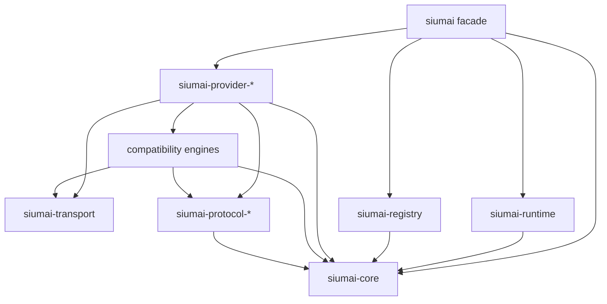
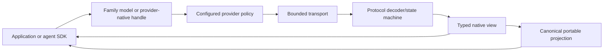
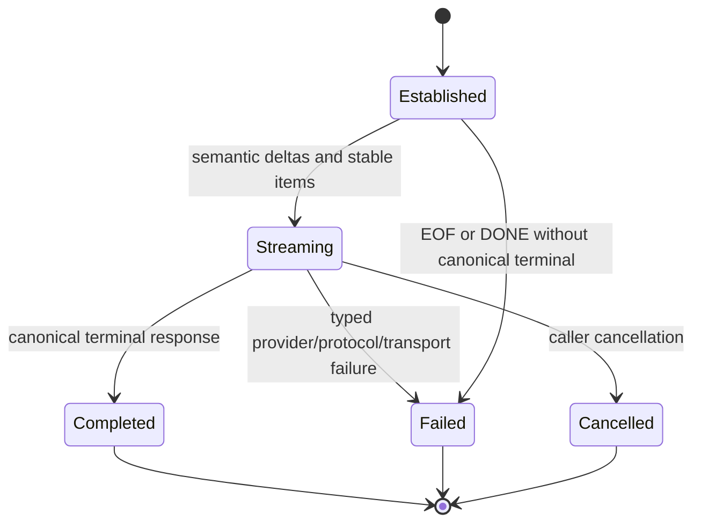
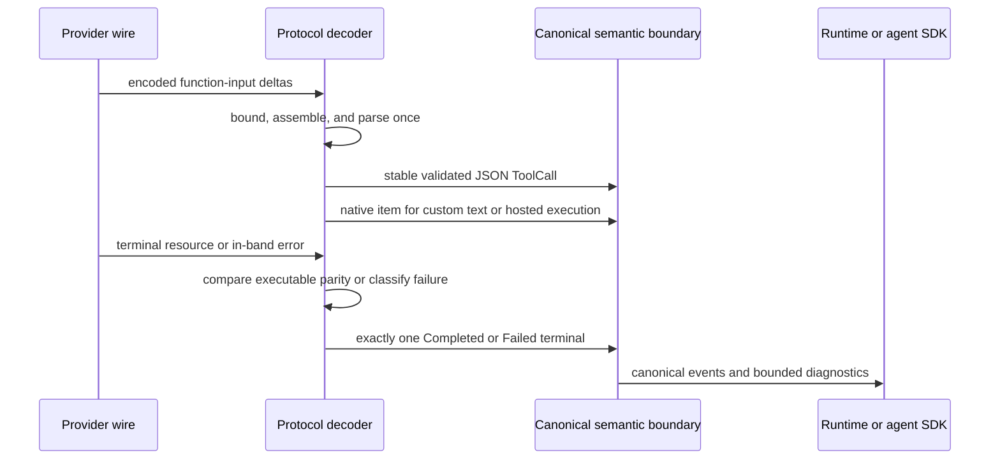

# Siumai Provider-Faithful Semantic Revival - Plan

## Goal Capsule

| Field | Contract |
|---|---|
| Objective | Make the Siumai `0.11.0-beta.9` development line provider-faithful and Rust-ergonomic, with equally trustworthy unified model-family and provider-native APIs. Close the remaining semantic-boundary defects proven by Hajimi, correct current provider wire behavior, remove premature abstractions, move branded ownership out of compatibility engines, and deepen high-value flagship, Chinese-provider, media, and audio-provider surfaces. |
| Authority | This plan is the implementation authority. Current official provider documentation is authoritative for remote behavior. Repository ADRs and architecture documents define accepted ownership. `repo-ref/ai` at `3bc0d4f40d` is a secondary product and fixture reference, not a Rust API blueprint. |
| Release contract | Keep the workspace version at `0.11.0-beta.9`. Breaking source changes and deletion of obsolete code, tests, documentation, aliases, and feature relays are allowed. The six provider-neutral model-family traits and the value of the unified interface are preserved. |
| Execution profile | Work serially in dependency order, use deterministic offline fixtures, run one Cargo process at a time, and create reviewable English Conventional Commits at meaningful boundaries. Do not push, publish, tag, or open a pull request. |
| Stop conditions | Stop only for an official-provider contradiction that changes product scope, a security boundary that cannot be implemented safely, or an overlap with unrelated user changes that cannot be isolated. Stale downstream code caused by an intentional public break is migration work, not a blocker. |

This plan follows the completed baseline in
`docs/plans/2026-08-04-001-refactor-siumai-next-revival-plan.md`. It does not reopen the decisions to
replace a universal client with small family traits, keep Registry local and network-free, separate
provider and host control planes, or make stream settlement canonical. It starts from commit
`3df1af34` and addresses the remaining correctness, ownership, ergonomics, and provider-coverage
work.

## Product Contract

### Summary

Siumai has two first-class public paths:

1. Provider-neutral family models for portable application and agent code.
2. Provider-owned typed APIs for native options, hosted tools, resources, sessions, and jobs.

The unified path is not a lowest-common-denominator client. It standardizes only semantic behavior
that can be enforced across providers. Provider wire syntax is normalized once below that boundary;
raw provider data remains available only through typed provider metadata, bounded diagnostics, or
provider-native resources.

The refactor is invariant-first. Provider breadth follows protocol correctness and public ownership,
so new integrations do not multiply known semantic defects or attach branded APIs to a generic
compatibility engine.

### Requirements

- **R1 — Version continuity.** Keep every workspace package on `0.11.0-beta.9`; do not introduce a
  `0.12` version line during this work.
- **R2 — Dual public surface.** Preserve the six stable family traits—`LanguageModel`,
  `EmbeddingModel`, `RerankModel`, `ImageModel`, `SpeechModel`, and `TranscriptionModel`—and keep
  provider-direct APIs equally discoverable through provider crates and the facade.
- **R3 — No universal client.** Do not add a universal provider trait, runtime capability booleans,
  provider downcasts, model-name capability inference, or a manually synchronized runtime feature
  matrix.
- **R4 — Canonical executable tool input.** A caller-executed portable function call must expose
  exactly one parsed JSON value. Provider-native text/custom calls remain typed native output or
  replay items until a second provider and an owning host-execution contract prove portability;
  encoded JSON text must never be ambiguously stored as semantic JSON input.
- **R5 — Exactly-once stream settlement.** After establishment, every high-level language stream
  must settle exactly once as `Completed`, `Failed`, or `Cancelled`. EOF, `[DONE]`, disconnect,
  parse failure, duplicate terminal events, and provider in-band failures must have explicit typed
  outcomes.
- **R6 — Typed in-band failures.** HTTP-200 SSE error envelopes must preserve a matchable
  `ErrorKind`, retry delay when explicitly provided, safe public diagnostics, and bounded sensitive
  provider detail. Classification reads only protocol-declared fields under explicit depth, node,
  identifier, and text budgets; context-window classification uses exact code/type values and never
  message guessing. High-level consumers must never parse arbitrary error JSON to recover category
  or retry behavior.
- **R7 — Incremental/terminal parity.** When an executable item appears in both stable incremental
  events and the terminal response, protocol normalization must guarantee equal identity, kind,
  execution owner, tool name, call ID, and semantic input. Provider metadata may differ only where
  the protocol contract explicitly permits it.
- **R8 — Direction-aware request validation.** Core must reject invalid role/content combinations
  before provider submission and expose role-safe construction paths. Do not reintroduce a parallel
  legacy V4 type family; retain one canonical language contract and document intentional
  provider-native replay suppression.
- **R9 — Provider-owned extensions.** Reasoning, prompt caching, hosted tools, provider cache
  annotations, MCP servers, inference geography, service tier, and similar non-portable behavior
  remain typed provider options, annotations, tools, or resources. Untyped extras cannot override
  protected fields.
- **R10 — Correct current wire behavior.** Fix verified current protocol errors before expanding
  product breadth, including OpenAI cache breakpoints and metadata, Anthropic request/response tier
  modeling, Gemini Interactions GA wire, Alibaba token fields, ARK MCP headers, and DeepSeek beta-only
  features.
- **R11 — Branded provider ownership.** Moonshot AI/Kimi and Volcengine/ARK must be public provider
  crates. Generic compatibility engines may execute their dialects but must not own branded options,
  model advice, support claims, resources, or facade identity.
- **R12 — Product-level Gemini owner.** Replace the image-only `GoogleImageProvider` with a
  model-independent `GeminiProvider`. Move Gemini wire schemas into a protocol crate and represent
  Interactions and GenerateContent as explicit API modes.
- **R13 — Remove premature shared lifecycles.** Delete `VideoJobModel`, `MediaJob`—whose provider
  state is currently stored as `serde_json::Value`—and the zero-implementation
  `StreamingTranscriptionModel`. Keep asynchronous media jobs and realtime or streaming
  transcription as typed provider-owned APIs until shared semantics are proven.
- **R14 — Flagship OpenAI plane.** Deepen OpenAI Responses with typed hosted tools, items, events,
  input-token counting, Conversations, Files, Vector Stores, and Skills; implement portable
  embedding, image, speech, and transcription adapters without hiding native functionality.
- **R15 — Flagship Anthropic plane.** Expose current Messages controls through typed provider
  options, separate request tier preference from assigned response tier, preserve automatic and
  explicit caching, and retain Files, Batches, Token Counting, Skills, and cache prewarming as
  provider-owned resources or operations.
- **R16 — Gemini and xAI breadth.** Add the portable families their current APIs can represent
  honestly. Keep stored/background interactions, Files, Veo/video, Live/Realtime, batches, and other
  lifecycle resources provider-owned.
- **R17 — Chinese-provider breadth.** Add Alibaba and DeepSeek Anthropic-compatible Messages,
  Kimi-specific partial/prefix and resource APIs, ARK MCP/media APIs, and MiniMax portable image and
  speech adapters while retaining provider-native breadth.
- **R18 — Audio-provider breadth.** Add Groq Remote MCP and Orpheus TTS, provider-native translation
  and URL-audio paths, Deepgram TTS, and ElevenLabs STT where the official API can be represented
  faithfully. Do not introduce a shared Translation or realtime-transcription trait in this cycle.
- **R19 — Technical addressing only.** Caller-selected project, workspace, location, deployment,
  and origin values may exist when required for addressing or signing. Siumai must not maintain
  region availability, pricing, quota, compliance, health, or business-routing catalogs.
- **R20 — Honest support evidence.** Separate Siumai public API stability from upstream maturity and
  upstream support status. Every named support claim records provider, technical platform, exact
  mode or native surface, fidelity, Siumai stability, optional normalized maturity, optional
  normalized support status, the provider's official label when useful, official source, and
  verification date. Missing or ambiguous upstream state remains unasserted; it is never inferred
  from recommendation prose or the absence of a deprecation notice.
- **R21 — Minimal deterministic evidence.** Each changed or added API mode needs one representative
  success fixture and only the error, unsupported-combination, redaction, or terminal-boundary
  fixtures required by its distinct semantics. Live tests remain opt-in and non-gating.
- **R22 — Simple automation.** Repository scripts remain focused Python orchestration or bounded
  schema validation. Do not build Rust parsers, call-graph analyzers, source digests, provider/model
  cross-products, or repeated smoke matrices.
- **R23 — Complete breaking migration.** Remove obsolete aliases and dead implementation paths in
  the same unit that replaces them. Update facade features, rustdoc, examples, support evidence,
  migration guidance, and package metadata with each public change.
- **R24 — Native/portable projection parity.** A provider-native response or stream and its portable
  projection must be produced by the same request/decoder state machine. Native APIs may preserve
  more wire detail, but they must not silently issue a second request or disagree on executable
  content, terminal status, usage, or replay-critical identity.
- **R25 — Replay-domain safety.** Provider-opaque item IDs, encrypted reasoning, signed content,
  provider-owned tool state, and other replay-critical metadata are bound to an explicit non-secret
  replay domain. The domain distinguishes official and custom endpoint audiences plus any material
  caller-selected project, workspace, deployment, or account scope. Credentials never enter it,
  and resume rejects opaque state from a different domain.
- **R26 — Native-resource transport safety.** Files, media jobs, MCP endpoints, voice operations,
  signed URLs, multipart bodies, and other native resources must use `siumai-transport` destination,
  redirect, body-bound, redaction, and replay-safety policies. Mutating operations declare semantic
  idempotency or fail closed after uncertain submission; provider-returned URLs never bypass
  destination policy or forward credentials across origins.

### Key Flows

- **FL1 — Portable function-tool turn.** A provider decoder receives encoded function arguments,
  normalizes them once into structured local JSON, emits a stable tool call, and settles with a
  terminal response containing the same executable call.
- **FL2 — Provider-owned tool turn.** A hosted, MCP, computer, custom-text, or other provider-native
  tool retains typed ownership and replay identity on the provider-owned output surface without
  being misrepresented as a portable local function call.
- **FL3 — In-band provider failure.** An SSE connection established with HTTP 200 later emits a
  provider error. The protocol owner maps explicit code/type/status fields to a typed terminal
  failure, preserves safe identifiers, keeps private details sensitive, and never returns successful
  EOF.
- **FL4 — Late terminal metadata.** A Chat stream receives `finish_reason`, then a usage-only chunk,
  then `[DONE]`. The single terminal response includes the final usage and metadata.
- **FL5 — Provider-native plus portable family.** A configured provider exposes a faithful native
  resource API and, where semantics overlap, a portable family model handle backed by the same
  credential, endpoint, transport, and provider policy.
- **FL6 — Named-compatible provider construction.** A Moonshot AI or Volcengine caller imports the
  branded provider crate. The provider composes the generic compatible engine internally and owns
  its identity, model policy, options, resources, claims, and tests.
- **FL7 — Technical origin selection.** A caller supplies a project/workspace/location/origin needed
  by the remote API. The provider derives technical paths but does not infer commercial
  availability or select business routes.
- **FL8 — Future model call.** An unknown but syntactically valid model ID remains callable with
  protocol-baseline behavior. An explicit typed option is either encoded or rejected; it is never
  silently removed by a model-name allowlist.
- **FL9 — Three-view parity.** A direct response, stable stream events, and the terminal stream
  snapshot for one provider call share one semantic projection. Missing views follow explicit merge
  rules; provider-only metadata does not become a false semantic mismatch.

### Acceptance Examples

- **AE1 (R4, FL1):** OpenAI Chat and Responses object, array, and scalar function arguments produce
  checked structured `ToolInput` values in both direct and streaming paths. Malformed or oversized
  encoded JSON fails before a local tool can execute.
- **AE2 (R4, FL2):** An OpenAI custom-text or provider-executed tool remains a typed OpenAI native
  output/replay item and never enters the portable JSON-schema tool loop. It cannot be confused with
  encoded structured JSON or silently downgraded to an opaque portable `ToolCall`.
- **AE3 (R6, FL3):** A Chat or Responses SSE `rate_limit_exceeded` or explicit concurrency-limit
  envelope settles as `ErrorKind::RateLimited` with a static safe message and bounded provider
  identifiers. A context-window code maps exactly to `ContextWindowExceeded`; a message-only hint,
  deeply nested object, overlong identifier, or non-three-digit string status cannot spoof a
  category. A bounded valid `retry_after` field or header is preserved, while negative, excessive,
  malformed, or ambiguous retry values are ignored. Unknown details remain redacted.
- **AE4 (R7, FL1):** A Responses terminal resource that reuses an item ID but changes a function
  name, call ID, execution owner, or normalized arguments fails as a protocol mismatch.
- **AE5 (R5, FL4):** `[DONE]` without a canonical completion, clean EOF after deltas, and disconnect
  before terminal settlement each produce one `UnexpectedEof` failure; duplicate terminal events
  cannot produce a second settlement. Cancellation after establishment produces exactly one
  `Cancelled` terminal and no later settlement.
- **AE6 (R8):** A tool-result part in a user message or response-only refusal in an invalid request
  role fails `LanguageRequest::validate()` before provider encoding. Ordinary assistant history and
  provider-native replay remain representable through explicit constructors.
- **AE7 (R8, R23):** Unsupported prompt content is rejected or handled by an explicitly documented
  provider replay rule. No default request codec branch silently drops content.
- **AE8 (R10):** OpenAI models the GPT-5.6 cache-write budget separately from retained breakpoint
  history: implicit mode reserves one of four new-write slots, explicit mode can use four, and cache
  reads can consider the latest 50 markers. `prompt_cache_options.ttl` controls GPT-5.6 breakpoint
  lifetime independently from the deprecated pre-GPT-5.6 `prompt_cache_retention` policy.
- **AE9 (R10):** Anthropic request options cannot construct response-only assigned service-tier
  values. Automatic cache control, speed, inference geography, task budget, context management,
  container/skills, and MCP servers have typed provider-owned entry points.
- **AE10 (R10, R12):** Gemini Interactions uses stable `v1`, encodes `response_modalities`, and no
  longer sends the retired beta `response_format` shape. GenerateContent is an explicit legacy mode,
  not the hidden default.
- **AE11 (R10, R17):** Current Alibaba Qwen requests use the verified token-limit field; DeepSeek
  strict tools or prefix completion reject the stable endpoint and require explicit beta mode; ARK
  Remote MCP sends its required beta header.
- **AE12 (R11, FL6):** The facade can enable Moonshot AI and Volcengine independently. Disabling them
  leaves `siumai-openai-compatible` as a generic/custom execution engine with no branded exports.
- **AE13 (R13):** No stable or experimental core type accepts a provider media request or job state
  as arbitrary `Value`; Alibaba, MiniMax, Gemini, xAI, and Volcengine jobs use provider-owned typed
  lifecycles.
- **AE14 (R14-R18, FL5):** Each newly portable family has one provider-owned native entry point and
  one family-model adapter where applicable; unsupported native lifecycle operations do not appear
  on the shared trait.
- **AE15 (R20):** A support row can state that a Siumai API is stable while independently recording
  upstream maturity and support status. A Beta API may also be Deprecated; an undocumented state
  remains unasserted; a custom endpoint never inherits a named official claim.
- **AE16 (R24, FL9):** OpenAI native Responses output and its portable `LanguageResponse` projection
  come from one decoded terminal. Direct and streaming portable projections agree on executable
  content and usage; native-only fields remain available through the native view without a second
  network request.
- **AE17 (R25):** A provider-opaque Responses item resumes successfully under the same replay domain
  and is rejected before submission when moved between official and custom endpoints or between
  distinct caller-declared workspace/account scopes. The persisted domain contains no credential or
  signed URL.

### Canonical Role and Content Matrix

The matrix is a Siumai semantic rule, not a copy of any provider's wire-role names. Protocol codecs
may project several canonical roles to one wire role when required by the provider.

| Canonical role | Portable content allowed | Explicitly not allowed by default |
|---|---|---|
| `System` / `Developer` | Text and provider-scoped annotations | Tool calls/results, response-only citations/refusals, unproven media |
| `User` | Text, input media, provider-scoped annotations | Tool results, tool calls, signed assistant reasoning |
| `Assistant` | Text, reasoning, tool calls, generated media, replay-critical provider opaque items | Tool results; response-only citation/refusal unless explicitly projected or preserved as opaque replay |
| `Tool` | Tool results, with the matching call ID and bounded output | User text as a substitute for a tool result, assistant tool calls |

`MessageRole::Tool` is the canonical role for a portable tool result even when Anthropic encodes it
as a wire `user` message. A canonical message does not mix ordinary user text and tool-result
blocks; callers create adjacent `User` and `Tool` messages, and a codec may merge them only when its
wire contract requires it without changing order or ownership. Response citations, refusals, and
provider signed reasoning are not silently projected into ordinary history. They require an explicit
portable text projection or provenance-bearing `ProviderOpaque` replay item.

### Scope Boundaries

In scope:

- The remaining Hajimi HF1-HF9 semantic gaps that still exist at `3df1af34`.
- Breaking public API cleanup needed to make tool input, provider ownership, and request validation
  honest.
- Verified current wire corrections and high-value product surfaces described by R10-R18.
- Removal of obsolete experimental contracts, compatibility aliases, tests, documents, and feature
  relays that contradict the target design.

Out of scope for this cycle:

- Replacing the six family traits or Registry with a universal client.
- A second parallel V4 language type family or a wholesale rewrite of the existing canonical stream
  contract.
- Shared Files, Batch, Realtime, Translation, Video, voice-cloning, or remote-catalog traits.
- SDK-maintained region/model availability, pricing, quota, compliance, health, routing, or fallback
  policy.
- OpenAI Assistants API work; current functionality belongs in Responses and provider-owned
  resources.
- Provider × model × option Cartesian-product tests, credentialed release gates, source digests, or
  automation that reimplements compiler or protocol logic.
- Claiming complete provider-platform parity merely because the implemented slice is well tested.

### Provider Slice Delivery Matrix

`Must land` rows are part of Global Completion. `Deferred` rows are intentionally outside this
cycle and must remain documented as unsupported or partial. `Evidence blocker` rows may move to
`Must land` only through an explicit plan amendment after official contradictions are resolved; they
cannot be silently counted as delivered.

| Provider | Exact slice | Surface | Cycle status | Owner | Minimum evidence |
|---|---|---|---|---|---|
| OpenAI | stream errors/parity, cache/metadata, typed Responses tools/items/events, input tokens | Native + portable projection | Must land | U2, U11 | paired direct/stream fixture plus typed error/parity failures |
| OpenAI | Embedding, image generation, buffered speech, file transcription | Portable + provider options | Must land | U7 | one representative family fixture each |
| OpenAI | Conversations, Files, Vector Stores, Skills | Provider-native resources | Must land | U7 | one bounded lifecycle fixture each |
| OpenAI | image edits/partial images, custom voices, Uploads, WebRTC, SIP/call control | Provider-native | Deferred | — | support matrix names the omitted surface |
| Anthropic | current Messages options, tier split, automatic cache, cache prewarm | Provider-native options/operation | Must land | U12 | one combined wire/policy fixture and redaction check |
| Gemini | stable Interactions language/image and explicit GenerateContent legacy mode | Portable + native modes | Must land | U6 | direct/SSE terminal fixtures and legacy-mode assertion |
| Gemini | text embedding, buffered speech, Files, Veo submit/status | Portable + native resources | Must land | U6 | one family/resource lifecycle fixture per slice |
| Gemini | stored/background Interactions, Live sessions, and ephemeral tokens | Provider-native session/resource | Deferred | — | support matrix names the omitted surface |
| Alibaba | current Chat token field and Anthropic-compatible Messages | Portable language modes | Must land | U8 | Chat field assertion plus Messages direct/stream fixture |
| DeepSeek | Anthropic-compatible Messages, beta strict tools, typed prefix completion | Portable mode + annotation | Must land | U8 | endpoint-policy and direct/stream fixtures |
| Moonshot AI/Kimi | branded owner, typed partial/prefix, Files | Provider + portable/native | Must land | U5, U8 | provider construction/stream plus Files lifecycle |
| Moonshot AI/Kimi | Batch, token estimate, Formula resources | Provider-native | Deferred | — | add only through a later evidence-backed amendment |
| Volcengine/ARK | branded owner, Remote MCP, image adapter, typed video jobs | Provider + portable/native | Must land | U5, U8 | MCP header/approval, image, and job lifecycle fixtures |
| MiniMax | portable image/speech, Responses input tokens, voice clone/design | Portable + provider-native | Must land | U8 | adapter fixtures plus one native voice lifecycle |
| xAI | Responses primary, typed tools, Files, image, video, speech, final transcription | Portable + provider-native | Must land | U9 | one representative family/resource fixture per slice |
| xAI | Realtime and Batch | Provider-native | Deferred | — | do not claim OpenAI Realtime fidelity |
| Groq | Orpheus buffered speech | Portable speech | Must land | U9 | one binary speech fixture |
| Groq | Remote MCP and translation/URL audio | Provider-native | Must land | U9 | MCP approval/output and model-policy fixtures |
| Groq | Files/Batch | Provider-native | Evidence blocker | U10 evidence only | official guide/reference conflict recorded; no implementation claim |
| Deepgram | Aura buffered speech | Portable | Must land | U9 | one binary speech fixture |
| ElevenLabs | final/batch transcription | Portable/provider-native | Must land | U9 | one final transcription fixture and bounded error |
| Cohere | text embedding and text rerank claim wording | Evidence only | Must land | U10 | claim explicitly remains text-only |

## Planning Contract

### Current Baseline and Hajimi Finding Disposition

The Hajimi report was produced against the previously published `0.11.0-beta.9`. Static audit of
the current branch changes the implementation priority:

| Finding | Current status at `3df1af34` | Plan treatment |
|---|---|---|
| HF1 canonical tool arguments | Concrete OpenAI function-call split is fixed; core `ToolCall` still permits unchecked construction and custom-text calls still share its carrier | U1 validates portable JSON calls and moves provider-native text calls to native output |
| HF2 typed in-band failure | One typed terminal lane exists, but Chat/Responses/Anthropic classification is incomplete | P0 in U2 |
| HF3 bidirectional content carrier | Direction risk remains; request encoders are now mostly strict | U1 adds role-safe validation and constructors; no parallel V4 reset |
| HF4 incremental/terminal parity | Chat and Anthropic are coherent; Responses compares only item ID/kind at terminal | P0 in U2 |
| HF5 successful EOF without settlement | Fixed by `DecoderLifecycle` and `established_stream` | Preserve focused regressions; do not redesign |
| HF6 deadline/idle behavior | Transport has connect, call, and read timeouts | Add only one deterministic stalled-read boundary if missing |
| HF7 Chat trailing usage loss | Fixed; a `finish_reason -> usage-only -> [DONE]` fixture exists | Preserve regression; do not duplicate |
| HF8 explicit reasoning/max | Fixed; typed `Max` exists and explicit options are not silently filtered | Add one future-model wire assertion only if absent |
| HF9 unbounded string status parse | Old downstream parser is gone | Bound identifiers in the protocol-owned HF2 classifiers; no global string wrapper |

### Key Technical Decisions

- **KTD1 — Preserve the current macro architecture (`session-settled`).** Keep the six small family
  traits, typed provider options and annotations, transport/protocol/provider ownership, local
  Registry, provider-neutral runtime, and thin facade. The proven defects are below these boundaries;
  rebuilding them would add migration cost without improving the known failure modes.
- **KTD2 — Make portable tool calls structured and executable by construction.** `ToolCall` will
  carry a validated parsed JSON input and will be constructed or deserialized only through checked
  APIs rather than arbitrary public field combinations. The portable runtime binds only caller-owned
  structured function calls. OpenAI custom-text calls and other provider-native input forms remain
  typed native output/replay items until a second provider and a complete host dispatch, approval,
  result-replay, cancellation, and snapshot contract justify promotion into Core. Provider-owned
  calls never enter a local binding. Deltas are assembly progress, not executable semantic values.
- **KTD3 — Harden one canonical language contract and publish its role matrix.** Core will own
  role/content validation and role-safe constructors. `ContentPart` may remain the shared semantic
  algebra where history replay genuinely needs the same value, but the canonical matrix above is
  enforced before encoding. Anthropic's wire `user` projection does not relax the canonical `Tool`
  role. A future full request/output split requires evidence from at least two protocols or
  consumers that cannot be expressed safely by this contract; the removed legacy V4 family is not
  restored.
- **KTD4 — Keep the canonical terminal event.** Established stream failures remain
  `StreamTerminal::Failed`, not a second public in-band raw error event and not a competing
  `Stream<Item = Result<...>>` settlement convention. Setup failure remains the outer `Result`.
- **KTD5 — Separate category, retry hint, and replay safety.** OpenAI-family and Anthropic protocol
  crates decode and classify their own bounded error envelopes. Core adds only matchable categories
  required by real consumers (`ContextWindowExceeded` and `Unavailable` in addition to existing
  kinds). `retry_after` is an explicit bounded hint, not a retry decision. Whether a submitted call
  may be replayed is decided by transport/provider policy from submission state and idempotency, not
  by `ErrorKind`. Protocol baseline classification is shared only within a verified dialect; branded
  profiles may add a narrow code-mapping policy without teaching Core every vendor catalog. Stream
  providers retain sanitized response headers through `TransportStreamResponse::into_parts()` so a
  valid header retry hint is available before the body decoder owns the stream.
- **KTD6 — Compare three semantic views, not wire snapshots.** Direct projection, stable stream
  events, and terminal stream response use one semantic normalizer. When both stable and terminal
  views contain an executable item they must match; a stable-only item is merged into a terminal
  snapshot when the protocol permits it, and a terminal-only item is accepted without inventing a
  retroactive stable event. Portable/replay-critical fields participate in equality; provider-only
  metadata may differ. This avoids brittle byte-for-byte comparison without allowing a provider to
  change the call an agent executes.
- **KTD7 — Rename the production Responses module now.** Move
  `siumai_protocol_openai::responses_next` to `responses`, delete the old public alias, and migrate all
  providers in one mechanical boundary before adding more Responses consumers.
- **KTD8 — Branded providers own branded behavior through a narrow composition seam.** Use
  `siumai-provider-moonshotai` for the Moonshot AI provider and Kimi product surface, and
  `siumai-provider-volcengine` for Volcengine with ARK as a technical platform/API mode. Both compose
  `siumai-openai-compatible` internally through a small, versioned, provider-neutral API that can
  select dialect codecs and policy hooks only; it cannot replace credentials, identity, endpoint,
  transport, or stream lifecycle. A branded provider retains its branded `ProviderId` even with a
  caller-supplied base URL; only its verified support/fidelity claim is downgraded to custom or
  generic. Provider identity is not sufficient for opaque replay: configured providers also expose
  a non-secret replay domain that distinguishes official/custom endpoint audiences and material
  caller-selected workspace, project, deployment, or account scope. Direct use of the compatibility
  engine remains the generic identity. The compatibility engine loses branded public modules.
- **KTD9 — Rebuild Gemini around protocol modes.** Add `siumai-protocol-gemini` with stable
  Interactions and explicit GenerateContent modules. `GeminiProvider` owns credentials, endpoints,
  model policy, family handles, and native resources. The facade may retain a `google` feature name
  if it remains the clearest vendor assembly, but public types use Gemini product terminology.
- **KTD10 — Native lifecycle first, portable adapter second.** Files, batches, stored interactions,
  conversations, vector stores, video jobs, realtime sessions, and voice lifecycle operations stay
  provider-owned. A shared family adapter is added only for the synchronous semantic subset already
  represented by a stable family trait.
- **KTD11 — Separate request and response enums when the wire does.** Anthropic service-tier request
  preference and assigned response tier are different types. Similar provider states must not be
  merged merely because their wire strings share one field name.
- **KTD12 — Open model identifiers, fail-closed explicit options.** Known catalogs are dated hints.
  Future model IDs use safe protocol-baseline behavior; any explicitly selected option is encoded or
  rejected with a typed configuration error, never silently removed.
- **KTD13 — Technical origins are caller-owned.** Keep helpers such as Alibaba workspace origin only
  when they derive technical paths. Rename misleading endpoint/location types where useful, but do
  not add availability catalogs or automatic business-region selection.
- **KTD14 — Evidence separates API, maturity, and support axes.** `ApiStability` continues to
  describe Siumai's public API. Optional upstream maturity and optional upstream support status are
  independent evidence fields, with an official provider label retained where normalization would
  lose meaning. Unasserted and unknown states remain explicit and never act as runtime capability
  authority.
- **KTD15 — Tests prove contracts, scripts orchestrate tools.** Provider changes use small offline
  codec or HTTP fixtures. Cargo, rustdoc, Clippy, and nextest remain authoritative. Python scripts may
  validate bounded manifests or invoke those tools but do not infer Rust behavior from source text.
- **KTD16 — Native and portable APIs share one decode/projection pipeline.** OpenAI and other
  providers may expose a native handle such as `generate_native`/`stream_native` alongside the
  family `generate`/`stream` methods. The native result contains the full typed provider view and
  offers an explicit portable projection; both are produced from one request and one state machine.
  Native-only fields never leak into Core by default, and a native-to-portable conversion never makes
  a second network request.
- **KTD17 — Native resources reuse transport policy rather than raw clients.** Provider resource
  modules may own lifecycle types and endpoint paths, but every request flows through
  `siumai-transport`. Destination audiences, redirects, body/frame limits, secret redaction,
  submission state, and replay safety are enforced once per distinct transport pattern. Tests cover
  representative unsafe redirect/audience, oversize body, and uncertain-submission cases rather
  than duplicating a provider-by-provider matrix.

### High-Level Technical Design

The diagrams are architectural constraints, not exact Rust signatures.

Compile-time dependency direction (`A --> B` means A depends on B):

Runtime request/response flow is separate from the dependency graph:

### Sequencing

1. Establish the orthogonal support-evidence schema before any claim-bearing provider unit lands.
2. Freeze the semantic boundary and migrate callers before adding new protocol consumers.
3. Fix stream semantics, then perform the mechanical Responses namespace migration before any new
   Responses consumer is added.
4. Complete OpenAI and Anthropic correctness as separate reviewable units.
5. Remove premature core lifecycles and extract branded providers before extending their resources.
6. Rebuild Gemini's protocol/provider owner before implementing additional Gemini families.
7. Deepen OpenAI, Chinese-provider, xAI, and targeted media/audio surfaces through independently
   reviewable provider checkpoints on the corrected contracts.
8. Finish with facade, migration, package, documentation, and workspace validation.

### System-Wide Impact

- **Core API:** `ToolCall` construction and request validation change. Runtime, protocol decoders,
  provider codecs, server projections, examples, and downstream facade tests must migrate together.
- **Durable state:** `ToolCall` is embedded in runtime checkpoints and prepared-tool snapshots. U1
  increments `RUN_SNAPSHOT_SCHEMA_VERSION` and explicitly rejects older snapshots as unsupported;
  this pre-release refactor does not retain an ambiguous compatibility reader. The migration guide
  must call out that in-flight checkpoints created before this schema cannot resume.
- **Stream behavior:** Consumers gain more precise failure kinds and stricter Responses mismatch
  detection. Successful EOF remains impossible. Raw error details remain opt-in sensitive data.
- **Provider topology:** New Moonshot AI and Volcengine crates affect workspace membership,
  dependency policy, facade features, Registry registration sources, package metadata, and publish
  ordering.
- **Protocol topology:** The OpenAI Responses rename touches all Responses-capable providers. The new
  Gemini protocol crate becomes the single wire owner for Gemini Interactions and GenerateContent.
- **Feature graph:** Facade provider features must activate only their owning provider and required
  protocol/transport dependencies. Generic compatibility remains explicit and is not pulled in by
  unrelated providers unless they internally depend on it.
- **Security:** New MCP and resource APIs introduce credentials, signed URLs, file bodies, and remote
  tool payloads. Secret fields require redacted `Debug`, bounded diagnostic excerpts, protected-field
  validation, destination policy, and conservative replay behavior.
- **Persistence/replay:** Provider-native item IDs, reasoning IDs, encrypted content, call IDs, and
  provider-owned tool state remain provenance-bearing metadata or opaque replay items bound to a
  non-secret replay domain. Canonical local tool input never consumes those fields by inference, and
  resume rejects official/custom endpoint or caller-declared scope mismatches before submission.
- **Documentation:** Current architecture and support tables must describe compiled public behavior,
  not intended future breadth. Claims land with implementation and evidence, not ahead of it.

### Risks and Mitigations

| Risk | Mitigation |
|---|---|
| A core tool-input break fans out across many crates and snapshots | Make U1 compiler-guided and mechanical after defining the invariant; migrate direct/stream/history/server/snapshot paths together, bump the exact snapshot schema, and run only affected serial lanes before committing |
| A complete request/output split recreates the deleted V4 parallel model | Follow KTD3: strengthen constructors and validation first; do not add a second canonical type family |
| Provider-native replay fidelity is lost during normalization | Normalize only caller-executed semantic input; keep provider IDs, encrypted/reasoning state, and raw replay material in typed provider metadata or `ProviderOpaque` |
| Opaque replay state crosses endpoints or tenant scopes | Bind it to a non-secret configured replay domain and reject mismatches before encoding or network submission |
| Error classification leaks provider or tenant data | Expose only bounded identifiers and static public messages; keep raw envelopes in sensitive diagnostics and add sentinel-secret tests |
| Branded-provider extraction creates facade or dependency cycles | Follow existing DeepSeek/Groq/Alibaba wrapper patterns and validate the machine-readable dependency policy after each extraction |
| Official APIs change during the long refactor | Record source and verification date per claim, keep model IDs open, and refresh the owning provider unit immediately before implementation |
| New native resources create accidental universal abstractions | Keep lifecycle types provider-owned per KTD10; promote only an already-proven synchronous family subset |
| Provider breadth makes CI expensive or flaky | Use one representative offline fixture per mode plus distinct failures; live canaries remain opt-in and never gate release |
| Deleted aliases or tests hide a real regression | Before deletion, identify the observable behavior they protected and move only that behavior into the new owning contract fixture |

### Sources and Research

- Current repository architecture and decisions:
  - `docs/architecture/overview.md`
  - `docs/architecture/public-api.md`
  - `docs/adr/0010-provider-plane-and-host-control-plane.md`
  - `docs/adr/0011-protocol-projection-ownership.md`
  - `docs/adr/0012-provider-annotations-follow-semantic-nodes.md`
  - `docs/adr/0013-provider-identity-and-family-registration.md`
  - `docs/adr/0014-canonical-language-history-and-replay.md`
- Current support evidence: `docs/providers/support-policy.md`.
- Prior implementation baseline:
  `docs/plans/2026-08-04-001-refactor-siumai-next-revival-plan.md`.
- Hajimi behavioral evidence supplied by the maintainer on 2026-08-07, covering direct and streaming
  Chat/Responses tool loops and Pi as a behavioral control.
- Local AI SDK reference: `repo-ref/ai` commit `3bc0d4f40d` (2026-08-01).
- OpenAI official documentation, verified 2026-08-07:
  - `https://developers.openai.com/api/docs/guides/latest-model`
  - `https://developers.openai.com/api/docs/guides/tools`
  - `https://developers.openai.com/api/docs/guides/prompt-caching`
  - `https://developers.openai.com/api/reference/resources/chat/subresources/completions/methods/create`
  - current Responses, Conversations, Files, Vector Stores, audio, image, and embedding references
- Anthropic official documentation, verified 2026-08-07:
  - `https://platform.claude.com/docs/en/api/messages/create`
  - `https://platform.claude.com/docs/en/build-with-claude/prompt-caching`
  - current service-tier, fast-mode, task-budget, MCP, Files, Batches, Token Counting, and Skills docs
- Gemini official documentation, verified 2026-08-07:
  - current Interactions, GenerateContent, embeddings, Files, TTS, Veo, and Live API documentation
- xAI and Groq official documentation, verified 2026-08-07:
  - `https://docs.x.ai/developers/tools/files`
  - current xAI image, video, speech, transcription, realtime, and batch references
  - `https://console.groq.com/docs/responses-api`
  - `https://console.groq.com/docs/remote-mcp`
  - current Groq speech-to-text, text-to-speech, Files, and Batch references
- Alibaba, Kimi, Volcengine, DeepSeek, MiniMax, Cohere, Deepgram, and ElevenLabs official sources
  recorded in provider-owned profiles and `docs/providers/support-policy.md`, refreshed by the owning
  implementation unit.

## Implementation Units

| Unit | Title | Primary paths | Depends on |
|---|---|---|---|
| U0 | Establish the support-evidence schema | `siumai-core::profile`, provider claim constructors, support docs | — |
| U1 | Canonical tool input and role-safe request boundary | `siumai-core`, language protocols, runtime | U0 |
| U2 | Typed stream failures and executable parity | OpenAI/Anthropic protocol stream decoders | U1 |
| U3 | Migrate the OpenAI Responses namespace | OpenAI protocol and every Responses consumer | U2 |
| U11 | OpenAI wire and native correctness | OpenAI provider and protocol crates | U0, U3 |
| U12 | Anthropic typed options and request policy | Anthropic provider and protocol crates | U0, U2 |
| U4 | Remove premature shared lifecycles | `siumai-core::experimental`, Alibaba video | U1 |
| U5 | Extract branded compatible providers | new Moonshot AI and Volcengine provider crates, facade | U0, U3 |
| U6 | Rebuild Gemini provider and protocol | new Gemini protocol crate, Gemini provider, facade | U0, U2; checkpoint B also U4 |
| U7 | Complete the high-value OpenAI product plane | OpenAI protocol codecs, family adapters, native resources | U0, U11 |
| U8 | Deepen Chinese-provider product surfaces | Alibaba, DeepSeek, Moonshot AI, Volcengine, MiniMax | U0; per checkpoint U3/U4/U5/U12 |
| U9 | Deepen xAI, Groq, Deepgram, and ElevenLabs | provider family adapters and native resources | U0, U2; per checkpoint U3/U4 |
| U10 | Facade, migration, documentation, and release readiness | docs, facade, manifests, scripts, CI | U0, U3, U5-U9, U11-U12 |

### U0 — Establish the Support-Evidence Schema

- **Goal:** Make the evidence model available before provider units add or rewrite named claims.
- **Requirements:** R20-R23; AE15.
- **Decisions:** KTD14-KTD15.
- **Dependencies:** U0.
- **Primary paths:**
  - `siumai-core/src/profile.rs`
  - provider-owned support-claim constructors and manifest tests
  - `docs/providers/support-policy.md`
- **Approach:**
  - Replace a single overloaded upstream lifecycle with an evidence record containing independent
    optional maturity and support-status axes plus an optional verbatim official label.
  - Include explicit unasserted/unknown states and prohibit inference from model names,
    recommendation prose, or absent deprecation notices.
  - Migrate every existing verified and generic portable/native claim mechanically before later
    units add new claims. Keep the schema descriptive and compile-time; it is not runtime routing or
    capability authority.
- **Test scenarios:**
  - A stable Siumai API can describe an upstream Beta-and-Deprecated surface without collapsing
    either axis.
  - A claim with no official lifecycle assertion remains unasserted, and a custom endpoint cannot
    inherit a named official claim.
  - Existing claim constructors and support-manifest aggregation compile after the one-time
    migration.
- **Verification outcome:** Every later claim-bearing provider unit can complete its evidence work in
  the same commit series without a second workspace-wide schema migration.

### U1 — Canonical Tool Input and Role-Safe Request Boundary

- **Goal:** Close the remaining type-level ambiguity exposed by Hajimi without recreating a second
  language API.
- **Requirements:** R2-R8, R21, R23, R25; FL1-FL2; AE1-AE2, AE6-AE7, AE17.
- **Decisions:** KTD1-KTD3, KTD12, KTD15.
- **Dependencies:** None.
- **Primary paths:**
  - `siumai-core/src/tool.rs`
  - `siumai-core/src/language/mod.rs`
  - `siumai-core/src/stream.rs`
  - `siumai-runtime/src/tool/`
  - `siumai-runtime/src/history.rs`
  - `siumai-runtime/src/snapshot/`
  - `siumai-runtime/src/durable.rs`
  - `siumai-server/src/event.rs`
  - `siumai-mcp/`
  - `siumai-protocol-openai/src/chat_completions/`
  - `siumai-protocol-openai/src/responses_next/`
  - `siumai-protocol-anthropic/src/messages/`
  - every provider/compatibility codec, facade example, or test that constructs, destructures,
    serializes, or inspects `ToolCall` or `Message`
  - `docs/adr/0012-provider-annotations-follow-semantic-nodes.md`
  - `docs/adr/0014-canonical-language-history-and-replay.md`
- **Approach:**
  - Introduce a validated structured-JSON input newtype or `ToolInput::Json` variant for portable
    executable calls. Make invalid `ToolCall` field combinations unconstructable through the public
    API while retaining inspection and ergonomic pattern matching. Define its stable Serde shape,
    owned-parts type, constructors, and accessors together.
  - Deserialize through a private wire DTO and the same checked `from_parts` path used by public
    constructors. Apply identical ID, name, input-size, and ownership checks at snapshot, server, and
    MCP boundaries; unchecked derived deserialization must not bypass the invariant.
  - Normalize function-call JSON once in each decoder. Keep custom/provider text and provider-owned
    replay data on typed native output/replay items; do not infer meaning from a JSON-looking string
    or add a Core text carrier with no owning execution path.
  - Enforce KTD2's execution contract: only validated caller-owned JSON enters portable JSON-schema
    binding and approval/execution. Provider-owned and custom-text items never enter a local binding.
  - Add core-owned role/content validation and role-safe message constructors using the canonical
    matrix. Anthropic maps canonical `Tool` to wire `user`; mixed user text and tool results remain
    adjacent canonical messages rather than one invalid message. Keep provider annotations beside
    semantic nodes and retain `ProviderOpaque` for replay-critical state.
  - Treat tool-input delta events as bounded assembly/progress only. A stable `ToolCall` is the first
    executable semantic value, and it carries the final input kind.
  - Increment `RUN_SNAPSHOT_SCHEMA_VERSION` and reject older snapshots with the existing typed
    unsupported-version error. Update history, durable checkpoints, server events, MCP projections,
    approval fingerprints, and idempotency inputs for the validated call. Add a non-secret replay
    domain to provenance-bearing native state and reject cross-domain resume before submission.
  - Audit every request codec branch that intentionally suppresses a neutral projection because a
    native replay item is present; name and document the policy. Replace any unrelated silent drop
    with a typed conversion error.
  - Update ADR 0012 to describe the strengthened invariant and why a full parallel request/output
    type family remains rejected.
- **Test scenarios:**
  - Structured function inputs cover object, array, scalar, empty object, malformed JSON, and one
    bounded oversized input without multiplying the matrix across every provider.
  - Native custom-text input round-trips on the provider-native surface without being parsed as JSON
    or projected into a portable `ToolCall`; provider-owned input preserves replay metadata.
  - Invalid serialized IDs, names, oversized input, and ownership/input combinations cannot reach
    approval or execution after snapshot, server, or MCP deserialization.
  - Invalid role/content combinations fail core validation before a codec or transport is invoked.
    Anthropic canonical Tool messages still encode as wire user messages in correct order.
  - Existing assistant tool-call history, tool-result history, and provider-opaque replay still
    encode through representative OpenAI and Anthropic paths.
  - One complete two-turn portable tool loop proves model call → prepare/approve/execute → ToolResult
    history → next provider request. One stored version-4 snapshot is rejected after the schema bump
    without exposing its contents. Same-domain opaque replay succeeds; official-to-custom and
    caller-declared workspace/account mismatches fail before submission.
- **Verification outcome:** Runtime and providers consume one validated tool-call abstraction;
  direct, streaming, and terminal paths cannot disagree merely because the wire carried encoded
  text.

### U2 — Typed Stream Failures and Executable Parity

- **Goal:** Finish the canonical stream boundary already established by the previous refactor.
- **Requirements:** R5-R7, R21; FL1, FL3-FL4; AE3-AE5.
- **Decisions:** KTD4-KTD6, KTD15.
- **Dependencies:** U1.
- **Primary paths:**
  - `siumai-core/src/error/contract.rs`
  - `siumai-core/src/stream.rs`
  - `siumai-protocol-openai/src/chat_completions/wire.rs`
  - `siumai-protocol-openai/src/chat_completions/stream.rs`
  - `siumai-protocol-openai/src/responses_next/stream.rs`
  - `siumai-protocol-openai/src/responses_next/tests.rs`
  - `siumai-protocol-anthropic/src/messages/stream.rs`
  - `siumai-protocol-anthropic/src/messages/tests.rs`
  - `siumai-provider-openai/src/configured/model.rs`
  - `siumai-openai-compatible/src/configured/model.rs`
  - `siumai-anthropic-compatible/src/model.rs`
- **Approach:**
  - Decode OpenAI Chat error envelopes instead of treating them as empty choice chunks. Share only a
    bounded OpenAI-family classifier between Chat and Responses; do not create a universal provider
    error parser.
  - Classify explicit rate-limit, quota, context-window, timeout, invalid-input, authentication, and
    provider-unavailable signals where official codes/types support the distinction. Inspect only
    protocol-declared `code`, `type`, `error_code`, and `status` fields. String status is valid only
    as exactly three ASCII digits; numeric status must be a valid HTTP status. Context-window
    classification requires an exact code/type and never message guessing. Retry delay comes only
    from a valid explicit field or header. Stream providers preserve sanitized response headers with
    `TransportStreamResponse::into_parts()` and pass only a prevalidated retry hint into the protocol
    classifier before the body stream is consumed. Unknown values remain provider failures with
    sanitized identifiers.
  - Bound classifier recursion depth, visited nodes, identifier bytes, and total inspected text.
    Preserve the complete bounded envelope only in sensitive diagnostics; public messages are static
    and safe.
  - Map Anthropic error-event types to matchable kinds and safe diagnostics while preserving raw
    provider detail only as sensitive source material.
  - Extend Responses terminal validation from item ID/kind to executable call ID, name, owner, tool
    kind, and normalized input. Preserve documented terminal-only metadata.
  - Use one semantic projector for direct and stream results. Merge a stable-only executable item
    into the terminal snapshot only where the protocol allows omission; accept a terminal-only item
    without inventing a retroactive stable event; require equality whenever both views contain it.
  - Retain exactly-once terminal behavior and trailing Chat usage. Add no second error lane.
- **Test scenarios:**
  - One OpenAI Chat and one Responses HTTP-200 rate/concurrency error fixture settle as typed failures;
    one unknown error remains provider-typed and redacted.
  - One Anthropic in-band overload/rate error fixture proves classification and safe diagnostics.
  - Deeply nested JSON, overlong identifiers, a leading-zero status string, and a sentinel secret do
    not alter classification or appear in public diagnostics.
  - One bounded valid retry field and one valid retry header survive classification; negative,
    excessive, malformed, and conflicting values are ignored rather than becoming retry policy.
  - Responses terminal mutations of name, call ID, owner, or normalized input fail; a metadata-only
    difference succeeds.
  - One paired Chat direct/stream fixture and one Responses direct/stable/terminal fixture prove
    semantic parity and the stable-only/terminal-only merge rules.
  - `[DONE]` without completion, clean EOF after deltas, duplicate terminal, and the existing
    `finish_reason -> usage-only -> [DONE]` lane remain green. Cancellation after establishment
    emits exactly one `Cancelled` terminal and no later settlement.
- **Verification outcome:** A Hajimi-like consumer can rely on typed failure and executable parity
  without reconstructing provider state machines or parsing arbitrary JSON.

### U3 — Migrate the OpenAI Responses Namespace

- **Goal:** Remove the production `responses_next` name in one mechanical, reviewable workspace
  migration before adding more Responses consumers.
- **Requirements:** R10, R14, R23.
- **Decisions:** KTD7-KTD8, KTD15.
- **Dependencies:** U2.
- **Primary paths:**
  - `siumai-protocol-openai/src/responses_next/` → `siumai-protocol-openai/src/responses/`
  - `siumai-protocol-openai/src/lib.rs`
  - `siumai-provider-openai/src/configured/options.rs`
  - `siumai-provider-openai/src/configured/model.rs`
  - `siumai-provider-openai/src/configured/responses_resource.rs`
  - `siumai-openai-compatible/src/`
  - Alibaba, DeepSeek, Groq, MiniMax, xAI, and branded profile consumers
  - facade rustdoc and examples that expose protocol-native paths
- **Approach:**
  - Rename `responses_next` to `responses`, delete the old public alias, and migrate all workspace
    imports mechanically. Do not mix behavior changes, provider extraction, or new features into this
    unit.
  - Preserve the existing `openai-responses` feature name, protocol/API mode identifiers, serialized
    wire shapes, and fixture behavior unless a name itself is part of the public Rust path.
- **Test scenarios:**
  - Every prior Responses provider compiles and its focused existing fixtures pass through the new
    module path.
  - The old `responses_next` Rust module path is absent rather than retained as an alias.
  - Feature and dependency metadata are unchanged except for paths that must move.
- **Verification outcome:** The workspace has one permanent `responses` namespace and a clean base
  for U5, U8, U9, and U11.

### U11 — OpenAI Wire and Native Correctness

- **Goal:** Correct known OpenAI wire gaps and make the Responses-native surface ergonomic before
  adding broader product families.
- **Requirements:** R9-R10, R14, R20-R24, R26; FL4, FL8-FL9; AE8, AE15-AE16.
- **Decisions:** KTD5-KTD7, KTD10, KTD12, KTD14-KTD17.
- **Dependencies:** U0, U3.
- **Primary paths:**
  - `siumai-protocol-openai/src/responses/`
  - `siumai-protocol-openai/src/chat_completions/`
  - `siumai-provider-openai/src/configured/options.rs`
  - `siumai-provider-openai/src/configured/model.rs`
  - `siumai-provider-openai/src/configured/responses_resource.rs`
  - new OpenAI native tool/item/event modules under `siumai-provider-openai/src/`
- **Approach:**
  - Model OpenAI prompt-cache history and write eligibility separately. Retain a bounded latest-50
    marker history for reads, budget no more than four new writes per request, reserve one write slot
    for the implicit latest-message breakpoint, and permit four explicit writes only in explicit
    mode. Add typed GPT-5.6 `prompt_cache_options.ttl` independently from the deprecated
    pre-GPT-5.6 `prompt_cache_retention` policy, and correct metadata/safety-identifier validation.
  - Prevent ordinary family `generate`/`stream` calls from injecting lifecycle-only options such as
    background execution; those belong to the explicit Responses resource/native operation.
  - Preserve full Chat direct/stream usage and terminal metadata, including nested cached and
    prediction token details and stable top-level fields. Unknown allowed metadata remains bounded.
  - Replace broad `Value` hosted-tool construction with non-exhaustive typed OpenAI tools, native
    input/output items, and native stream events. Retain a bounded `Raw`/`Custom` escape hatch for
    future official variants.
  - Expose `generate_native`/`stream_native` on the provider-native Responses handle and an explicit
    native-to-portable projection. Family `generate`/`stream` reuse that request/decoder pipeline and
    never issue a second request.
  - Add Responses input-token counting now; leave Files, Vector Stores, Skills, and Conversations
    lifecycle implementation to U7.
- **Test scenarios:**
  - Explicit mode can select four new writes; implicit mode can select three explicit writes plus
    its implicit write. Older read-only markers remain encodable up to the bounded 50-marker history,
    while an actual fifth new write is not selected. GPT-5.6 TTL and legacy retention encode only for
    their supported model policies and never overwrite one another.
  - A future/private model with explicit maximum reasoning effort retains it on the final wire or
    returns a typed incompatibility error.
  - Ordinary generation rejects lifecycle-only background options before transport.
  - One Chat direct/stream fixture preserves nested usage and terminal metadata.
  - Typed OpenAI hosted tools and one unknown raw tool round-trip through native request/response
    views.
  - Responses input-token count has one representative success and sanitized error fixture.
  - Native terminal projection equals the portable terminal on content, tool semantics, finish,
    usage, and replay-critical identity while retaining native-only items.
- **Verification outcome:** OpenAI's public typed API expresses its current flagship controls without
  protected-field escape hatches, duplicate network paths, or known wire inaccuracies.

### U12 — Anthropic Typed Options and Request Policy

- **Goal:** Lift protocol-supported Anthropic controls into a complete, provider-owned typed API and
  correct request/response state modeling.
- **Requirements:** R9-R10, R15, R20-R23; FL8; AE9, AE15.
- **Decisions:** KTD5, KTD10-KTD15, KTD17.
- **Dependencies:** U0, U2.
- **Primary paths:**
  - `siumai-protocol-anthropic/src/messages/`
  - `siumai-provider-anthropic/src/options.rs`
  - `siumai-provider-anthropic/src/request_policy.rs`
  - `siumai-provider-anthropic/src/resources/`
- **Approach:**
  - Split Anthropic request service-tier preference from response assigned tier. Expose automatic
    cache control, speed, inference geography, task budget, context management, container/skills,
    and MCP servers through typed options with provider-owned validation, beta-header policy, and
    secret redaction.
  - Keep explicit block/tool/message caching annotations and top-level automatic caching as separate
    typed paths. Add a provider-native cache-prewarm operation for the official zero-output behavior
    rather than weakening ordinary `LanguageRequest` output rules.
  - Correct dated model lifecycle advice from current official status; do not infer retirement solely
    from a previously announced date.
- **Test scenarios:**
  - Anthropic request-only and response-only tier values cannot be confused; one combined current
    options fixture proves encoding, headers, incompatibility checks, and secret-safe `Debug`.
  - Automatic and explicit cache controls coexist without one silently overriding the other; cache
    prewarm is available only through the provider-native operation.
  - Current lifecycle profiles match official Deprecated/Active state exactly.
- **Verification outcome:** Anthropic's protocol capability is fully reachable through typed
  provider options and resources without protected-field extras or request/response enum confusion.

### U4 — Remove Premature Shared Lifecycles

- **Goal:** Delete abstractions that claim portability without demonstrated common semantics.
- **Requirements:** R13, R19, R21-R23; AE13.
- **Decisions:** KTD10, KTD13, KTD15.
- **Dependencies:** U1.
- **Primary paths:**
  - `siumai-core/src/experimental/mod.rs`
  - `siumai-provider-alibaba/src/video.rs`
  - `siumai-provider-alibaba/tests/video_contract.rs`
  - `siumai-core` and facade experimental re-exports
  - architecture and migration references to shared media jobs or streaming transcription
- **Approach:**
  - Delete `StreamingTranscriptionModel`, its stream aliases/events, `VideoJobModel`, and
    `MediaJob` without compatibility aliases.
  - Move Alibaba job ID, status, state, and lifecycle behavior into typed Alibaba-owned types and
    keep its create/poll/cancel/materialize operations explicit.
  - Preserve `ProviderSession`, which has a real OpenAI Realtime implementation.
  - Audit MiniMax and future media jobs only to confirm they remain provider-owned; do not introduce
    a replacement shared trait.
- **Test scenarios:**
  - Alibaba typed create/poll/cancel/materialize and serialization continue to work without any core
    media-job type.
  - Core and facade no longer export the deleted zero/one-implementation contracts.
  - OpenAI Realtime session contracts remain unaffected.
- **Verification outcome:** Core experimental APIs contain only demonstrated cross-provider seams;
  provider job state is typed and owned by the provider that defines it.

### U5 — Extract Branded Compatible Providers

- **Goal:** Make public ownership match product identity while retaining protocol implementation
  reuse.
- **Requirements:** R11, R19-R23, R25; FL6-FL8; AE11-AE12, AE15, AE17.
- **Decisions:** KTD7-KTD8, KTD12-KTD15, KTD17.
- **Dependencies:** U0, U3.
- **Primary paths:**
  - new `siumai-provider-moonshotai/`
  - new `siumai-provider-volcengine/`
  - `siumai-openai-compatible/src/configured/profiles/`
  - `siumai-openai-compatible/src/provider_options/`
  - `siumai-openai-compatible/src/lib.rs`
  - `siumai/Cargo.toml`
  - `siumai/src/providers/`
  - `siumai/src/registry.rs`
  - `siumai/tests/facade_contract.rs`
  - root `Cargo.toml` and `config/architecture/dependency-policy.json`
- **Approach:**
  - Create long-lived configured `MoonshotProvider` and `VolcengineProvider` owners using the
    existing DeepSeek/Groq/Alibaba wrapper pattern. Model handles remain synchronous and network-free.
  - Move Kimi and ARK model profiles, typed options, request policies, evidence, and HTTP fixtures
    into their branded crates. Keep Moonshot AI as provider identity and Kimi as the product/model
    surface; keep Volcengine as provider identity and ARK as technical platform/API mode.
  - Retain generic Chat/Responses execution and explicit dialect extension seams inside
    `siumai-openai-compatible`; formalize the narrow versioned composition seam from KTD8 and delete
    branded `profiles` and `provider_options` exports.
  - Keep branded provider identity when a caller supplies a custom endpoint, but downgrade official
    support/fidelity evidence to custom or generic. Direct compatible-engine construction remains the
    generic provider identity; claims never follow a URL heuristic. Derive a non-secret replay
    domain from the configured endpoint audience and explicit caller scope rather than `ProviderId`
    alone.
- **Test scenarios:**
  - Each branded provider has construction, future-model, representative success/error/stream, and
    facade registration fixtures.
  - The generic compatible crate compiles and runs without branded modules; enabling either facade
    provider feature activates only the required owner and engine dependencies.
  - The composition seam cannot override credentials, canonical identity, endpoint policy,
    transport, or stream settlement.
  - Same-domain opaque replay succeeds; official-to-custom and caller-scope mismatches are rejected
    before encoding or transport.
  - Dependency policy rejects provider-to-provider edges and facade back-edges.
- **Verification outcome:** Users import branded providers from branded crates, while compatible
  execution remains reusable and product-neutral.

### U6 — Rebuild Gemini Provider and Protocol

- **Goal:** Replace the obsolete image-only/beta implementation with a current multi-family Gemini
  owner.
- **Requirements:** R10, R12, R16, R19-R24, R26; FL5, FL7-FL9; AE10, AE14-AE16.
- **Decisions:** KTD9-KTD10, KTD12-KTD17.
- **Dependencies:** U0 and U2 for checkpoint A; checkpoint B also depends on U4.
- **Primary paths:**
  - new `siumai-protocol-gemini/`
  - `siumai-provider-gemini/src/`
  - `siumai-provider-gemini/Cargo.toml`
  - `siumai/src/providers/google.rs`
  - `siumai/src/registry.rs`
  - `siumai/tests/facade_contract.rs`
  - root workspace manifest and dependency policy
- **Approach:**
  - Move all Gemini wire schema, request/response mapping, SSE decoding, and terminal lifecycle into
    `siumai-protocol-gemini`, separated into Interactions and GenerateContent modes.
  - Replace `GoogleImageProvider` and all compatibility aliases with `GeminiProvider`. The provider
    owns credentials, endpoint policy, model advice, options, family factories, native resources,
    and support claims.
  - Correct the existing image slice to stable `v1` Interactions and GA field names before adding
    other families.
  - Add Interactions `LanguageModel` as the primary current mode with explicit storage policy; keep
    GenerateContent as an explicit legacy-but-supported mode for capabilities not yet available in
    Interactions.
  - Complete checkpoint A after U0/U2: protocol extraction, `GeminiProvider` rename, stable-v1
    correction, and the existing image regression with no added family.
  - Complete checkpoint B only after U4: add Interactions language, text embedding, buffered speech,
    Files, and typed Veo submit/status. Keep stored/background Interactions, Live sessions, and
    ephemeral tokens provider-owned and deferred according to the delivery matrix.
  - Route Files, binary speech, and Veo job traffic through shared transport destination, redirect,
    body-bound, redaction, and replay-safety policy; do not add provider-local raw HTTP clients.
  - Merge per-family registration bindings through existing `ProviderRegistration` behavior; do not
    change Registry architecture.
- **Test scenarios:**
  - Stable Interactions direct and SSE fixtures use `v1`, current response modalities, canonical
    terminal settlement, and no retired beta fields.
  - GenerateContent is selected only through an explicit API mode and carries an upstream Legacy
    claim.
  - Language, embedding, image, and speech each have one representative portable fixture; Files and
    Veo each have one typed lifecycle fixture.
  - Custom endpoints do not inherit Google's official fidelity or model lifecycle.
- **Verification outcome:** Gemini is a product-level provider with reusable protocol ownership,
  honest API modes, and room to grow without renaming the provider again.

### U7 — Complete the High-Value OpenAI Product Plane

- **Goal:** Make the default flagship provider complete enough for modern Rust applications and
  agent SDKs without weakening native fidelity.
- **Requirements:** R2, R9, R14, R19-R24, R26; FL2, FL5, FL8-FL9; AE14-AE16.
- **Decisions:** KTD10, KTD12-KTD17.
- **Dependencies:** U0, U11.
- **Primary paths:**
  - new `siumai-protocol-openai` modules for embedding, image, audio/transcription, and reusable
    resource wire codecs
  - `siumai-provider-openai/src/`
  - new provider-owned resource modules for Conversations, Files, Vector Stores, and Skills
  - portable family adapters under the OpenAI provider
  - `siumai-provider-openai/Cargo.toml`
  - `siumai/src/providers/openai.rs`
  - OpenAI facade features and contract tests
- **Approach:**
  - Add portable text embedding, text-to-image, buffered speech, and final-result transcription
    adapters backed by typed OpenAI protocol request/response codecs. Keep credentials, endpoint
    policy, family factories, typed options, and resource lifecycle clients in the provider crate.
  - Add provider-native Conversations, Files, Vector Stores, and Skills lifecycle clients. Reuse
    transport destination, body, redirect, replay, and diagnostics policy rather than adding raw
    reqwest clients.
  - Keep Realtime, WebRTC, SIP/call lifecycle, realtime transcription, and asynchronous native
    behavior under provider-owned experimental APIs.
  - Expose a coherent provider surface in which `language_model()` defaults to Responses while
    `responses()` and `chat_completions()` remain explicit, and native resources are discoverable
    without a universal client.
- **Test scenarios:**
  - One request/response fixture for each portable family plus a distinct unsupported-input check
    where the shared contract is narrower than OpenAI's native API.
  - One representative lifecycle fixture for Conversations, Files, Vector Stores, and Skills,
    including sanitized errors and bounded body/file handling.
  - Provider construction and model acquisition remain synchronous and network-free across all
    families.
- **Verification outcome:** OpenAI covers the modern Responses-centered agent and multimodal product
  path while keeping native resources typed and provider-owned.

### U8 — Deepen Chinese-Provider Product Surfaces

- **Goal:** Bring the high-value Chinese-provider surfaces to current official behavior after their
  ownership and shared contracts are corrected.
- **Requirements:** R10-R11, R17, R19-R26; FL5-FL9; AE11-AE17.
- **Decisions:** KTD8, KTD10, KTD12-KTD17.
- **Dependencies:** U0 for all checkpoints; checkpoint A (Alibaba/DeepSeek) also U3/U12,
  checkpoint B (Moonshot AI/Volcengine) also U3/U4/U5, and checkpoint C (MiniMax) also U4.
- **Primary paths:**
  - `siumai-provider-alibaba/src/`
  - `siumai-provider-deepseek/src/`
  - `siumai-provider-moonshotai/src/`
  - `siumai-provider-volcengine/src/`
  - `siumai-provider-minimax/src/`
  - `siumai-anthropic-compatible/`
  - facade provider modules, features, and contract tests
- **Approach:**
  - Land provider checkpoints independently: A for Alibaba/DeepSeek Messages and wire corrections, B
    for Moonshot AI/Volcengine branded resources, and C for MiniMax adapters and voice operations.
    Each checkpoint has its own focused validation and commit; all remain part of Global Completion.
  - Correct Alibaba's current Chat token field and add an Anthropic-compatible Messages mode by
    composing the existing Anthropic compatibility engine. Preserve Alibaba workspace origin as
    caller-owned technical addressing and derive the official Anthropic path without adding a
    region catalog.
  - Add DeepSeek Anthropic-compatible Messages. Make strict function calling and prefix completion
    explicit beta-only behavior, with typed assistant-prefix annotation and pre-submit endpoint
    validation.
  - Add Kimi partial/assistant-prefix semantics through typed annotations, then provider-owned Files,
    while leaving Batch, token-estimate, and Formula resources explicitly deferred for a later
    evidence-backed amendment.
  - Add Volcengine ARK Remote MCP with its required beta header, typed approval/allowed-tools
    controls, image portability, and typed video jobs/resources without reviving a shared video
    trait.
  - Add MiniMax portable image and speech adapters over its existing native resources, Responses
    input-token counting, and typed voice clone/design operations. Keep asynchronous/native breadth
    available through the existing provider resource APIs.
  - Route Files, MCP URLs, media jobs, binary bodies, and voice operations through shared transport
    audience, redirect, bounds, redaction, and replay-safety policy.
- **Test scenarios:**
  - Alibaba and DeepSeek each have one Anthropic Messages direct/stream fixture and one unsupported or
    endpoint-policy fixture.
  - Alibaba current Qwen token limit uses the official field; no model-name guess silently rewrites an
    unknown future model.
  - DeepSeek stable endpoint rejects beta-only strict/prefix behavior before transport.
  - Kimi partial output is attached to the semantic assistant node, not a numeric request index; one
    resource lifecycle proves secret-safe diagnostics.
  - Volcengine media jobs and MiniMax native/portable adapters preserve typed lifecycle and usage.
- **Verification outcome:** Chinese-provider breadth is current, branded, typed, and compositional;
  compatibility engines remain implementation details rather than public product owners.

### U9 — Deepen xAI, Groq, Deepgram, and ElevenLabs

- **Goal:** Fill the highest-value remaining media, MCP, and audio gaps without inventing new shared
  lifecycles.
- **Requirements:** R16, R18-R24, R26; FL2, FL5, FL8-FL9; AE14-AE16.
- **Decisions:** KTD10, KTD12-KTD17.
- **Dependencies:** U0/U2 for all checkpoints; checkpoint A (xAI/Groq) also U3/U4, while checkpoint B
  (Deepgram/ElevenLabs) has no dependency on the Responses rename or media-job deletion.
- **Primary paths:**
  - `siumai-provider-xai/src/`
  - `siumai-provider-groq/src/`
  - `siumai-provider-deepgram/src/`
  - `siumai-provider-elevenlabs/src/`
  - facade provider modules, features, and contract tests
- **Approach:**
  - Land checkpoint A for xAI/Groq and checkpoint B for Deepgram/ElevenLabs independently, with
    provider-level commits and validation. Both checkpoints remain part of Global Completion.
  - Keep xAI Responses as the primary language mode and Chat as an explicit upstream-legacy mode.
    Add portable image, speech, and final transcription adapters plus provider-owned Files, video
    jobs, and typed hosted-tool views. Keep Realtime/WebSocket and Batch explicitly deferred; do not
    claim OpenAI Realtime fidelity.
  - Add typed xAI hosted/MCP tools and response views where current provider output differs from the
    generic compatible baseline.
  - Add Groq Remote MCP typed tools, Orpheus buffered speech, and provider-native translation/URL
    audio. Do not implement or claim Files/Batch while their official size/endpoint documentation is
    an evidence blocker.
  - Add Deepgram Aura buffered speech and ElevenLabs final/batch transcription where the official
    synchronous contracts fit existing family traits. Keep live/Flux or realtime sessions
    provider-owned.
  - Route Files, MCP URLs, video jobs, and binary audio bodies through shared transport audience,
    redirect, bounds, redaction, and replay-safety policy.
- **Test scenarios:**
  - xAI has one representative fixture for each portable family and each added native lifecycle;
    Files TTL multipart ordering and video lifecycle receive focused checks.
  - Groq MCP approval/output, Orpheus binary speech, and translation model-policy rejection have one
    fixture each.
  - Deepgram speech and ElevenLabs transcription preserve absent usage as unknown and bound binary
    bodies/errors.
  - Upstream Beta/Legacy status is reflected in evidence independently from Siumai API stability.
- **Verification outcome:** The remaining high-value provider gaps are implemented with honest
  portability and provider-owned lifecycle boundaries.

### U10 — Evidence, Facade, Migration, and Release Readiness

- **Goal:** Make the rebuilt `0.11.0-beta.9` workspace understandable, verifiable, package-ready,
  and ready for a later explicit publish-version decision without historical or automation debt.
- **Requirements:** R1-R3, R19-R26; all flows and acceptance examples.
- **Decisions:** KTD1, KTD13-KTD17.
- **Dependencies:** U0, U3, U5-U9, U11-U12.
- **Primary paths:**
  - root `Cargo.toml` and all affected crate manifests
  - `siumai/`, facade rustdoc, examples, and contract tests
  - `docs/architecture/`, `docs/adr/`, `docs/providers/`, `docs/migration/`
  - root and crate `README.md` files
  - `config/architecture/`
  - `scripts/` and `scripts/README.md`
  - `.github/workflows/` where feature/package lanes changed
- **Approach:**
  - Refresh every changed named claim against official sources on its implementation date using the
    U0 maturity/support-status schema; evidence remains descriptive rather than runtime capability
    authority.
  - Rewrite the compact support table to distinguish implemented claim slice, full provider product
    coverage, and intentionally deferred surfaces. Keep source and verification date visible.
  - Update current architecture and ADRs for tool-input semantics, stream failures/parity, provider
    ownership, Gemini protocol ownership, native lifecycle boundaries, and technical addressing.
  - Write one coherent breaking migration guide covering removed types, Responses rename, branded
    provider moves, Gemini rename, facade feature changes, and portable/native entry points. Delete
    superseded guides, examples, aliases, and tests that teach removed behavior.
  - Publish three internal delivery checkpoints in migration/status documentation: semantic trust
    and OpenAI/Anthropic correctness; provider ownership and topology; provider breadth. Each
    checkpoint is independently reviewable and consumable, but every `Must land` matrix row still
    belongs to Global Completion.
  - Add a credential-free downstream handoff that maps each Hajimi containment workaround to the
    Siumai invariant that replaces it. If a local Hajimi checkout is available, run its adapter
    compile and representative direct/stream fixtures as a non-live compatibility check; otherwise
    record exact local-workspace dependency and fixture commands without making an external checkout
    a hidden release gate.
  - Keep scripts focused and cross-platform. Extend only bounded manifest or workspace checks that
    cannot be expressed by Cargo metadata, Clippy, rustdoc, or existing tests.
  - Validate package contents, feature independence, dependency policy, facade assembly, MSRV,
    rustdoc/examples, and release ordering without changing the version or publishing artifacts.
- **Test scenarios:**
  - Every facade provider feature independently compiles with its documented provider surface; the
    aggregate feature does not pull generic escape hatches accidentally.
  - Every named claim maps to a compiled provider-owned profile/manifest row with Siumai stability,
    independent upstream maturity/support fields, source, date, and representative fixture evidence.
  - Migration examples compile against public APIs; removed names do not remain as undocumented
    aliases.
  - Repository scripts run on Python 3 without shell-specific local wrappers and do not parse Rust
    source to infer semantics.
- **Verification outcome:** The workspace tells one accurate story, passes its focused and release
  gates, contains no dead migration scaffolding, and is ready for a later explicit publish decision.

## Verification Contract

### Principles

- Run Cargo commands serially with the shared workspace `target` directory and `-j 1` where the
  command supports it.
- Prefer `cargo nextest` for tests and `cargo test` only for doctests or unsupported harnesses.
- Start with the owning crate and direct dependents. Do not repeatedly run the full workspace after
  every small edit.
- Default gates are deterministic, offline, secret-free, and non-billable. Live canaries require a
  separate explicit authorization and never become release gates.
- Each API mode uses representative fixtures, not model/option cross-products. Preserve unknown
  usage as unknown and assert redaction at every new credential or provider-error boundary.
- Run `git diff --check` before every commit; stage only files owned by that unit.

### Unit Lanes

- **U0 evidence schema:** focused `siumai-core` profile tests plus compile/tests for every claim
  constructor changed by the mechanical migration.
- **U1-U2 semantic boundary:** format check; focused nextest for `siumai-core`, `siumai-runtime`,
  `siumai-protocol-openai`, and `siumai-protocol-anthropic`; affected-consumer compile/tests for
  `siumai-provider-deepseek`, `siumai-server`, `siumai-mcp`, compatibility engines, the facade, and
  every additional package discovered by `ToolCall` construction/Serde usage; Clippy on changed
  core/protocol/provider crates.
- **U3 Responses namespace:** serial focused tests for every current Responses consumer plus metadata
  and feature checks; no behavior expansion in this lane.
- **U11 OpenAI correctness:** focused nextest and Clippy for the OpenAI protocol/provider and
  compatible-engine dependents, including native/portable parity.
- **U12 Anthropic correctness:** focused nextest and Clippy for Anthropic protocol/provider and the
  Anthropic-compatible engine.
- **U4 experimental cleanup:** focused nextest for core, Alibaba, facade experimental contracts, and
  OpenAI Realtime session regressions.
- **U5 provider extraction:** `cargo metadata --locked --no-deps --format-version 1`, the existing
  workspace-boundary Python check, focused provider/engine/facade nextest, and feature-independent
  checks for Moonshot AI and Volcengine.
- **U6 Gemini:** focused protocol/provider/facade nextest and Clippy, plus an explicit no-default
  feature lane for Gemini's independently gated families/resources.
- **U7-U9 provider breadth:** owning provider and facade tests first; direct dependent compatible
  engines only where changed; one family/resource feature check per new optional dependency.
- **U10 release readiness:** workspace format, metadata, architecture policy, all-targets/all-features
  nextest and Clippy serially, doctests, examples, MSRV lane, package-content checks, and one final
  `git diff --check`/`git diff --cached --check`.

### Behavioral Gates

- Hajimi's direct/stream semantic expectations are represented by credential-free Siumai fixtures:
  canonical tool input, typed in-band error, executable parity, exactly-once settlement, trailing
  usage, and explicit reasoning behavior.
- Provider-native operations expose enough typed information for a downstream agent SDK to replay or
  diagnose safely without parsing provider JSON.
- No high-level request conversion silently discards an unsupported semantic part.
- No public error/debug/serialization output contains sentinel credentials, authorization tokens,
  signed URLs, raw private provider payloads, or unbounded diagnostic text.
- Native resource operations share destination, redirect, body-bound, redaction, and replay-safety
  enforcement. One representative unsafe audience/redirect, oversize body, and uncertain-submission
  fixture exists for each distinct transport pattern rather than for every provider.
- The Hajimi containment handoff identifies which downstream normalization, error classification,
  settlement, usage, and reasoning workarounds can be deleted after adopting the rebuilt API.

## Definition of Done

### Per-Unit Completion

A unit is complete when:

1. Its public and internal code paths implement the stated invariant or provider surface.
2. Its focused deterministic fixtures cover the representative success and distinct failure or
   boundary cases named by the unit.
3. Direct dependents, feature forwarding, rustdoc/examples, support evidence, and migration notes
   affected by the unit are updated in the same commit series.
4. Focused nextest/Clippy/format/diff checks pass serially.
5. Replaced aliases, dead code, superseded tests, and abandoned experimental attempts are removed.
6. The unit is committed with an English Conventional Commit message after diff review.

### Global Completion

The goal is complete only when:

- The workspace version remains `0.11.0-beta.9`.
- The unified six-family API and provider-native APIs are both documented and usable without a
  universal client.
- U0-U12 are complete, including all public migration and support-evidence changes. U11 and U12 are
  the deliberate splits of the original U3 correctness scope; no numerical gap is treated as an
  omitted unit.
- Hajimi HF2 and HF4 are closed; HF1 has a type-level semantic input invariant; HF3 is hardened through
  role-safe validation without a parallel V4 reset; HF5/HF7/HF8/HF9 remain protected by focused
  regressions.
- Known P0 official-wire issues for OpenAI, Anthropic, Gemini, Alibaba, Volcengine, and DeepSeek are
  corrected.
- Moonshot AI and Volcengine are branded provider owners; Gemini is a product-level provider;
  `siumai-openai-compatible` contains no branded public ownership.
- Premature core media/streaming-transcription abstractions and every obsolete compatibility alias
  introduced by the replaced design are gone.
- Implemented flagship and Chinese-provider product surfaces satisfy their unit acceptance examples,
  while every `Deferred` or `Evidence blocker` row in the delivery matrix remains explicitly
  provider-owned and honestly documented rather than being counted as delivered.
- Every named support claim has current official evidence, both lifecycle axes, and representative
  deterministic contract coverage; no row implies whole-platform completeness.
- The final serial workspace, MSRV, feature, package, docs, and quality lanes pass, the working diff
  contains no unrelated user changes, and all abandoned attempts are removed.
