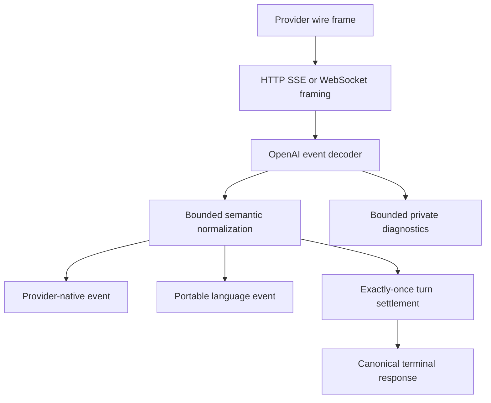
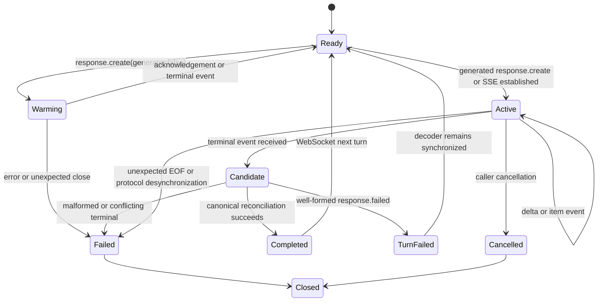
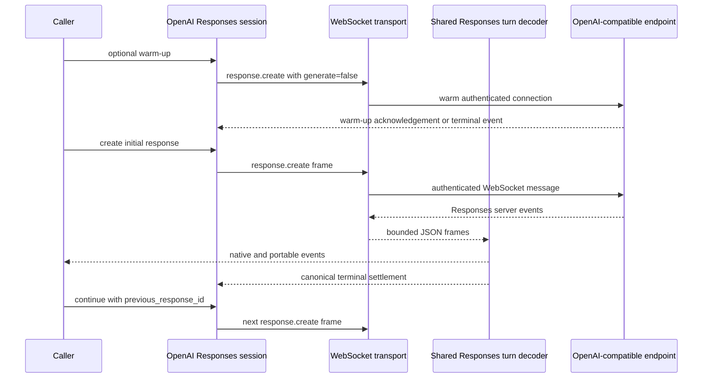

# OpenAI Conversation Conformance and Responses WebSocket - Plan

## Goal Capsule

| Field | Contract |
|---|---|
| Objective | Harden Siumai's OpenAI conversation surface by unifying Chat, Responses SSE, and Responses WebSocket settlement, correcting prompt-cache intent and lifetime semantics, and enabling explicit RFC 6598 relay authorization while preserving provider-native fidelity. |
| Authority | Current official OpenAI documentation is authoritative for wire behavior. Repository architecture and ADRs are authoritative for ownership. The local `repo-ref/ai` checkout is secondary prior art only. |
| Release contract | Keep every workspace package at `0.11.0-beta.9`. Breaking source changes and removal of obsolete cache, stream, or facade APIs are allowed. |
| Stable product boundary | Preserve the unified language interface and the six provider-neutral family traits. Keep Responses WebSocket and other provider-specific sessions provider-owned. |
| Execution profile | Land focused deterministic fixtures before changing each parser or state machine. Run Cargo serially, avoid test matrices, and commit meaningful units with English Conventional Commit messages. |
| Tail ownership | Update facade exports, migration guidance, support evidence, and the completed-revival status narrative after behavior is proven. Do not push, publish, tag, or open a pull request. |
| Stop conditions | Stop only for an official-contract contradiction that changes product behavior, a transport security boundary that cannot be enforced in the owning layer, or overlapping unrelated user changes that cannot be isolated. |

---

## Product Contract

### Summary

This plan hardens the OpenAI conversation stack without reopening Siumai's core architecture.
It normalizes real Chat and Responses stream shapes at the protocol boundary, updates prompt-cache semantics, adds an OpenAI-owned Responses WebSocket session, and adds an explicit RFC 6598 endpoint grant for caller-authorized overlay networks.

### Problem Frame

The completed provider-faithful revival established the correct macro boundaries, but current live traffic exposed several concrete protocol gaps that deterministic fixtures did not cover.
Chat tool-call streams may repeat an established function name as an empty continuation value.
Responses terminal events may abbreviate output items that were already delivered completely through `response.output_item.done`.
The current prompt-cache API still combines historical matching markers and new write intent, treats a provider-side matching lookback as a client validity rule, and does not make the generation-specific TTL-versus-retention contract explicit at the typed provider boundary.

Siumai also exposes OpenAI Realtime WebSocket sessions but not the current Responses WebSocket mode intended for long-running tool workflows.
Finally, the explicit local-network endpoint policy has no grant for RFC 6598 shared address space, so a caller cannot safely opt into a common overlay-network deployment without an external loopback forwarder.

The upstream status API returned `all_ok: true` at `2026-08-09T06:00:10Z`, and every monitored model's latest check was successful.
Its recent rolling uptime remained materially below 100%, so live canaries remain diagnostic evidence rather than release gates.

### Requirements

#### Product and ownership boundaries

- R1. Keep the workspace version at `0.11.0-beta.9` throughout this work.
- R2. Preserve the unified `LanguageModel` path and the six existing family traits; do not introduce a universal client, capability booleans, or another neutral type family.
- R3. Keep provider-native sessions, raw events, replay data, and lifecycle-specific resources owned by the OpenAI provider or OpenAI protocol crates.

#### Chat and Responses semantic conformance

- R4. Treat an empty Chat tool identity continuation as absent only after that identity has been established; reject conflicting non-empty identities and reject completion when identity was never established.
- R5. Decode Responses terminal resources through a partial terminal representation, then fill only policy-permitted missing fields from completed items observed in the same stream before constructing the strict canonical response.
- R6. Preserve any terminal field that is present, reject present-versus-present conflicts, and never use reconciliation to repair malformed semantics that were not independently proven by the stream.
- R7. Produce exactly one high-level settlement for SSE and WebSocket turns: a canonical response, a typed failure, or cancellation; EOF without settlement and duplicate terminal outcomes are errors.

#### Prompt caching

- R8. Replace the ambiguous request-level prompt-cache coordinate list with typed OpenAI content annotations that distinguish historical markers from current write candidates, enforce a maximum of four new writes per request, and do not turn the provider's documented 50-versus-80 historical matching lookback into a client-side validity limit.
- R9. In implicit mode, reserve one write for the server-selected implicit breakpoint and allow at most three explicit write candidates; in explicit mode, allow at most four explicit write candidates.
- R10. Model `prompt_cache_options.ttl` and `prompt_cache_retention` as distinct controls. TTL expresses a minimum cache lifetime and retention expresses a maximum retention policy; preserve both when the selected model supports them, including simultaneous use. Apply exact known-model restrictions, preserve explicit future-model intent, and reject only combinations that the selected known model cannot encode.

#### Provider-native WebSocket mode

- R11. Add an experimental OpenAI-owned Responses WebSocket session that sends `response.create`, supports optional `generate: false` warm-up, reuses the Responses request and event codecs, permits one in-flight response per connection, and supports continuation through `previous_response_id`.
- R12. Do not send `stream` over Responses WebSocket and reject `background` before connection submission because the official WebSocket mode does not support it.
- R13. Reuse transport authentication, endpoint policy, frame bounds, deadlines, redaction, and exactly-once stream settlement instead of implementing a provider-local socket stack; add a shared per-turn Responses budget for accumulated item count and bytes across both SSE and WebSocket framing.

#### Endpoint security and compatibility claims

- R14. Add a caller-selected local-network grant limited to RFC 6598 `100.64.0.0/10`, including IPv4-mapped IPv6 handling, without widening `Official`, `PublicCustom`, RFC 1918, loopback, or link-local policies. Revalidate every redirect and connected peer, reject scheme downgrade, and require same-origin resource redirects for this grant.
- R15. A custom endpoint may exercise the encoded OpenAI protocol, but it must not acquire official OpenAI capability claims, native-resource claims, or replay identity merely because the wire operation succeeds.

#### Evidence and validation

- R16. Use a small set of recorded fixtures derived from observed wire shapes as the release gate; do not add provider-by-model option matrices or parser-like repository scripts.
- R17. Keep credentialed live checks opt-in and diagnostic. Classify relay capacity, account exhaustion, and timeouts as operational evidence unless deterministic protocol evidence proves a Siumai regression.
- R18. Update migration, architecture status, support evidence, facade exports, and rustdoc in the same commit series as the public breaking changes.

### Key Flows

- F1. Chat tool-call streaming
  - **Trigger:** A Chat Completions stream emits a tool-call identity once, then emits empty identity continuation fields with argument deltas.
  - **Steps:** The decoder preserves the established identity, bounds and assembles arguments, emits one canonical tool call, and waits for trailing usage before settlement.
  - **Outcome:** The stable event and terminal response contain the same caller-executed call and canonical JSON input.
  - **Covered by:** R4, R7

- F2. Responses terminal canonicalization
  - **Trigger:** A Responses stream emits complete output-item events followed by a terminal response whose output items omit fields already observed.
  - **Steps:** The decoder records completed items, parses a partial terminal response, applies the endpoint's strict or compatible terminal policy, reconciles only policy-permitted missing fields, validates conflicts, and creates the strict canonical response.
  - **Outcome:** Valid abbreviated terminals settle successfully; mismatched identity or semantics fail with a typed protocol error.
  - **Covered by:** R5, R6, R7

- F3. Responses WebSocket continuation
  - **Trigger:** A caller opens one authenticated Responses WebSocket and sends an initial `response.create`.
  - **Steps:** The session may warm the connection with `generate: false`, streams canonical native and portable events for a generated turn, settles that turn without closing the socket, then accepts a later `response.create` with new input and `previous_response_id` while no response is in flight.
  - **Outcome:** Long-running tool workflows reuse the connection without weakening request validation or settlement guarantees.
  - **Covered by:** R11, R12, R13

- F4. Prompt-cache projection
  - **Trigger:** A request contains retained history markers, current write candidates, and optional TTL or retention controls.
  - **Steps:** Provider validation traverses typed content annotations in canonical request order, preserves bounded historical intent without inventing a semantic lookback cap, enforces the mode-specific current-write budget, and projects the same validated result into Chat or Responses wire blocks.
  - **Outcome:** Caller intent is deterministic and no cache control is silently dropped.
  - **Covered by:** R8, R9, R10

### Acceptance Examples

- AE1. Covers F1. Given a Chat tool call whose first chunk contains `lookup` and later chunks contain an empty name plus argument deltas, the stream completes with one `lookup` call and parsed JSON arguments.
- AE2. Covers R4. Given an established Chat tool identity followed by a different non-empty name or call ID, decoding fails before a local tool can execute.
- AE3. Covers F2. Given a completed function item followed by a terminal function item that omits optional item ID or status, or a completed message followed by a terminal message that omits status, the terminal response inherits only policy-permitted missing fields and settles successfully.
- AE4. Covers R6. Given a terminal function item whose present name, caller, call ID, or canonical arguments disagree with the completed streamed item, the stream returns a typed protocol failure.
- AE5. Covers R7. Given `[DONE]`, EOF, or socket close before canonical terminal settlement, the established stream returns an incomplete-stream error instead of successful EOF.
- AE6. Covers F4. Given implicit mode with three explicit write candidates and retained markers, validation succeeds; a fourth explicit candidate fails because the implicit write consumes the remaining slot.
- AE7. Covers F4. Given explicit mode with four write candidates and additional historical markers, validation preserves the historical markers subject only to ordinary request bounds; a fifth write candidate fails with a typed option error.
- AE8. Covers R10. Given TTL `30m` on a known GPT-5.6 model or retention `24h` on a known legacy model, the selected field reaches both the Chat and Responses wire bodies; a request that supplies both controls fails before transport for known and unknown model policies.
- AE9. Covers F3. Given one active WebSocket response, a second `response.create` on the same session is rejected locally; after settlement, a continuation request is accepted.
- AE10. Covers R12. Given a WebSocket request carrying `background` or an explicit `stream`, configuration fails before any frame is sent.
- AE11. Covers R14. Given an endpoint inside `100.64.0.0/10` and the explicit shared-address grant, both HTTP and WebSocket destination checks accept it; adjacent non-authorized ranges remain rejected.
- AE12. Covers R15. Given a custom RFC 6598 relay using OpenAI-compatible Chat, Responses, and WebSocket shapes, the operations may execute but the provider support manifest remains generic or unverified.
- AE13. Covers F2. Given a terminal message without an ID, strict official OpenAI mode fails; an explicitly compatible endpoint mode may inherit the ID only from one unique completed item at the same output position and kind.

### Success Criteria

- The recorded Chat and Responses relay fixtures pass through direct and streaming paths with canonical tool-call parity.
- Responses SSE and WebSocket share the same terminal normalization and typed failure behavior.
- Prompt-cache validation expresses historical intent and the current write budget without silently trimming explicit writes or enforcing contradictory provider lookback documentation as a client rule.
- The custom overlay-network relay can be configured without a loopback forwarder and without weakening public-endpoint safety.
- Focused crate tests, Clippy, facade contracts, and diff checks pass serially.
- After deterministic fixtures pass, an explicitly authorized live canary is attempted when the upstream status API is green. Representative success or a clearly classified operational failure satisfies diagnostic reporting; neither outcome replaces the offline release gate.

### Scope Boundaries

#### Included

- OpenAI Chat Completions direct and streaming conversation semantics affected by tool identity or late terminal metadata.
- OpenAI Responses direct/SSE canonical response and native event reconciliation.
- OpenAI Responses WebSocket request, event, session, continuation, and settlement behavior.
- OpenAI prompt-cache typed options, model policy, Chat projection, and Responses projection.
- Transport endpoint policy for RFC 6598 shared address space.
- OpenAI facade exports, feature wiring, provider support evidence, migration guidance, and status documentation.

#### Deferred to Follow-Up Work

- A portable cross-provider WebSocket or session trait; one OpenAI Responses implementation is insufficient evidence.
- Generic OpenAI-compatible Responses WebSocket profiles for named providers that have not documented or proven the surface.
- Connection pooling, automatic WebSocket reconnect, or multiplexing; the official mode permits one in-flight response per connection.
- A maintained credentialed smoke script; live validation remains an operator-run diagnostic unless repeated use proves a small script is worthwhile.

#### Outside This Plan

- Replacing the six family traits or introducing a universal client.
- Reworking OpenAI Realtime or Realtime Translation protocols.
- Treating relay failures for stored Responses, Conversations, Files, or Vector Stores as Siumai defects without deterministic contract evidence.
- Expanding unrelated provider breadth or revisiting branded-provider ownership.

---

## Planning Contract

### Assumptions

- A1. The relay's abbreviated terminal output is a compatible contraction only when the endpoint explicitly selects compatible terminal policy and the same stream already delivered one unique matching completed item. Verified official OpenAI mode remains strict.
- A2. The official one-in-flight-per-connection rule is the initial Responses WebSocket concurrency contract; parallel callers use separate sessions.
- A3. `siumai-transport` already owns WebSocket connection, framing, endpoint validation, and resource bounds, while the existing OpenAI Realtime actor is provider-private lifecycle prior art rather than a reusable transport actor. Responses WebSocket therefore needs its own bounded provider session actor plus a transport-neutral Responses request-preparation helper shared with HTTP.
- A4. No new repository script is required. Temporary credentialed probes may run outside the repository, and deterministic fixtures remain the committed evidence.
- A5. The prior revival plan remains complete at the architecture level. This focused plan corrects newly observed protocol shapes and documentation claims without reopening unrelated completed units.

### Key Technical Decisions

- KTD1. **Normalize once inside the protocol decoder.** Chat continuation handling and Responses terminal repair remain below the unified boundary; no consumer adapter and no parallel core type system is introduced. (session-settled: user-approved — chosen over another core reset: the unified interface remains Siumai's primary ergonomic value and the current family boundaries are already sound.) Governs R2, R4-R7.
- KTD2. **Use a partial terminal candidate plus an explicit terminal policy before strict construction.** Responses terminal events decode into a bounded partial representation. Verified official OpenAI mode permits only omissions allowed by the official schema; compatible endpoints may additionally fill a missing message ID from one unique same-position, same-kind completed item. Every present conflict fails. The raw abbreviated native event and the reconstructed canonical response remain distinct public concepts, and misleading accessors that blur them may be removed. Governs R5-R7.
- KTD3. **Share one Responses turn state machine across SSE and WebSocket.** Framing adapters differ, but item accumulation, reconciliation, error classification, cancellation, and settlement do not. Governs R7, R11-R13.
- KTD4. **Keep Responses WebSocket provider-owned and experimental.** The OpenAI provider exposes a typed single-flight session built on transport primitives; `LanguageModel::stream` remains the portable SSE-like request surface. (session-settled: user-approved — chosen over provider-specific behavior in the unified trait: native capabilities remain reachable without weakening the portable contract.) Governs R2, R3, R11-R13.
- KTD5. **Attach role-aware cache intent to semantic content nodes.** The public API uses one typed OpenAI content annotation to distinguish historical markers from current write candidates, removes request-level coordinates and the ambiguous constructor, and rejects excess current writes. In canonical marker traversal order, historical markers must precede current write candidates; interleaving is rejected. It does not trim or reject historical markers using the provider's contradictory 50-versus-80 lookback descriptions; ordinary request and body bounds remain authoritative. (session-settled: user-approved — chosen over preserving the old beta API and over another index-based side table: breaking changes are allowed when they remove ambiguous semantics, and ADR-0012 requires node-scoped provider intent.) Governs R8-R10.
- KTD6. **Model cache lifetime and retention as distinct controls.** Provider validation treats TTL as a minimum lifetime and retention as the deprecated maximum-retention policy. The current Responses schema documents them as independent, so GPT-5.6 may carry `ttl: 30m` and `24h` retention together; GPT-5.5 still rejects TTL and content breakpoints and accepts only `24h` retention. Unknown-model IDs preserve explicit caller intent without name-pattern guessing or silent filtering. Governs R10.
- KTD7. **Add an exact shared-address grant.** `LocalNetworkGrant` gains an RFC 6598-specific variant used by HTTP and WebSocket validation; no broad `unsafe` or `allow_non_public` switch is added. Governs R13-R14.
- KTD8. **Keep live traffic outside release gates.** Committed fixtures reproduce the semantic shapes, while operator-run canaries confirm real compatibility after the deterministic suite passes. (session-settled: user-directed — chosen over heavy smoke automation and digest-based proof: repository tests should remain focused and portable.) Governs R16-R18.

### High-Level Technical Design

#### Semantic pipeline

The framing layer owns transport mechanics.
The Responses decoder owns wire interpretation.
The shared turn state owns item accumulation, parity, and settlement.
Provider and facade layers expose typed construction without reimplementing protocol behavior.

#### Responses turn state

SSE closes after one terminal turn.
WebSocket may return to `Ready` after a successful turn, but it never accepts a second active response on the same connection. A response terminal settles a turn, not the socket session; only explicit close, transport failure, cancellation policy, timeout, or protocol failure settles the session itself.

#### WebSocket continuation sequence

#### Prompt-cache mode contract

| Mode | Server implicit write | Explicit current-write budget | Historical markers | Excess current-write intent |
|---|---:|---:|---|---|
| Implicit or unspecified | 1 | 3 | Preserved subject to ordinary request bounds; provider lookback is not a client validity rule | typed option error |
| Explicit | 0 | 4 | Preserved subject to ordinary request bounds; provider lookback is not a client validity rule | typed option error |

### Sequencing

1. Characterize and fix Chat continuation behavior independently.
2. Extract the shared Responses turn state and fix SSE terminal normalization before adding another transport.
3. Replace the prompt-cache API while the OpenAI provider and protocol crates are already under focused review.
4. Add the exact transport grant before the WebSocket live canary depends on it.
5. Add Responses WebSocket on top of the proven decoder and transport contracts.
6. Update public documentation, evidence, and migration guidance after the public API shape is final.

### Independently Completable Milestones

- **Conversation conformance:** U1 and U2 establish the corrected Chat and Responses SSE boundary and may be reviewed, committed, and validated independently.
- **Prompt-cache contract:** U3 is an independent breaking provider-options milestone with its own migration evidence.
- **Transport and WebSocket:** U4 is an independent endpoint-security milestone. U5 depends on U2 for semantic settlement; only its custom RFC 6598 integration scenario depends on U4.
- **Public assembly:** U6 closes the umbrella plan after all preceding milestones, without making an operational live success a prerequisite for any milestone.

### System-Wide Impact

- **Downstream Rust users:** The prompt-cache marker API breaks source compatibility. The migration guide must show retained markers, write candidates, and mode-specific budgets.
- **Agent and workflow runtimes:** Chat and Responses streams become safer to execute because stable and terminal tool calls agree after protocol normalization.
- **Custom deployments:** Callers can explicitly authorize RFC 6598 endpoints without pretending they are public or private RFC 1918 addresses.
- **Provider evidence:** Official OpenAI claims gain a Responses WebSocket session row only after deterministic session fixtures pass. Custom endpoints remain unverified.
- **Maintenance:** SSE and WebSocket share one Responses state machine, reducing drift across future event additions.

### Alternatives Considered

- **Normalize in Hajimi or every consumer:** Rejected because each consumer would duplicate tool identity, terminal reconciliation, error, and settlement logic.
- **Relax strict Responses wire structs globally:** Rejected because direct responses and completed item events should remain strict; only terminal stream envelopes have proven partial semantics.
- **Expose Responses WebSocket through `LanguageModel::stream`:** Rejected because connection reuse, one-in-flight state, and continuation lifecycle are provider-specific.
- **Add a generic `allow_non_public` endpoint switch:** Rejected because it would collapse distinct loopback, private, link-local, and RFC 6598 trust decisions.
- **Keep the old breakpoint list and silently keep a subset:** Rejected because it cannot distinguish matching history from current write intent and can discard explicit caller intent without notice.

### Risks and Mitigations

| Risk | Impact | Mitigation |
|---|---|---|
| Over-repairing malformed terminal items | A hostile or buggy provider could change semantics and still settle | Fill only absent fields from independently completed same-stream items; reject every present conflict |
| SSE and WebSocket decoder drift | Equivalent events produce different canonical responses | Extract a framing-neutral Responses turn state before implementing WebSocket |
| Incorrect cache budget interpretation | Valid requests fail or excess writes are silently ignored | Enforce only the documented current-write budget; record the official 50-versus-80 historical lookback conflict and leave read-window behavior to the service |
| WebSocket session leaks tasks or credentials | Long-lived connections outlive callers or expose diagnostics | Reuse transport actor shutdown, bounded queues, redacted errors, and deterministic close tests |
| RFC 6598 grant becomes a broad SSRF escape | Credentials reach unintended non-public destinations | Match only `100.64.0.0/10`, validate resolved and connected peers, and keep the grant caller-explicit |
| Caller selects cleartext RFC 6598 transport | API keys and prompts lack transport confidentiality | Keep cleartext available only behind the exact caller-selected local grant, bind credentials to the exact audience, forbid redirect downgrade, document the risk, and prefer HTTPS/WSS whenever the deployment supports it |
| Live relay instability obscures regressions | Operational failures are misclassified as parser bugs | Gate on offline fixtures; check `status.input.im/api/status` before optional canaries and report operational failures separately |

### Sources and Research

- `docs/adr/0014-canonical-language-history-and-replay.md` defines canonical tool input, provider-owned replay, and history projection boundaries.
- `docs/architecture/public-api.md` defines the dual portable/provider-native public surface and experimental session ownership.
- `docs/architecture/transport-contract.md` defines shared HTTP/WebSocket destination and resource-bound enforcement.
- `docs/plans/2026-08-07-001-refactor-provider-faithful-semantic-revival-plan.md` is the completed architecture baseline and must not be reopened as a second reset.
- `https://developers.openai.com/api/reference/resources/chat/subresources/completions/streaming-events` defines usage-only final chunks and stable Chat chunk metadata.
- Current official prompt-caching reference pages disagree on whether the service considers the latest 50 or 80 historical markers. This plan therefore treats the four-write budget as enforceable caller intent and the read lookback as provider behavior, not a client validation limit.
- `https://developers.openai.com/api/reference/resources/responses/methods/create` defines current Responses prompt-cache options, matching window, write budget, retention, metadata, and safety identifier fields.
- `https://developers.openai.com/api/docs/guides/prompt-caching#prompt-cache-retention` distinguishes GPT-5.6+ minimum TTL from legacy maximum-retention policy and lists current exact model restrictions.
- `https://developers.openai.com/api/reference/resources/responses/websocket-events` defines `response.create`, implicit streaming, and unsupported background mode.
- `https://developers.openai.com/api/docs/guides/deployment-checklist#use-websocket-mode` defines persistent continuation, one in-flight response per connection, and the current 60-minute connection limit.
- `https://status.input.im/api/status` supplied current operational evidence on 2026-08-09.
- The local `repo-ref/ai` checkout remains secondary prior art for event fixtures and provider-surface comparison.

---

## Implementation Units

### U1. Normalize Chat tool identity continuations

- **Goal:** Accept empty continuation identity fields after establishment while preserving strict mismatch and completeness checks.
- **Requirements:** R4, R7; F1; AE1-AE2.
- **Dependencies:** None.
- **Files:**
  - `siumai-protocol-openai/src/chat_completions/stream.rs`
  - `siumai-protocol-openai/src/chat_completions/wire.rs`
- **Approach:**
  1. Add a recorded multi-frame tool-call fixture with a non-empty initial identity and empty continuation fields.
  2. Treat an empty continuation as absent only when the field already has a value.
  3. Preserve rejection of changed non-empty identity, never-established identity, oversized arguments, malformed JSON, and duplicate settlement.
  4. Retain the existing buffered `finish_reason` behavior so trailing usage-only chunks remain part of the single terminal response.
- **Execution note:** Add characterization coverage before changing the identity merger.
- **Patterns to follow:** Existing bounded tool-input assembly and `LanguageStreamLifecycle` checks in the same module.
- **Test scenarios:**
  - Covers AE1. Initial name and call ID followed by empty continuation fields and valid argument deltas produces one canonical local tool call.
  - Covers AE2. A later non-empty name differs from the established name and returns a protocol error.
  - A stream that emits only empty identities never produces an executable tool call and fails at completion.
  - A standard `finish_reason` chunk followed by a usage-only chunk and `[DONE]` preserves the tool call, usage, and terminal metadata.
- **Verification:** Direct and streaming Chat fixtures agree on tool identity and canonical JSON arguments, with no regression in late usage retention.

### U2. Canonicalize partial Responses terminal resources

- **Goal:** Accept valid abbreviated terminal output while rejecting every unsupported or conflicting terminal representation.
- **Requirements:** R5-R7; F2; AE3-AE5, AE13.
- **Dependencies:** None.
- **Files:**
  - `siumai-protocol-openai/src/responses/stream.rs`
  - `siumai-protocol-openai/src/responses/wire.rs`
  - `siumai-protocol-openai/src/responses/response.rs`
  - `siumai-protocol-openai/src/responses/tests.rs`
  - `siumai-protocol-openai/tests/fixtures/responses/`
  - `siumai-provider-openai/src/configured/model.rs`
  - `siumai-openai-compatible/src/configured/codec_policy.rs`
  - `siumai-provider-groq/src/language.rs`
  - `siumai-provider-xai/src/providers/xai/language.rs`
- **Approach:**
  1. Introduce a protocol-internal partial terminal envelope rather than weakening strict `ResponseWire` or `OutputItem` decoding globally.
  2. Extract framing-neutral item accumulation, matching, reconciliation, error classification, and settlement into one Responses turn state.
  3. Select an explicit strict-official or compatible terminal policy from provider endpoint ownership; match terminal items by proven item ID, output position and kind, or function call ID as that policy permits, require unique matches, and copy only absent fields.
  4. Compare canonical text, media, reasoning, function name, caller, call ID, and parsed arguments whenever both views provide them.
  5. Enforce one framing-neutral per-turn budget over accumulated item count, item metadata, text, reasoning, and tool-input bytes before inserting state.
  6. Preserve the original abbreviated native event payload separately from the canonical projected response, and remove or rename public accessors that imply the native payload is already canonical.
- **Execution note:** Begin with recorded text and tool fixtures that reproduce the observed abbreviated terminal shapes.
- **Patterns to follow:** Existing provider-opaque replay handling, checked tool JSON parsing, bounded event diagnostics, and stream lifecycle enforcement.
- **Test scenarios:**
  - Covers AE3. A strict official message terminal item may inherit missing status from the completed streamed item, but not a required missing ID.
  - Covers AE3. A function terminal item without item ID inherits it while preserving equal call ID, name, caller, and arguments.
  - Covers AE13. Compatible terminal policy may inherit a missing message ID only from one unique completed item at the same output position and kind; strict official policy rejects it.
  - Covers AE4. Present identity or canonical argument disagreement returns a typed protocol error.
  - Duplicate streamed identities or ambiguous terminal matches fail closed.
  - Many individually small frames that exceed the aggregate item or byte budget produce one typed response-limit failure in both SSE and WebSocket adapters.
  - Covers AE5. `[DONE]`, EOF, or disconnect without terminal settlement returns an incomplete-stream error.
  - A valid terminal followed by EOF settles once; a duplicate terminal fails.
- **Verification:** Existing direct Responses decoding remains strict, verified official SSE follows strict terminal policy, and explicit compatible SSE fixtures settle abbreviated text and tool terminals to canonical responses equal to their completed streamed items.

### U3. Replace the OpenAI prompt-cache marker API

- **Goal:** Express current matching history, write budgets, TTL, and retention through one coherent typed provider contract.
- **Requirements:** R8-R10; F4; AE6-AE8.
- **Dependencies:** None.
- **Files:**
  - `siumai-provider-openai/src/configured/annotations.rs`
  - `siumai-provider-openai/src/configured/options.rs`
  - `siumai-provider-openai/src/configured/model.rs`
  - `siumai-provider-openai/src/configured/provider.rs`
  - `siumai-provider-openai/src/configured/mod.rs`
  - `siumai-provider-openai/src/lib.rs`
  - `siumai-protocol-openai/src/responses/request.rs`
  - `siumai-protocol-openai/src/chat_completions/request.rs`
  - `docs/migration/siumai-next.md`
- **Approach:**
  1. Delete request-level breakpoint coordinates and introduce a typed OpenAI content annotation with explicit historical-marker and write-candidate constructors.
  2. Read only the OpenAI annotation namespace from `MessagePart` nodes, deserialize and validate it at the provider boundary, and traverse markers in canonical message/content order.
  3. Require historical markers to precede current write candidates, reject role interleaving, and enforce the mode-specific write budget on the write suffix; do not impose a semantic 50- or 80-marker read window.
  4. Project only the validated annotated nodes into Chat and Responses wire blocks; protocol crates retain defensive structural bounds but do not own caller-intent policy or a parallel coordinate API.
  5. Keep TTL and retention as separate typed fields, preserve their documented independent semantics, apply exact known-model restrictions, and preserve explicit unknown/custom-compatible intent without model-name pattern guessing or silent filtering.
  6. Ensure raw option merging cannot bypass final cache validation.
- **Execution note:** Treat the public type replacement as one atomic breaking unit with migration docs and focused fixtures.
- **Patterns to follow:** Typed provider option validation, final-wire validation after raw merge, and open future-model handling in the configured OpenAI provider.
- **Test scenarios:**
  - Covers AE6. Implicit mode accepts three explicit write candidates and rejects a fourth.
  - Covers AE7. Explicit mode accepts four write candidates and rejects a fifth.
  - Historical marker count is not rejected or silently trimmed merely for exceeding 50 or 80; ordinary request/body bounds still apply.
  - A node cannot carry conflicting OpenAI cache roles, and malformed or wrong-target annotations return a typed provider error.
  - A historical marker after the first current write candidate is rejected before either protocol encoder runs.
  - Covers AE8. TTL `30m` reaches known GPT-5.6 Chat and Responses bodies, retention `24h` reaches known legacy Chat and Responses bodies, and supplying both controls fails before transport for known and unknown model policies.
  - Known unsupported model-policy combinations fail before transport; an unknown compatible model does not silently lose explicit fields.
  - Raw extra options cannot inject protected cache fields around typed validation.
- **Verification:** Provider option tests and one request fixture per protocol prove the current-write budgets, historical-marker preservation, generation-sensitive lifetime controls, and final-wire protection.

### U4. Authorize RFC 6598 endpoints explicitly

- **Goal:** Let callers opt into shared address space for HTTP and WebSocket without weakening any other endpoint policy.
- **Requirements:** R13-R15; AE11-AE12.
- **Dependencies:** None.
- **Files:**
  - `siumai-transport/src/endpoint.rs`
  - `siumai-transport/src/resource.rs`
  - `siumai-transport/src/websocket.rs`
  - `siumai-transport/src/lib.rs`
  - `siumai-transport/tests/transport_contract.rs`
- **Approach:**
  1. Add a non-exhaustive `LocalNetworkGrant` variant for RFC 6598 shared address space.
  2. Apply the same exact range predicate to initial URL validation, DNS resolution, connected peer validation, resource transport, and WebSocket transport.
  3. Keep explicit scheme requirements and credential audience validation unchanged.
  4. Reject redirect scheme downgrade and require same-origin redirects for resources authorized through the shared-network grant.
  5. Add rustdoc that distinguishes overlay/shared addresses from RFC 1918 private networks and globally routable public addresses, including the caller's responsibility when explicitly selecting cleartext local transport.
- **Patterns to follow:** Existing loopback, private-network, and link-local grants plus destination revalidation after resolution and connect.
- **Test scenarios:**
  - Covers AE11. `100.64.0.1` and `100.127.255.254` pass only under the new explicit grant.
  - `100.63.255.255` and `100.128.0.0` remain rejected.
  - An IPv4-mapped IPv6 address inside the range follows the same policy.
  - A deterministic resolver accepts a hostname whose complete answer set is inside RFC 6598 and rejects mixed RFC 6598 plus public or private answers.
  - Connected-peer revalidation rejects a peer outside RFC 6598 even after an allowed resolution result.
  - HTTP resource and WebSocket endpoint checks produce the same result for the same target.
  - Shared-network resource redirects reject cross-host, cross-port, and scheme-downgrade targets even when the next address also falls inside RFC 6598.
  - Public custom and official endpoint policies still reject cleartext or non-public destinations.
- **Verification:** Transport contract tests prove the exact range and unchanged adjacent policy behavior without provider-specific duplicates.

### U5. Add an OpenAI Responses WebSocket session

- **Goal:** Expose a typed provider-native persistent Responses session that reuses the canonical Responses turn state.
- **Requirements:** R3, R7, R11-R13, R15; F3; AE5, AE9-AE10, AE12.
- **Dependencies:** U2. The custom RFC 6598 integration scenario also requires U4.
- **Files:**
  - `siumai-provider-openai/Cargo.toml`
  - `siumai-provider-openai/src/configured/provider.rs`
  - `siumai-provider-openai/src/configured/model.rs`
  - `siumai-provider-openai/src/configured/responses_websocket.rs`
  - `siumai-provider-openai/src/configured/mod.rs`
  - `siumai-protocol-openai/src/responses/request.rs`
  - `siumai-protocol-openai/src/responses/stream.rs`
  - `siumai-transport/src/websocket.rs`
  - `siumai-provider-openai/tests/responses_websocket_contract.rs`
- **Approach:**
  1. Add an OpenAI Responses WebSocket feature that depends on the existing transport WebSocket capability but remains distinct from OpenAI Realtime.
  2. Extract a transport-neutral Responses call-preparation helper from `configured/model.rs`; use it for both HTTP and WebSocket so `response.create` receives the same normalized request and typed options, omits only internally derived HTTP `stream` metadata, and rejects explicit caller-supplied `stream` or `background` intent before sending a frame.
  3. Support an explicit `generate: false` warm-up request without pretending that it is a generated turn, and expose any returned provider event through the native surface.
  4. Implement a bounded session actor with one active generated turn, explicit cancellation and close, configurable connect, idle, turn, and session deadlines, and no hidden reconnection.
  5. Feed incoming JSON frames into the shared Responses turn state and expose provider-native events plus the canonical terminal response.
  6. Treat response completion or a well-formed `response.failed` as turn settlement. Return the socket to ready when decoder state remains synchronized; reserve session settlement for explicit close, transport failure, cancellation policy, timeout, malformed framing, or protocol desynchronization.
  7. Preserve custom endpoint operation without adding official support claims unless the provider-owned default endpoint and feature are used.
- **Execution note:** Build on deterministic mock WebSocket fixtures first; run the authorized live canary only after offline tests pass.
- **Patterns to follow:** OpenAI Realtime's bounded actor and shutdown discipline, `siumai-transport` WebSocket framing, and U2's Responses settlement state.
- **Lifecycle contract:** Reuse the existing experimental session lifecycle vocabulary and terminal
  types, but keep the public Responses API provider-owned. `ProviderSession::send/receive` would
  require an untyped command envelope and would hide turn ownership, so this milestone deliberately
  does not implement that generic trait.
- **Test scenarios:**
  - Initial `response.create` encodes the validated Responses body without `stream` or `background`.
  - A `generate: false` warm-up is encoded explicitly, settles through the ordinary Responses event
    sequence with a terminal response ID, and does not fabricate a canonical language response.
  - Covers AE9. A second create while active returns a typed local state error without sending a frame.
  - A completed first response permits a second continuation using `previous_response_id`.
  - Covers AE10. Explicit `stream` or `background` configuration fails before send.
  - Covers AE5. Socket close before terminal settlement returns an incomplete-stream failure.
  - In-band provider error preserves typed category, retry hint, safe message, and bounded private diagnostics.
  - A well-formed failed turn can be followed by a successful generated turn on the same synchronized connection.
  - Duplicate terminal, conflicting abbreviated terminal, oversize frame, queue saturation, cancellation, and timeout each produce one terminal outcome.
  - Custom endpoint plus explicit custom replay domain and RFC 6598 grant connects without gaining official claims.
- **Verification:** Provider session fixtures prove two sequential turns, single-flight rejection, shared SSE/WS canonical parity, and deterministic shutdown with no task leak.

### U6. Publish the corrected OpenAI conversation surface

- **Goal:** Make the new behavior discoverable, migrate breaking callers, and align support evidence with verified scope.
- **Requirements:** R1-R3, R15-R18; AE12.
- **Dependencies:** U1-U5.
- **Files:**
  - `siumai/Cargo.toml`
  - `siumai/src/providers/openai.rs`
  - `siumai/tests/facade_contract.rs`
  - `siumai-provider-openai/src/lib.rs`
  - `docs/architecture/public-api.md`
  - `docs/architecture/transport-contract.md`
  - `docs/providers/support-policy.md`
  - `docs/migration/siumai-next.md`
  - `docs/migration/siumai-next-status.md`
  - `README.md`
- **Approach:**
  1. Add curated facade exports and a narrowly scoped feature for Responses WebSocket without merging it with Realtime.
  2. Document the cache marker migration, mode budgets, generation-sensitive lifetime controls, custom endpoint grant, and every Responses native-event accessor removed or renamed by U2 with its direct replacement.
  3. Add an official OpenAI Responses WebSocket support row with source and verification date only for the provider-owned default endpoint.
  4. Revise the revival status narrative so architecture completion is not presented as proof that every future wire shape is closed.
  5. Run a final operator-authorized canary against the configured relay after confirming `status.input.im/api/status` is green; record only result categories and timestamps, never credentials or private payloads.
- **Execution note:** Keep live evidence out of default tests. Use an operator-run temporary harness outside the repository; any maintained credentialed smoke script remains deferred.
- **Patterns to follow:** Curated facade modules, dated support manifests, focused migration tables, and the existing distinction between official and custom endpoint evidence.
- **Test scenarios:**
  - Facade feature combinations expose Responses WebSocket only when the owning feature is enabled.
  - Default OpenAI construction reports the official session claim; custom endpoint construction does not.
  - Public examples and rustdoc compile against the replacement cache types and WebSocket session.
  - The migration guide names every removed or renamed cache API and Responses native-event accessor with its direct replacement.
  - The opt-in live sequence exercises Chat text/tool stream, Responses text/tool SSE, repeated cache request, and two sequential WebSocket turns; operational failures are classified separately from parser failures.
- **Verification:** Facade contracts, rustdoc, support evidence, and migration documentation agree with the implemented feature gates and provider ownership.

---

## Verification Contract

| Scope | Required validation | Done signal |
|---|---|---|
| Formatting | `cargo fmt --all -- --check` after scoped formatting | No formatting diff |
| Chat protocol | `cargo nextest run -p siumai-protocol-openai --all-features -j 1 --test-threads 1` | Chat continuation and late-usage fixtures pass |
| Responses protocol | Same focused protocol suite plus the recorded Responses fixtures | Partial terminal, parity, settlement, and error cases pass |
| OpenAI provider | `cargo nextest run -p siumai-provider-openai --all-features -j 1 --test-threads 1` | Cache and WebSocket provider contracts pass |
| Transport | `cargo nextest run -p siumai-transport --all-features -j 1 --test-threads 1` | RFC 6598 HTTP/WS policy cases pass |
| Facade | `cargo nextest run -p siumai --all-features -j 1 --test-threads 1` plus relevant no-default feature checks | Curated exports and feature gates compile and behave as documented |
| Lints | Serial Clippy for the four affected crates with all targets and features | No warnings under `-D warnings` |
| Documentation | Affected doctests and facade examples | Public migration paths compile |
| Repository hygiene | `git diff --check` and explicit diff review before each commit | No unrelated changes, secrets, build output, or abandoned attempts |
| Live diagnostic | Operator-authorized temporary harness after the status API is green | Successful representative flows, or a clearly separated operational failure report |

The final workspace-wide test lane runs only if focused validation or dependency changes show cross-workspace risk.
No provider-by-model Cartesian test matrix is required.

---

## Definition of Done

### Per-Unit Completion

A unit is complete when:

1. Its owning crate enforces the stated invariant before exposing data to the next layer.
2. The focused deterministic tests cover the named success, conflict, boundary, and lifecycle cases.
3. Each implementation unit updates its owned API rustdoc and tests. U6 owns facade exports, support evidence, migration finalization, and cross-cutting documentation after the public API shape is final.
4. Focused nextest, Clippy, formatting, and diff checks pass serially.
5. Replaced APIs, duplicate state machines, superseded fixtures, dead helpers, and abandoned experiments are removed.
6. The unit is committed with a scoped English Conventional Commit message after diff review.

### Global Completion

The goal is complete only when:

- The workspace still reports version `0.11.0-beta.9`.
- The unified language API and six family traits remain intact.
- Chat empty identity continuations work without weakening mismatch detection.
- Responses abbreviated terminal resources settle only after bounded, conflict-checked reconciliation.
- SSE and WebSocket turns share one Responses semantic state machine and exactly-once settlement contract.
- The prompt-cache API distinguishes historical markers from current writes, enforces the mode-specific current-write budget without inventing a client-side historical lookback cap, preserves independent TTL and retention controls when supported, and rejects only exact known-model incompatibilities.
- Responses WebSocket supports sequential continuation, one in-flight response per connection, typed failure, cancellation, timeout, and conservative close behavior.
- RFC 6598 endpoints require an explicit exact grant for both HTTP and WebSocket paths.
- Official and custom endpoint claims remain distinct.
- Focused offline release gates pass, the authorized live canary is reported separately, and no credential or private provider payload enters the repository.
- All obsolete code and abandoned implementation attempts are removed, all intended changes are committed, and the working tree contains no unrelated modifications introduced by this goal.
