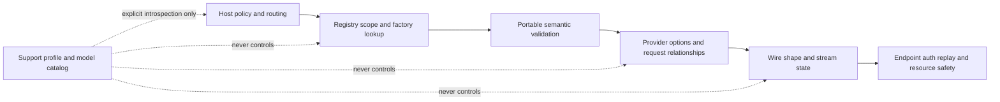
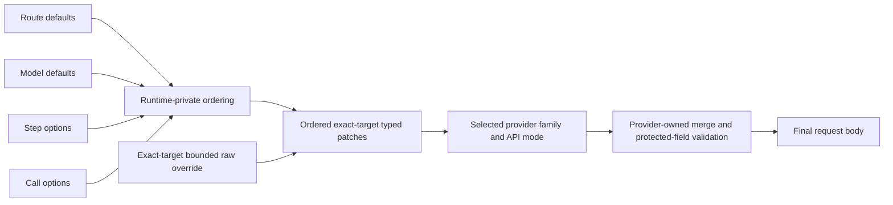
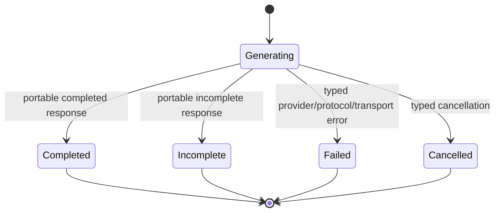

# Validation Ownership, Forward Compatibility, and Terminal Semantics - Plan

## Goal Capsule

| Field | Contract |
|---|---|
| Objective | Remove runtime authority over dated provider product policy, make provider options forward-compatible, and replace overlapping portable terminal states while preserving strict semantic, security, resource, replay, and stream-settlement invariants. |
| Product boundary | Preserve the six provider-neutral family traits, provider-owned native APIs, Registry lookup, runtime orchestration, and the curated facade. Do not introduce a universal client or another neutral type family. |
| Release contract | Keep every workspace package at `0.11.0-beta.9`. Breaking source changes, renamed or deleted APIs, and removal of obsolete policy code are expected. |
| Primary authority | Current official provider wire documentation and repository ADRs own executable behavior. Provider support manifests and model catalogs are dated introspection, not request-time truth. The local `repo-ref/ai` checkout is secondary prior art. |
| Execution posture | Prefer deletion and narrower seams over compatibility aliases. Add only focused deterministic contract fixtures. Run Cargo serially and reuse the workspace target directory. |
| Tail ownership | Update architecture, migration, facade exports, examples, and support-policy wording in the same change series. Commit reviewable units with English Conventional Commit messages. Do not push, publish, tag, or open a pull request. |
| Stop conditions | Stop only for a contradiction in an official wire contract that changes the target semantics, an unresolvable security ownership gap, or overlapping unrelated user changes that cannot be isolated safely. |

---

## Product Contract

### Summary

Siumai should be stricter than a dynamic SDK where Rust can guarantee stable semantics, but it should not turn mutable provider product knowledge into a local execution allowlist or expose overlapping portable terminal states.
This refactor removes shallow policy abstractions that currently let model catalogs, lifecycle evidence, endpoint claims, or model-name heuristics reject or rewrite calls.
It preserves the unified interface and strengthens the provider boundary around four durable responsibilities:

1. canonical portable semantics;
2. provider-owned wire encoding and typed options;
3. transport, replay, resource, and diagnostic safety;
4. exactly-once stream settlement and typed failures.

The result is a caller-first API: open model identifiers remain callable, explicit options are encoded or rejected for a structural reason, raw provider options are a bounded forward-compatibility escape hatch, dated support evidence remains available only through explicit introspection, and portable completed/incomplete results are separated cleanly from typed failure/cancellation.

### Problem Frame

The current workspace has the correct macro architecture, but several later abstractions assign authority to the wrong layer:

- every `ProviderRegistration` family binding carries a `ModelPolicy`, even though the binding already proves the family and exact API mode;
- providers use static model catalogs to reject retired models or attach automatic lifecycle warnings during normal calls;
- OpenAI and Anthropic request preparation uses exact model IDs to remove, reject, or constrain explicit caller options that the selected wire protocol can represent;
- OpenAI support claims select `ResponsesTerminalPolicy::{Strict, Compatible}`, so dated evidence changes protocol decoding behavior;
- core exposes route, model, runtime-step, and provider-default option origins to every provider merger, leaking host orchestration concepts into a provider-neutral contract;
- the checked raw escape hatch is still reinterpreted through closed typed enums or a global recursive field-name denylist, preventing legitimate future provider values;
- portable language responses maintain overlapping `LanguageResponseStatus`, `FinishReason`, and `StreamTerminal` terminal axes, causing direct failures to appear as successful values while streaming uses typed failed terminals.

The local AI SDK reference provides useful evidence for open model IDs, provider-scoped options, and Registry construction without a policy gate. It is not the target architecture: Siumai must retain stronger typed errors, canonical tool input, replay provenance, resource bounds, and exact stream settlement, and must not copy AI SDK model-name heuristics or silent option omission.

### Requirements

#### Stable product shape

- R1. Keep every workspace package at `0.11.0-beta.9`.
- R2. Preserve `LanguageModel`, `EmbeddingModel`, `RerankModel`, `ImageModel`, `SpeechModel`, and `TranscriptionModel` as the provider-neutral portable families.
- R3. Preserve provider-owned sessions, resources, hosted tools, opaque replay data, and native protocol events outside the portable family contracts.
- R4. Do not introduce a universal provider trait, capability boolean matrix, downcast ladder, or second neutral request/response type family.

#### Validation ownership

- R5. Treat role safety, canonical caller-executed tool input, stream settlement, typed error classification, replay provenance, endpoint/authentication isolation, and resource bounds as hard local invariants.
- R6. Treat model lifecycle, commercial availability, documented model capability, rolling aliases, provider product eligibility, and support-claim freshness as advisory data that cannot block model construction or a provider call.
- R7. Put a rule in the lowest layer that can enforce it completely: core owns portable shape, protocol owns wire shape, provider owns provider-specific relationships, transport owns network authority, and the host owns deployment and business policy.
- R8. Unknown or future model identifiers remain callable whenever the selected family and protocol can encode the request safely.

#### Explicit caller intent

- R9. The effective value selected after documented precedence must either reach the final wire or fail with a typed pre-transport error explaining a stable structural conflict. A lower-precedence typed value may be superseded by a later typed patch or the explicit raw override, but it is never removed for an unrelated model-policy heuristic.
- R10. Do not silently remove or alter an explicit option because a model-name table predicts that the provider may reject it.
- R11. A portable request field that the selected API mode cannot encode fails locally instead of being omitted with only a warning.
- R12. Feature-driven protocol requirements, such as beta headers or wire variants, are derived from the requested feature and selected protocol, not from a dated model allowlist.

#### Provider option seam

- R13. Replace fixed public route/model/runtime/provider option origins with origin-free ordered typed patches plus at most one exact-target raw override. Typed patches apply in order with later provider-owned field values winning according to that provider's merge semantics; nullable clearing and collection replacement remain provider-defined.
- R14. `CallOptions` may carry explicitly optional patches for multiple route/scope/family targets. A selected provider consumes only its exact target; valid non-selected fallback targets remain inert and inspectable so one portable call configuration can support Registry routes or host fallback without hiding ordinary target mistakes.
- R15. Raw provider options must declare an exact provider, family, and API-mode target, remain bounded by object/byte/depth/field limits at insertion time, and never reach endpoint, authentication, HTTP headers, signing, retry, or transport configuration. A mode-less target is valid only for a family registration with no API mode; a family exposing multiple modes requires the exact selected mode and never treats omission as a wildcard.
- R16. Provider-specific merge semantics remain provider-owned. Runtime may assemble precedence, but it must not perform a generic deep merge or learn provider schemas.
- R17. Remove the global recursive protected-name scan. Provider codecs reject protected canonical body fields for their exact schema; type and module boundaries prevent raw request JSON from becoming transport authority.
- R18. The raw escape hatch may carry future provider-owned fields and future values of known provider fields without being decoded through the current release's closed enum set. For non-canonical provider body fields it is the authoritative final overlay; canonical request fields and provider-declared protected fields always fail instead of being overridden.
- R41. The ordinary typed convenience entry infers its exact target from `TypedProviderOptions` and is required for the selected call; a target mismatch returns a typed error. Advanced Registry/fallback hosts opt into explicitly optional exact-target patches, whose non-selected targets remain inert and inspectable as unconsumed diagnostics.
- R43. Ordinary single-provider callers do not construct `ProviderOptions` or `ProviderOptionTarget` manually. Public typed builders erase and target options internally; explicit target construction is reserved for raw and routing-aware fallback use.
- R47. Every raw-consuming provider mode and compatibility codec must declare an explicit path-aware canonical/protected body policy. There is no permissive default: a mode without a reviewed policy rejects raw options.
- R48. One `CallOptions` accepts at most 64 provider-option entries, 32 distinct targets, and 512 KiB of aggregate retained encoded option data across typed and raw patches. Bounded raw bytes are rejected before materialization; an already materialized `Value` is checked by an early-abort accounting walk before cloning, filtering, or provider merge, while caller-side allocation remains outside Siumai's guarantee.
- R49. Required ordinary options apply only to the concrete model receiving the call. Optional fallback patches bind to an exact Registry route, `ProviderScope`, family, and opaque configured-instance identity so provider-body credentials such as MCP authorization cannot cross instances or replay audiences. Raw fallback is unavailable without that instance binding.
- R50. Deadline ownership is explicit. Transport/setup deadlines return the outer setup error; once a stream is established, the owning stream orchestrator converts an idle/total deadline into exactly one failed or cancelled `StreamTerminal`, cancels the underlying transport, and suppresses any later provider terminal from the same stream.
- R51. A usage event is a cumulative per-call snapshot unless a protocol explicitly marks it as a delta. Runtime replaces/reconciles snapshots within one provider call, adds settled usage across calls, and never adds the same terminal snapshot twice. Unknown dimensions never become zero.
- R52. Replay-critical native state has an explicit authority rule. If incremental and terminal observations disagree on item identity, encrypted reasoning/replay material, or another provider-declared replay field, portable semantic success may still be returned, but native replay is marked unavailable rather than silently merging incompatible state.
- R53. `PartialLanguageOutput` is observational and non-executable by construction: its portable content excludes caller-executed tool calls and tool results, and any provider-native tool/replay fragment remains native-only or sensitive. Its item and byte bounds are enforced before publication.
- R54. Incremental event ordering remains checked when a protocol supplies sequence numbers: reject duplicate or backwards semantic deltas, but do not require terminal snapshots to repeat sequence numbers or be contiguous with the event stream.
- R55. Raw overlays retain stable shape and relationship validation without closed-value gating. A representative codec rejects wrong JSON kinds, fixed numeric/resource violations, and impossible cross-field combinations locally; unknown fields and future values pass within bounds.
- R56. A model-dependent branch may survive only when official wire evidence proves that the selected protocol cannot encode or interpret the request correctly without that branch. Such a branch must use protocol baseline behavior for unknown IDs and have a focused known-dialect and unknown-baseline fixture.
- R57. Responses decoding has a provider-owned wire-normalization seam before the shared semantic reconciler. Each maintained dialect declares permitted omissions, aliases, and identity fallbacks; support claims and model catalogs never select this descriptor.
- R58. Every configured provider instance that can consume sensitive typed or raw body data has an opaque, non-serializable instance identity that cannot be reconstructed from provider, route, scope, replay-domain, family, or API-mode labels. Reusable unbound options are limited to non-instance-sensitive fields.
- R59. Raw resource limits state their enforcement boundary honestly. A bounded raw-bytes constructor rejects before JSON materialization; a `Value` constructor performs an early-abort accounting walk and does not claim to protect allocations already made by the caller.
- R60. Direct failed/cancelled language calls preserve bounded usage and observational partial content through a language-specific typed error context, or the public contract explicitly declares direct failure data lossy. This plan chooses parity: direct and established-stream failures expose the same bounded non-executable partial context without embedding a provider-native resource in generic errors.
- R61. Responses reconciliation has a normative per-item/per-field matrix identifying portable, executable, replay-required, and diagnostic-only data, including the canonical replay source or replay-unavailable outcome when incremental and terminal observations disagree.
- R62. Partially observed portable items may be completed by a terminal snapshot only as a whole aligned item after dialect normalization and canonical validation; field-by-field repair of an already-present malformed item remains an error.

#### Support evidence and model policy

- R19. Delete `ModelPolicy`, `ModelPolicyContext`, `ModelPolicyDecision`, `SupportState`, `UnsupportedReason`, `ProviderRegistration::evaluate`, and `Registry::evaluate` from the public execution path.
- R20. `ProviderRegistration` family bindings contain only exact scope and factory. Missing families remain typed lookup errors; alternate API modes remain separate registrations.
- R21. Keep provider profiles, model constants, catalogs, support manifests, official sources, verification dates, fidelity, and lifecycle data only as explicit provider-owned introspection and maintenance evidence.
- R22. Do not replace `ModelPolicy` with another runtime policy trait or make advisory querying a prerequisite for construction, planning, option merge, transport, retry, or decoding.
- R23. Remove automatic unknown, rolling, deprecated, or retired model warnings from normal response and stream execution. Hosts that need allowlists or lifecycle guidance own that policy above Registry.
- R42. Migration guidance must show the supported host-policy replacement: retain the configured concrete provider or its support/profile value alongside Registry registration, inspect that explicit evidence before execution if desired, and keep the resulting allowlist/warning decision outside Registry. Registry intentionally provides no generic advisory query in this release.
- R45. Before deleting each policy implementation, classify every branch: family/API-mode availability moves to registration and scope identity; fixed-endpoint/model constraints stay in the concrete model factory or request planner; provider option relationships stay in provider validation; lifecycle/catalog/commercial rules are deleted from execution. No structural check may disappear merely because its old container is deleted.

#### OpenAI Responses settlement

- R24. Delete `ResponsesTerminalPolicy::{Strict, Compatible}` and any support-claim-driven selection of decoder behavior.
- R25. Use one semantic reconciler for official and compatible endpoints. Hard parity covers portable text/refusal semantics and caller-executed item kind, identity, ownership, call ID, tool name, and canonical JSON input.
- R26. Provider-native phase, transient status, optional metadata, sequence numbers, encrypted bookkeeping, and other non-portable details do not fail a portable stream solely because terminal and incremental snapshots differ. Preserve them in native events, the terminal native resource, or bounded diagnostics.
- R27. Keep strict duplicate-terminal, event-after-terminal, executable-item conflict, malformed input, typed in-band failure, and unexpected-EOF enforcement.
- R28. Do not use dated support evidence, endpoint claim labels, or model catalogs to choose stream reconciliation behavior.
- R46. Reconciliation diagnostics have two classes: public diagnostics contain only bounded static summaries such as field kind and count; raw metadata, fingerprints, encrypted content, event payloads, and provider messages remain behind the existing bounded sensitive-response access contract and are redacted from default `Debug`, `Display`, serialization, source chains, and tracing.

#### Language terminal model

- R29. Replace `LanguageResponseStatus × FinishReason` with one portable termination value that represents only completed or incomplete generation results.
- R30. Portable direct provider failure and cancellation return a language-specific typed failure wrapper containing the sanitized `Error` plus optional bounded `PartialLanguageOutput`; established streams use `StreamTerminal::Failed` or `StreamTerminal::Cancelled` with the same optional partial shape.
- R31. Provider-native response/resource APIs continue to expose complete failed, cancelled, queued, or in-progress wire states when those states are meaningful for the provider product.
- R32. Missing usage remains unknown, and terminal refactoring must preserve late usage-only chunks and direct/stream usage parity.
- R37. A failure before stream establishment remains the outer setup `Error`. After establishment, provider in-band failure, timeout, unexpected EOF, and cancellation settle the stream exactly once through `StreamTerminal`; they never reappear as successful responses.
- R38. Replace failed/cancelled `Option<LanguageResponse>` payloads with an optional bounded `PartialLanguageOutput` containing only observational text/reasoning/refusal content and `Usage`. It has no completion status, provider metadata, executable tool authority, or replay authority. Direct and stream failures expose the same partial shape; callers requiring the complete failed resource use the provider-native API.
- R39. Runtime accumulates usage from ordinary stream usage events and the optional partial output without double counting, then maps failed/cancelled terminals into its existing typed run failure/cancellation outcomes. Server adapters map pre-establishment/direct failures to sanitized HTTP errors and established failures to sanitized terminal events.
- R40. Queued and in-progress states remain provider-native only. Portable `length` and content-filter endings map to incomplete results, refusal maps to a completed refusal reason plus refusal content when present, and provider failed/cancelled states map to outer typed outcomes.
- R44. The terminal serde break increments `RUN_SNAPSHOT_SCHEMA_VERSION` from 5 to 6. Versions 5 and earlier are rejected from the minimal envelope before payload decoding, and migration guidance states that pre-refactor checkpoints cannot resume in this beta.

#### Evidence and implementation discipline

- R33. Use focused deterministic fixtures for representative invariants and migration contracts. Do not build provider-by-model-by-option matrices.
- R34. Do not add repository scripts that parse Rust, infer call graphs, duplicate Cargo, or maintain capability digests.
- R35. Live provider checks remain opt-in diagnostics and are not required for this architecture refactor unless a changed wire path cannot be proven offline.
- R36. Delete obsolete implementations, tests, compatibility aliases, exports, and documentation rather than retaining two public policy models.

### Key Flows

- F1. Open future-model execution
  - **Trigger:** A caller asks Registry or a configured provider for a model ID absent from Siumai's dated catalog.
  - **Steps:** Registry resolves the selected family binding, constructs the model from the open ID, provider request preparation validates structural semantics and explicit options, and transport sends the request without consulting lifecycle evidence.
  - **Outcome:** The request reaches the provider when it is structurally encodable; any actual product rejection returns through the provider error contract.
  - **Covered by:** R6-R12, R19-R23

- F2. Multi-target provider options
  - **Trigger:** One portable call carries OpenAI Responses, OpenAI Chat, and Anthropic typed options for possible host-selected routes.
  - **Steps:** Runtime assembles its internal precedence, `CallOptions` validates target envelopes and resource bounds for every patch, required ordinary options must match the selected target, optional fallback patches filter by exact provider/family/API mode, and the provider applies its defaults, typed patches, then its one raw override.
  - **Outcome:** A mistargeted ordinary option fails; intentionally optional foreign targets remain inert and are observable as unconsumed diagnostics; selected typed intent reaches wire or returns a typed structural error; no provider sees host origin names.
  - **Covered by:** R13-R18, R41, R43

- F3. Forward-compatible raw option
  - **Trigger:** A provider introduces a new request field or a new string value for a known provider-owned field before Siumai publishes a typed variant.
  - **Steps:** The caller supplies a bounded exact-target raw object, core validates target and resource bounds, the provider rejects canonical/protected body conflicts, and the raw value overlays the provider-owned body without closed-enum decoding.
  - **Outcome:** The value reaches wire without gaining transport authority or bypassing request-shape limits.
  - **Covered by:** R15-R18

- F4. Responses stream reconciliation
  - **Trigger:** A Responses stream exposes incremental items and a terminal resource with abbreviated or changed provider-native bookkeeping.
  - **Steps:** The decoder preserves native events, canonicalizes caller-executed input once, compares portable and executable semantics, records non-semantic native drift without failing, and settles exactly once.
  - **Outcome:** Provider metadata variation is tolerated; executable disagreement, duplicate terminal, in-band failure, or missing settlement remains a typed failure.
  - **Covered by:** R24-R28

- F5. Portable terminal parity
  - **Trigger:** A provider returns a completed, incomplete, failed, or cancelled direct response, or the equivalent established stream terminal.
  - **Steps:** Completed/incomplete results construct the one portable termination value. Failed/cancelled direct responses map to `LanguageCallError` with sanitized error plus bounded observational partial context, while streams map to failed/cancelled terminals with the same partial shape where available.
  - **Outcome:** Consumers no longer inspect a successful `LanguageResponse` to discover failure, and direct/stream behavior has one documented correspondence.
  - **Covered by:** R29-R32

- F6. Error handoff across model, runtime, server, and facade
  - **Trigger:** A call fails before stream establishment, or an established stream encounters an in-band provider failure, timeout, cancellation, or unexpected EOF after producing partial output or usage.
  - **Steps:** Setup failures remain outer errors. Established failures settle once with a sanitized error and optional `PartialLanguageOutput`; the deadline owner wins a race by cancelling the source and suppressing later provider settlement; runtime reconciles cumulative usage snapshots once; server projects either an HTTP error or a terminal event according to establishment state; facade exports the same core types without a parallel wrapper.
  - **Outcome:** Every layer preserves the distinction between setup failure and established-stream settlement, exposes no successful failed response, and retains only bounded portable partial data.
  - **Covered by:** R30-R32, R37-R40

### Acceptance Examples

- AE1. Covers F1. A catalog-unknown `gpt-future-private` language model resolves and encodes through a valid registration without `Registry::evaluate` or a policy warning.
- AE2. Covers R6 and R23. A model marked deprecated or retired in provider evidence remains constructible and callable; its lifecycle is visible only through explicit provider profile/support introspection.
- AE3. Covers R9-R11. An explicit OpenAI sampling or reasoning option is present on final wire, or the selected API mode returns a typed structural error; no model-name branch silently deletes it.
- AE4. Covers R12. An Anthropic feature that requires a beta header derives that header from the requested feature even for an unknown model ID; no exact-model allowlist blocks it.
- AE5. Covers F2. A call carrying typed options for multiple providers succeeds through the selected target while unrelated provider or API-mode patches remain inert.
- AE6. Covers R13 and R16. Provider defaults followed by route, model, runtime-step, and call intent produce the documented final value even though the provider sees only ordered typed patches, not origin labels.
- AE7. Covers F3. An exact-target raw object containing a future OpenAI or Anthropic provider value reaches the request body without re-decoding through a closed enum.
- AE8. Covers R15 and R17. A legitimate nested provider body field named `headers`, such as an MCP server configuration, can pass the core carrier; an attempt to override canonical request input or transport authentication is rejected by the owning provider boundary.
- AE9. Covers R18. A raw option targeted at OpenAI Chat cannot be consumed accidentally by OpenAI Responses or another provider.
- AE10. Covers F4. Removing verified support claims or changing endpoint claim labels does not change Responses reconciliation output for the same event sequence.
- AE11. Covers R25-R27. A terminal metadata or sequence-number difference does not fail an otherwise equal stream, while a changed local tool call ID, name, owner, or canonical arguments returns a typed protocol error.
- AE12. Covers R27. `[DONE]`, EOF, socket close, or decoder exhaustion before a canonical terminal remains an incomplete-stream error; duplicate terminal and semantic events after terminal remain errors.
- AE13. Covers F5. A direct failed Responses resource returns `Err(LanguageCallError)` and an established stream exposes `StreamTerminal::Failed`; neither constructs `Ok(LanguageResponse { status: Failed, ... })`.
- AE14. Covers R29-R32. Completed and incomplete direct responses have one termination value, late usage-only chunks remain represented, and missing usage does not become zero.
- AE15. Covers R2-R4. Existing direct and Registry-created models still implement the same six family traits after policy and option seam deletion.
- AE16. Covers R37-R39. Authentication, HTTP setup, or initial codec failure returns outer `Err(Error)` and creates no established stream terminal; an HTTP-200 in-band provider error produces one failed terminal with the same safe category and retryability.
- AE17. Covers R38-R39. A failed stream and failed direct call expose the same bounded non-executable `PartialLanguageOutput` shape; runtime counts usage only when it advances the current per-call snapshot, and server omits provider metadata and secrets.
- AE18. Covers R39-R40. Cancellation, idle timeout, and unexpected EOF remain distinguishable typed outcomes through runtime and server; the facade public compile contract exports the new termination and partial-output types, and the server JSON/SSE shape intentionally replaces `status` plus `finish_reason` with `termination`.
- AE19. Covers R41 and R43. `CallOptions::with_provider_options(typed)` infers the typed target and fails if the selected model differs; a routing-aware host may add optional OpenAI and Anthropic fallback patches, of which exactly the selected target is consumed and the remainder is available through bounded diagnostics.
- AE20. Covers R42. A migration example retains a concrete provider/support manifest beside its Registry registration, performs an optional host-owned lifecycle/allowlist check, and then executes through Registry without any policy callback in the execution path.
- AE21. Covers R48. Inserting the sixty-fifth patch, thirty-third distinct target, or data beyond the aggregate 512 KiB budget fails before route selection; a normal multi-target fallback remains within the budget.
- AE22. Covers R46-R47. A sentinel secret in terminal native metadata or an MCP header never appears in public error/debug/server output. A reviewed codec may carry the bounded value through its native or sensitive channel; a codec without an explicit raw-body protection policy rejects raw options.
- AE23. Covers R49. Optional fallback options bound to one OpenAI route/scope are not consumed by a second official or custom route with the same provider/family/API mode; required options still apply to the concrete model explicitly called.
- AE24. Covers R45. A provider policy branch that only marks a retired model disappears; a fixed-endpoint/model restriction still returns the same typed pre-transport error from its concrete factory or request planner after `ModelPolicy` is gone.
- AE25. Covers R44. A real version-5 snapshot is rejected as `UnsupportedVersion` before response payload deserialization, while a version-6 snapshot round-trips the new termination and partial-output shapes.
- AE26. Covers R50. A timeout racing a provider terminal produces exactly one established failed/cancelled terminal, cancels the underlying stream, and never emits a second terminal from a late provider event.
- AE27. Covers R51. Repeated cumulative usage snapshots, a late usage-only snapshot, unknown dimensions, and a partial terminal produce one per-call usage result without double counting; a protocol-marked delta is applied exactly once.
- AE28. Covers R52 and R61. A replay-critical native field mismatch does not fail portable text/tool semantics, but the resulting native resource reports replay unavailable and does not synthesize a merged encrypted/replay payload.
- AE29. Covers R53. Partial output from a failed stream contains bounded text/reasoning/refusal content only; a completed-looking tool call cannot be executed, serialized as assistant history, or reintroduced by retry logic.
- AE30. Covers R54. Duplicate or backwards incremental sequence numbers fail, while terminal sequence-number drift and non-contiguous terminal snapshots do not fail an otherwise semantically equal stream.
- AE31. Covers R55 and R59. A future enum string is forwarded, a wrong JSON kind or fixed numeric violation fails locally, and oversized/deep raw input is rejected at the bounded-bytes boundary or by an early-abort `Value` accounting walk.
- AE32. Covers R56. One documented model-specific wire dialect retains its known-model branch and an unknown model uses the protocol baseline; a branch that only describes lifecycle/product eligibility is deleted.
- AE33. Covers R57 and R62. Official, maintained compatible, and explicit custom dialects normalize their documented omissions before the common reconciler; a terminal may complete one uniquely aligned whole item, but cannot repair a malformed present field.
- AE34. Covers R58. Two same-provider, same-family, same-mode instances (including colliding route labels or separate Registries) cannot consume each other's sensitive typed/raw patch or MCP credential.
- AE35. Covers R60. A direct failed/cancelled response with non-zero usage and partial text returns a typed language failure context matching the established-stream partial shape, without exposing provider-native payloads through generic error diagnostics.

### Success Criteria

- No provider call path, Registry path, request planner, stream decoder, retry path, or transport path reads model lifecycle or support evidence to determine callability or behavior.
- Unknown future model IDs reach structurally valid provider requests without local model-name gating.
- Explicit typed provider intent is wire-or-typed-error, and checked raw options can express future provider-owned values within exact-target and resource boundaries.
- Provider option precedence remains deterministic without exposing host origin names to core/provider public APIs.
- OpenAI Responses uses one semantic reconciler independent of endpoint/support claims, while executable parity and exactly-once settlement remain strict.
- Portable language direct and stream terminal behavior no longer has overlapping success/failure axes.
- Runtime, server, and facade preserve setup-versus-established failure semantics and the intentionally breaking terminal projection without exposing provider-private failure payloads.
- Focused affected-crate tests, Clippy, facade contracts, formatting, and diff checks pass serially.
- Architecture, ADR, support policy, migration, rustdoc, and examples describe the same validation ownership model.

### Scope Boundaries

#### Included

- Core provider registration and Registry policy APIs.
- Core provider-option carrier, exact-target filtering, ordered patch view, and `CallOptions` ergonomics.
- Runtime default assembly without provider-facing origin labels.
- Provider and compatibility-engine option mergers affected by the new patch seam.
- Workspace-wide removal of model-policy implementations and normal-call lifecycle warnings.
- OpenAI and Anthropic model-name request-policy cleanup, plus a workspace audit for equivalent provider product heuristics.
- OpenAI Responses SSE and WebSocket terminal-policy removal and unified semantic reconciliation.
- Portable language terminal type simplification across core, protocols, runtime, server, facade, snapshots, and tests.
- Architecture ADR, public API, Registry, support-policy, migration, changelog, rustdoc, and example updates.

#### Deferred to Follow-Up Work

- Moving support profiles, model catalogs, or support manifests into a separate optional crate. First remove their runtime authority and measure real consumers.
- A new cross-provider advisory query API. Existing provider-owned profile/support APIs are sufficient until at least two real consumers require a deeper common seam.
- Broad conversion of every provider enum into an open string newtype. This plan opens the raw escape hatch and changes typed enums only where a current blocking case proves the need.
- New provider product families, native resources, hosted tools, or model coverage unrelated to validation ownership.
- A portable session, batch, files, media-job, or remote catalog abstraction.

#### Outside This Plan

- Replacing the six family traits or introducing a universal client.
- Treating dated support evidence as remote availability, pricing, quota, region, compliance, or routing policy.
- Inferring unknown model capabilities from ID patterns.
- Silent best-effort request mutation as a compatibility policy.
- Provider-by-model-by-option Cartesian testing, mandatory live credential tests, or new validation scripts.

---

## Planning Contract

### Assumptions

- A1. Provider support manifests and model catalogs have ongoing value for documentation, release maintenance, and explicit diagnostics, but no proven consumer currently justifies a new shared advisory query abstraction.
- A2. Runtime route, model, step, and call defaults remain useful host ergonomics. Their ordering is preserved internally even though those origin names disappear from the provider-facing seam.
- A3. A call may intentionally carry provider options for multiple possible targets, but that is an advanced explicit fallback mode. The ordinary typed entry is required and target-inferred so mistakes fail. Every patch is checked for target identity and generic resource bounds when inserted; provider schema and protected-field checks are deferred to the selected target.
- A4. Raw options are request-body data only. They cannot reach transport configuration by construction, and each provider remains responsible for rejecting its canonical/protected body fields.
- A5. Provider-native response resources retain failed/cancelled states even after the portable language family maps those states to `LanguageCallError` or failed/cancelled stream terminals. Both paths use the same bounded observational partial-output shape, not a response with a fabricated terminal status.
- A6. Existing deterministic protocol fixtures are the release evidence. No live provider success is needed to prove this ownership refactor.

### Key Technical Decisions

- KTD1. **Preserve the unified family API and deepen its boundary.** The six family traits remain Siumai's portable value. This refactor deletes policy and wire leakage around them rather than replacing them. (session-settled: user-approved; chosen over a universal client or protocol-only library.) Governs R2-R4.
- KTD2. **Classify validation by ownership and volatility.** Semantic, security, resource, replay, and settlement rules remain hard. Mutable provider product facts become advisory or remote truth. A validation does not remain local merely because Siumai can implement it. (research-backed; chosen over globally relaxing validation and over preserving all current checks.) Governs R5-R12.
- KTD3. **Delete runtime `ModelPolicy` without introducing `ModelPolicy` v2.** Registration is `scope + factory`; support profiles remain explicit provider-owned introspection. No advisory query is added until multiple consumers prove leverage. (research-backed; chosen over retaining the current trait and over immediately creating a shared advisory index.) Governs R19-R23.
- KTD4. **Adopt caller-first wire-or-typed-error semantics.** Open model IDs use protocol baseline behavior. Explicit options are encoded or rejected only for stable structural reasons; model-name capability prediction never silently changes intent. (research-backed; chosen over AI SDK-style heuristic omission.) Governs R8-R12.
- KTD5. **Replace fixed origins with exact-target ordered patches and two explicit applicability modes.** Runtime owns source ordering, core validates every patch envelope and generic resource bound, then exposes only the selected exact target; providers own schema and merge semantics. The ordinary typed convenience path infers a required target and fails on mismatch. Routing-aware hosts may opt into optional fallback patches; valid non-selected fallback targets remain inert and inspectable. Later typed patches supersede earlier values according to provider merge rules; exact-target raw is the authoritative final overlay for non-canonical provider body fields. A mode-less target is valid only for a mode-less registration and is never a wildcard. (research-backed; chosen over silent foreign-target drops, the current six-slot public stack, and caller-side generic deep merge.) Governs R13-R18, R41, R43.
- KTD6. **Make checked raw genuinely forward-compatible and fail closed by codec.** Core enforces per-entry and aggregate bounds plus concrete target/instance binding; every raw-consuming codec declares a path-aware canonical/protected policy or rejects raw entirely. Current closed enums do not re-validate raw future values. The recursive global name denylist is deleted because request JSON cannot mutate transport authority and legitimate provider bodies may contain nested headers. (research-backed; chosen over unbounded JSON, a permissive default, and the current false escape hatch.) Governs R15-R18, R47-R49.
- KTD7. **Use one Responses semantic reconciler with sensitive-native isolation.** Endpoint ownership and support evidence do not select strictness. Portable and executable semantics remain strict; provider-native bookkeeping stays native or behind bounded sensitive access. Public diagnostics contain structural summaries only. Sequence numbers are preserved but are not a portable success gate. (research-backed; chosen over `Strict/Compatible` branches, raw public diagnostics, and a permissive no-parity decoder.) Governs R24-R28, R46.
- KTD8. **Use one portable language termination axis and one bounded partial-output type.** `LanguageTermination` is either `Completed(LanguageCompletionReason)` or `Incomplete(LanguageIncompleteReason)`. Completed reasons are stop, tool calls, refusal, or provider-specific other; incomplete reasons are max output tokens, content filter, or provider-specific other. Failed/cancelled direct calls use `LanguageCallError`; established failed/cancelled streams may carry the same observational `PartialLanguageOutput { content, usage }`, never a failed `LanguageResponse`, tool call, or tool result. Queued/in-progress states remain native. (research-backed; chosen over the current status/finish cross-product, over putting provider-native resources inside generic `Error`, and over discarding all partial data.) Governs R29-R32, R37-R40, R53, R60.
- KTD9. **Prefer representative conformance tests and code deletion.** Each invariant gets the smallest useful direct/stream/provider/runtime case. Obsolete branch tests and compatibility aliases are removed. No new script or live test gate is added. (session-settled: user-directed.) Governs R33-R36.
- KTD10. **Treat the terminal serde change as a snapshot schema break.** Runtime snapshots move from version 5 to 6 and reject all older envelopes before payload decoding; no compatibility decoder or migration script is added for this pre-release format. Governs R44.
- KTD11. **Delete the policy container, not structural provider checks.** Every old policy branch is assigned to registration/scope identity, concrete construction/request planning, provider option validation, or deletion as volatile advisory/product policy. No replacement public trait is introduced. Governs R19-R23, R45.
- KTD12. **Make settlement ownership deterministic under races.** Setup and transport own pre-establishment failure; the established stream orchestrator owns deadline/cancellation settlement, wins once, cancels the source, and ignores later provider terminal events. (adversarial review; chosen over letting runtime and protocol independently terminate a stream.) Governs R37, R50.
- KTD13. **Normalize usage as cumulative snapshots per provider call.** Protocol decoders may expose an explicitly marked delta, but the default semantic event is a cumulative snapshot. Runtime replaces within a call and adds across calls, preserving unknown dimensions and late usage-only chunks. (adversarial review; chosen over implicit additive merging.) Governs R32, R39, R51.
- KTD14. **Separate portable success from native replay eligibility.** Replay-critical native disagreement never gets silently merged; the native resource records the conflict and marks replay unavailable while portable semantic reconciliation follows its own rules. (adversarial review; chosen over arbitrary terminal/event precedence.) Governs R5, R26, R52, R61.
- KTD15. **Keep partial output observational.** Failed/cancelled streams and direct language failures expose only bounded non-executable content and usage. Executable tool/replay fragments stay native-only and cannot enter runtime history or retry input through the portable partial type. (adversarial review; chosen over exposing a general content vector.) Governs R38-R40, R53, R60.
- KTD16. **Preserve incremental ordering checks, relax only terminal bookkeeping parity.** When sequence numbers exist, duplicate/backwards deltas remain protocol errors; terminal sequence drift and non-contiguity are metadata differences, not portable failure. (adversarial review; chosen over removing all sequence validation.) Governs R24-R27, R54.
- KTD17. **Raw forward compatibility is shape-open, not schema-blind.** Each codec validates stable JSON kinds, numeric bounds, and relationships while allowing unknown fields and future enum values. Model-dependent branches require a documented wire necessity and paired known/unknown fixtures. (adversarial review; chosen over both closed-value rejection and permissive pass-through.) Governs R9-R12, R18, R55-R56.
- KTD18. **Bind sensitive options to an opaque configured-instance capability.** Provider/family/mode labels remain useful for ordinary applicability, but credential-bearing typed/raw patches require a non-forgeable instance token propagated from the configured provider/model. Unbound reusable options are explicitly non-sensitive. (adversarial review; chosen over trusting caller-visible route/scope labels.) Governs R49, R58.
- KTD19. **Normalize dialects before common Responses reconciliation.** A provider-owned descriptor handles documented omissions, aliases, and identity fallbacks for each maintained wire dialect; the shared reconciler then applies one semantic matrix. (adversarial review; chosen over claim-selected strictness or globally permissive matching.) Governs R24-R28, R57, R61-R62.
- KTD20. **Expose direct failure context without leaking native resources.** A language-specific typed failure context carries bounded usage and non-executable partial content for direct and established failures; generic error diagnostics remain sanitized and provider-native failed resources stay on native APIs. (adversarial review; chosen over lossy direct errors and over embedding raw provider payloads in `Error`.) Governs R30-R32, R38-R40, R60.

### High-Level Technical Design

#### Validation ownership



#### Provider option pipeline



The provider sees patch order, typed/raw kind, and exact target, but not host origin labels.
The runtime may retain private labels for diagnostics, duplicate-default checks, or configuration errors.

#### Policy responsibility disposition

| Old policy responsibility | New owner | Outcome |
|---|---|---|
| Family implementation | `ProviderRegistration` binding | Missing binding remains a typed lookup error |
| Protocol/API-mode identity | Exact `ProviderScope` and separate registration | Mismatch cannot be selected implicitly |
| Operation identity | Selected family trait/model method | No duplicate runtime evaluation |
| Fixed endpoint or fixed deployment model | Concrete provider model factory/request planner | Stable typed pre-transport error |
| Provider option relationship | Provider-private option/request validator | Stable typed pre-transport error |
| Model lifecycle/catalog membership | Provider profile/support manifest | Explicit introspection only |
| Commercial availability, quota, region, account policy | Remote provider or host control plane | Never inferred locally |

#### Responses reconciliation rules

Each protocol codec first applies its provider-owned `ResponsesWireDialect` normalization descriptor. The descriptor is selected by the configured protocol/dialect profile, never by support claims or model catalogs, and may only describe documented omissions, aliases, identity fallbacks, and whole-item completion rules. The shared reconciler receives normalized items and never infers a dialect from an endpoint label.

Alignment first uses an explicit stable item ID. When the provider omits that optional ID, the decoder may use one unique output-position and item-kind match. Ambiguous matches never merge. A partially observed item may be completed by a terminal snapshot only as one uniquely aligned, independently valid whole item; an already-present malformed field is never repaired from the terminal view.

| Incremental/completed view | Terminal view | Portable/executable result |
|---|---|---|
| Present | Present | Portable text/refusal sequence and caller-executable kind, owner, call ID, name, and canonical JSON input must agree; present conflicts fail |
| Complete portable item present | Entire item absent | Include the independently completed portable item when its protocol event proves completion and alignment is unique |
| Entire item absent | Valid terminal item present | Accept terminal-only portable content after ordinary canonical validation; do not invent prior stream events |
| Field absent | Optional provider bookkeeping present | Preserve it in the native terminal resource; it does not affect portable parity |
| Optional provider bookkeeping present | Field absent or changed | Preserve both native observations where available; public diagnostics expose only structural summaries |
| Required executable field present | Same terminal item contains an absent or empty required field | Fail; present-but-empty is not absence and required executable identity is never repaired field-by-field |
| Completed portable item present | Terminal item present but cannot align uniquely | Fail rather than guess or suppress either item |
| Provider-native-only item present | Missing or changed in the other view | Preserve native events/resource; do not synthesize a portable item |

The normative field matrix is:

| Item/field | Portable comparison | Replay treatment | Diagnostic treatment |
|---|---|---|---|
| Message text, refusal, citations | Strict semantic equality after dialect normalization | No replay authority | Structural count only publicly |
| Caller-executed function/tool call ID, owner, name, canonical arguments | Strict identity and canonical JSON equality | Stable event view is retained; conflict is a typed protocol error | No raw arguments in public diagnostics |
| Reasoning text and provider-encrypted reasoning material | Portable reasoning text is strict when exposed; encrypted material is not portable parity | If encrypted/replay material differs or is incomplete, mark native replay unavailable; never merge | Sensitive bounded channel only |
| Program/custom/provider-executed item | Opaque to portable execution; never synthesized as local `ToolCall` | Preserve provider-native item and caller relation; mismatch makes that native item non-replayable | Kind/count summaries only |
| Item IDs, call IDs, and replay relations | IDs used for alignment and executable identity where portable | Native source records each observation; ambiguous or conflicting replay relation disables replay | Identifiers are redacted or bounded structural summaries |
| Phase/status/sequence/fingerprint/service metadata | Diagnostic/native only unless a stable protocol invariant requires it | Never merge incompatible replay state | Sensitive values remain out of default surfaces |

Whole-item completion from independently finished events is allowed; field-by-field repair of a malformed executable terminal item is not. If a replay-required field conflicts, portable output may settle successfully while the native resource explicitly reports replay unavailable.

#### Language settlement



Direct calls return completed/incomplete values or `LanguageCallError`; established streams expose the same four outcomes through one terminal event.
Established streams expose the same four outcomes through one terminal event and never end successfully without one.

### Sequencing

1. Record validation ownership and add focused behavior fixtures before deleting branches.
2. Remove claim-driven Responses terminal policy while its scope is isolated.
3. Establish the exact-target bounded option carrier before relying on raw forward compatibility.
4. Remove model-name request mutation and make raw options forward-compatible at representative flagship providers.
5. Delete `ModelPolicy` from registration, providers, Registry, facade, and tests.
6. Remove the fixed provider-option origin seam and migrate provider mergers plus runtime assembly.
7. Collapse portable language terminal axes across core and downstream projections.
8. Remove obsolete exports/tests/docs and publish one migration narrative for the beta break.

### Independently Completable Milestones

- **Decoder ownership:** U1 followed by U2 can land as an independent decoder-ownership milestone and prove that support evidence no longer changes Responses semantics.
- **Caller-first provider behavior:** U8 followed by U3 establishes exact targeting, wire-or-error, and forward-compatible raw semantics before the wider option-origin deletion.
- **Registration simplification:** U4 removes runtime model policy without depending on the terminal type refactor.
- **Option seam:** U5 is a focused public API break with its own runtime and provider migration.
- **Terminal parity:** U6 is the widest type migration and lands only after policy/option deletion reduces surrounding complexity.
- **Public contract closure:** U7 updates all durable guidance after the code shape is final. U1-U5 plus U8 may be accepted as a complete validation-ownership milestone even if the separately reviewable U6 terminal migration needs additional stabilization.

### System-Wide Impact

| Surface | Impact |
|---|---|
| `siumai-core` | Deletes policy decision types and fixed option origins; adds exact-target ordered patch access; simplifies portable language termination. |
| `siumai-registry` | Removes `evaluate`; lookup remains route/family/scope/factory only. |
| `siumai-runtime` | Keeps route/model/step/call precedence privately; consumes the new terminal contract; snapshots and reports migrate if they serialize terminal values. |
| `siumai-protocol-openai` | Removes terminal policy; normalizes each maintained dialect into one semantic reconciler; retains incremental ordering checks while relaxing terminal bookkeeping parity; maps direct failed/cancelled Responses to typed errors with bounded language failure context. |
| Other protocol crates | Migrate completed/incomplete portable responses and direct/stream failure mapping without losing native provider status. |
| Compatibility engines | Remove runtime model policy and public merger traits; keep dialect/codec execution and explicit custom endpoint escape hatches. |
| Provider crates | Delete policy fields/implementations and automatic lifecycle warnings; move merge logic behind provider-private functions; remove model-name product gates. |
| `siumai-server` | Updates event and HTTP projections to the one portable terminal axis, language failure context, and established-stream failures. |
| `siumai` facade | Removes obsolete re-exports and updates prelude/public compile contracts. |
| Documentation | Rewrites registration, options, validation ownership, support evidence, migration, and examples. |

### Migration Workset

The following is the concrete initial workset from the current workspace audit. Mechanical call-site changes may add files discovered by the compiler, but new behavior must stay within the owning group rather than being hidden behind a catch-all glob.

| Behavior | Concrete modules | Migration owner |
|---|---|---|
| Core policy and registration | `siumai-core/src/provider.rs`, `siumai-core/src/lib.rs`, `siumai-core/tests/public_contract_compile.rs`, `siumai-registry/src/registry.rs` | U4 |
| Compatibility policy wrappers | `siumai-anthropic-compatible/src/{model,policy,provider,tests}.rs`, `siumai-openai-compatible/src/configured/{model,policy,provider}.rs` | U3/U4 |
| Branded model-policy implementations | `siumai-provider-alibaba/src/embedding.rs`, `siumai-provider-cohere/src/configured/{model,provider,tests}.rs`, `siumai-provider-deepgram/src/{model,provider,speech}.rs`, `siumai-provider-elevenlabs/src/configured/{model,policy,provider,transcription}.rs`, `siumai-provider-gemini/src/{generate_content,image,language,provider,speech}.rs`, `siumai-provider-groq/src/{provider,speech,transcription}.rs`, `siumai-provider-minimax/src/{portable,provider}.rs`, `siumai-provider-moonshotai/src/language.rs`, `siumai-provider-openai/src/configured/{model,policy,provider,responses_websocket}.rs`, `siumai-provider-volcengine/src/{image,provider}.rs`, `siumai-provider-xai/src/providers/xai/{media,provider}.rs`, and `siumai-provider-google-vertex/src/providers/anthropic_vertex/{profile,tests}.rs` | U3/U4 |
| Core option carrier and runtime assembly | `siumai-core/src/options.rs`, `siumai-core/src/lib.rs`, `siumai-runtime/src/options.rs`, `siumai-runtime/tests/runtime_contract.rs` | U5 |
| Option merger call sites | `siumai-anthropic-compatible/src/options.rs`, `siumai-openai-compatible/src/configured/provider.rs`, `siumai-provider-alibaba/src/embedding.rs`, `siumai-provider-cohere/src/configured/options.rs`, `siumai-provider-deepgram/src/provider.rs`, `siumai-provider-elevenlabs/src/configured/provider.rs`, `siumai-provider-gemini/src/{embedding,generate_content,image,language,speech}.rs`, `siumai-provider-groq/src/transcription.rs`, `siumai-provider-openai/src/configured/{embedding,image,provider,speech,transcription}.rs`, and `siumai-provider-volcengine/src/image.rs` | U5 |
| Responses reconciliation | `siumai-protocol-openai/src/responses/{stream,mod,tests}.rs`, `siumai-openai-compatible/src/configured/codec_policy.rs`, `siumai-provider-openai/src/configured/{model,responses_websocket}.rs`, `siumai-provider-groq/src/language.rs`, `siumai-provider-xai/src/providers/xai/language.rs` | U2 |
| Portable terminal migration | `siumai-core/src/{language/mod,stream}.rs`, `siumai-protocol-openai/src/{chat_completions,responses}`, `siumai-protocol-anthropic/src/messages/response.rs`, `siumai-protocol-gemini/src/{generate_content,interactions}`, `siumai-runtime/src/{output,snapshot}`, `siumai-server/src/{event,axum/response}.rs`, `siumai/src/lib.rs`, and their focused contract tests | U6 |

### Evidence Matrix Ownership

| Evidence | Owning unit | Primary test location |
|---|---|---|
| Future-model construction and no lifecycle gate | U4 | `siumai-registry` and provider registration contract tests |
| Explicit model/options wire-or-error | U3 | OpenAI configured model/options tests; Anthropic request-policy tests |
| Exact-target multi-provider patches | U5 | `siumai-core` options tests and `siumai-runtime/tests/runtime_contract.rs` |
| Raw future value and nested body headers | U3/U5 | OpenAI/compatible option fixtures and core carrier tests |
| Claim-independent Responses reconciliation | U2 | `siumai-protocol-openai/src/responses/tests.rs` |
| Executable parity and missing terminal | U2 | Responses SSE/WebSocket conformance fixtures |
| Direct/stream termination and failure handoff | U6 | core stream, runtime output, server projection contracts |
| Facade and migration surface | U7 | `siumai/tests/facade_contract.rs` plus changed examples |

### Failure Propagation

- Missing family or invalid route remains a Registry/model lookup error.
- Invalid portable shape remains a core/provider pre-transport error.
- A selected typed option that cannot be represented by the API mode returns a typed provider-option error.
- A raw object that conflicts with canonical/protected request fields returns a provider-owned typed option error.
- Remote model/option rejection remains a classified provider error and is never reclassified from a dated local catalog.
- In-band stream failures remain typed failed terminals; unexpected EOF remains an incomplete-stream error.
- Direct failed/cancelled provider responses become `LanguageCallError` with bounded observational context while the complete provider-native resource remains available only through native APIs.

---

## Implementation Units

### U1. Freeze validation ownership and representative conformance

**Advances:** R5-R12, R19-R28, R33-R35; AE1-AE4, AE10-AE12

**Primary paths:**

- `docs/adr/0015-validation-ownership-and-forward-compatibility.md`
- `docs/adr/README.md`
- `siumai-core/src/provider.rs`
- `siumai-core/src/options.rs`
- `siumai-protocol-openai/src/responses/tests.rs`
- `siumai-provider-openai/src/configured/model.rs`
- `siumai-provider-anthropic/src/request_policy.rs`

**Approach:**

- Record the hard-versus-volatile validation classification as a durable ADR before removing public seams.
- Add only fixtures that remain green under the current public contract: hard local tool/stream/resource invariants, support-claim independence where it already holds, and the current outer-error versus established-terminal distinction.
- Put target-behavior fixtures in their owning units (U2 for Responses, U3 for model/options, U4 for registration, U5 for options, U6 for terminal types) so each fixture has one release owner and is not duplicated.
- Reuse existing stream settlement fixtures for EOF, duplicate terminal, in-band failure, and local tool parity instead of creating another harness.
- Characterize current public compile failures that will intentionally migrate in U4-U6; these are migration notes, not independently submitted red tests.

**Test scenarios:**

- Unknown model plus explicit typed option reaches request preparation.
- Exact known model and unknown model produce the same wire when caller intent is the same and no structural codec difference exists.
- Removing support claims does not change the same Responses event outcome.
- Provider metadata drift succeeds; local executable identity or canonical input drift fails.

**Verification outcome:**

- The ADR provides the classification used by later units, all U1 fixtures remain green before the breaking units land, and the Evidence Matrix below has one owning unit for every target behavior.

### U2. Remove claim-driven Responses strictness

**Depends on:** U1

**Advances:** R24-R28, R46, R52, R54, R57, R61-R62, R33, R36; F4; AE10-AE12, AE22, AE28, AE30, AE33

**Primary paths:**

- `siumai-protocol-openai/src/responses/stream.rs`
- `siumai-protocol-openai/src/responses/mod.rs`
- `siumai-protocol-openai/src/responses/tests.rs`
- `siumai-openai-compatible/src/configured/codec_policy.rs`
- `siumai-provider-openai/src/configured/model.rs`
- `siumai-provider-openai/src/configured/responses_websocket.rs`
- `siumai-provider-groq/src/language.rs`
- `siumai-provider-xai/src/providers/xai/language.rs`

**Approach:**

- Delete `ResponsesTerminalPolicy`, decoder policy state, public setters, provider selection helpers, and tests whose only purpose is distinguishing official versus compatible strictness.
- Introduce a provider-owned `ResponsesWireDialect` descriptor before the shared reconciler. Official, maintained compatibility, and explicit custom codecs each declare their permitted omissions, aliases, and identity fallbacks without consulting support claims or model catalogs.
- Replace strict/compatible comparison branches with one field classification: portable semantic, executable identity, replay-critical native state, and provider bookkeeping.
- Implement the Responses Reconciliation Rules table exactly: unique alignment, whole-item completion only, no field-by-field executable repair, terminal-only acceptance after canonical validation, and present-but-empty treated as present.
- Keep hard equality only for portable/executable semantics proven necessary for agent execution or canonical history.
- Preserve provider-native event payloads and terminal resources without requiring status, phase, optional metadata, fingerprint, encrypted bookkeeping, or sequence-number equality for portable success.
- Retain duplicate/backwards incremental sequence validation when sequence numbers are present, without requiring contiguous numbers or terminal snapshots to repeat them. Track per-item delta order where the wire provides no global sequence and reject duplicate/reordered text, reasoning, refusal, or tool-input deltas.
- Define replay authority separately from portable parity: if encrypted reasoning material, item identity, call relation, or another replay-required field conflicts, preserve observations and mark native replay unavailable rather than merging them.
- Route raw native drift only to native resources or the existing bounded sensitive-response channel. Public protocol errors and diagnostics expose field kind/count summaries, never metadata values, fingerprints, encrypted content, or event payloads.

**Test scenarios:**

- Official and custom endpoints decode an identical event sequence identically.
- Official, maintained compatible, and explicit custom dialect fixtures normalize their documented omissions before the common reconciler.
- Terminal status/phase/metadata/sequence differences do not fail an equal portable response.
- Duplicate or backwards incremental sequence numbers, duplicate deltas, and reordered per-item deltas fail.
- Function call ID, owner, name, or canonical JSON mismatch still fails.
- Absent terminal, duplicate terminal, and event-after-terminal still fail.
- SSE and Responses WebSocket share the same reconciler behavior.
- A sentinel value in native metadata, fingerprint, or encrypted content is absent from public `Debug`, `Display`, serialization, source chains, tracing, and server projection.
- A replay-critical native mismatch leaves portable output available but marks native replay unavailable.

**Verification outcome:**

- No execution path references support claims or endpoint verification to choose Responses terminal behavior, and all settlement safety fixtures remain green.

### U8. Establish the exact-target bounded option carrier

**Depends on:** U1

**Advances:** R14-R15, R41, R43, R47-R49, R55, R58-R59, R33-R35; F2-F3; AE5, AE9, AE19, AE21-AE23, AE31, AE34

**Primary paths:**

- `siumai-core/src/options.rs`
- `siumai-core/src/lib.rs`
- `siumai-core/src/model.rs`
- `siumai-runtime/src/options.rs`
- `siumai-runtime/tests/runtime_contract.rs`
- existing provider-option public contract tests

**Approach:**

- Add a target-inferred required typed entry for the ordinary single-model path and an explicit optional fallback entry bound to exact Registry route, `ProviderScope`, family, and an opaque configured-instance capability when the patch can carry credentials, replay state, or other instance-sensitive body data.
- State the target split explicitly: required typed options target the selected model's provider/family/mode; optional typed fallback patches target route plus `ProviderScope`/family; raw patches always require the concrete provider-instance identity (selected model or bound fallback) because their body may contain credentials or replay-sensitive values. Unbound reusable options are limited to non-instance-sensitive fields.
- Prefer a bounded raw-bytes/newtype constructor that rejects before JSON materialization. Retain a `Value` convenience constructor only with an early-abort accounting walk and document that caller-side allocation is outside Siumai's guarantee. Enforce 64 entries, 32 distinct targets, and 512 KiB aggregate retained encoded data without a second unbounded serialization.
- Record applicability and bounded target identity in debug/diagnostics without serializing option values, replay domains, route-sensitive content, or secrets.
- Add the selected-target view while the old origin stack still exists internally, so U3 can prove raw target isolation before U5 deletes origins and migrates all mergers.
- Define a fail-closed raw-policy hook for the existing merger path: each raw-consuming provider mode supplies an explicit protected-body validator; absent policy means typed raw rejection.

**Test scenarios:**

- Ordinary typed insertion infers the static provider/family/API mode and fails when invoked against a different model target.
- Optional OpenAI and Anthropic fallback patches coexist and only the exact selected route/scope consumes one.
- Two same-provider routes with different replay domains or caller scopes cannot consume one another's optional raw or secret-bearing typed patch.
- Two same-provider, same-family, same-mode instances with colliding route labels or separate Registry objects cannot consume one another's sensitive patch or MCP credential.
- Sixty-fifth entry, thirty-third target, and aggregate data beyond 512 KiB fail at the bounded-bytes boundary or through the early-abort `Value` accounting walk before selection/filtering.
- Debug and public error output show only target/count summaries and never sentinel option values.
- A codec with no explicit raw-body protection policy rejects raw options.
- Wrong JSON kinds, fixed numeric/resource violations, and impossible provider relationships fail locally, while unknown fields and future enum strings pass within the same bounds.

**Verification outcome:**

- Exact target and aggregate bounds exist before provider raw forwarding changes, ordinary typed ergonomics remain simple, raw bounds have an honest materialization boundary, and no sensitive optional/raw patch can cross a configured provider-instance boundary.

### U3. Enforce caller-first request intent and real raw forward compatibility

**Depends on:** U1, U8

**Advances:** R8-R12, R16-R18, R23, R55-R56, R33-R36; F1, F3; AE1-AE4, AE7-AE8, AE31-AE32

**Primary paths:**

- `siumai-provider-openai/src/configured/model.rs`
- `siumai-provider-openai/src/configured/options.rs`
- `siumai-provider-openai/src/configured/provider.rs`
- `siumai-provider-openai/src/configured/embedding.rs`
- `siumai-provider-anthropic/src/request_policy.rs`
- `siumai-provider-anthropic/src/options.rs`
- `siumai-anthropic-compatible/src/options.rs`
- provider request-policy modules found by the workspace model-name gate audit

**Approach:**

- Delete exact-model product rules that remove sampling, log probability, reasoning, prompt-cache, thinking, speed, geo, context-management, or similar explicit options solely from model identity.
- Convert API-mode fields with no wire representation from warning-plus-drop to typed pre-transport errors.
- Keep stable schema shape, numeric/resource bounds, URL safety, tool ownership, annotation target, and feature-driven beta header validation.
- Stop re-decoding raw known fields through current closed typed structs. Validate raw object bounds and provider-owned canonical/protected body fields, then overlay the raw value.
- Audit other providers for equivalent model-name product gates and remove them in the same ownership class; retain fixed-endpoint or structural constraints only when they are technical, stable, and documented.
- Apply the deletion test from R56 to every surviving model-dependent branch: keep it only with official wire evidence of an encoding/interpretation necessity, preserve a known-dialect fixture plus an unknown-baseline fixture, and delete lifecycle/product eligibility branches.
- Change fast-moving typed values only where a current closed enum prevents a proven official wire value; rely on exact-target raw for otherwise untyped future values.

**Test scenarios:**

- Future/private OpenAI model plus explicit `max` reasoning effort reaches Chat and Responses wire without implicit summary or option removal.
- Explicit canonical field unsupported by the selected API mode returns a typed error before transport.
- Unknown Anthropic model plus a feature requiring a beta header is encoded from feature use, not model allowlist membership.
- Future raw service tier/reasoning/include value reaches final body.
- Canonical model/input/tools/auth/endpoint/transport conflicts remain rejected.
- A representative non-flagship provider future model bypasses dated product gating while stable structural validation remains.
- One surviving model-dependent wire dialect has paired known-model and unknown-baseline fixtures; a lifecycle-only branch is absent.

**Verification outcome:**

- No normal call silently mutates explicit provider intent based on model-name product policy, and raw options provide a bounded forward-compatibility path.

### U4. Delete runtime ModelPolicy authority

**Depends on:** U1, U3

**Advances:** R6-R8, R19-R23, R45, R56, R36; F1; AE1, AE2, AE15, AE24, AE32

**Primary paths:**

- `siumai-core/src/provider.rs`
- `siumai-core/src/lib.rs`
- `siumai-core/tests/public_contract_compile.rs`
- `siumai-registry/src/registry.rs`
- `siumai-anthropic-compatible/src/`
- `siumai-openai-compatible/src/configured/`
- `siumai-provider-*/src/`
- `siumai/tests/facade_contract.rs`

**Approach:**

- Reduce `FamilyRegistration` to exact `ProviderScope` plus model factory.
- Audit every existing policy branch against the Policy Responsibility Disposition table before deletion, recording its destination in the unit diff: registration/scope, concrete constructor/request planner, provider option validator, or deleted advisory/product rule.
- Remove policy parameters from every `ProviderRegistration::from_*` and `bind_*` constructor.
- Delete policy evaluation types, implementations, fields, helper modules, response warning adapters, `ProviderRegistration::evaluate`, and `Registry::evaluate`.
- Preserve `ModelOperation` only where support evidence or error context still uses the stable operation taxonomy.
- Preserve model profiles, lifecycle values, support manifests, and dated sources as explicit provider-owned data, but remove every execution dependency on them.
- Keep fixed-endpoint/model restrictions and provider request-shape relationships in concrete provider-private preflight functions with the existing typed error contract; do not replace them with a generic policy trait.
- Delete lifecycle warning variants if they have no remaining non-policy producer; do not retain compatibility aliases.

**Test scenarios:**

- Registration with a family constructs an unknown model; registration without a family returns the existing typed lookup error.
- Alternate API modes remain distinct registrations and resolve deterministically.
- Deprecated/retired catalog data does not affect construction or calling.
- At least one former fixed-endpoint/model restriction still fails before transport from its concrete factory/request planner after the policy trait is removed.
- Provider and facade public compile contracts use the reduced constructors and expose no evaluation API.

**Verification outcome:**

- Searching the workspace finds no runtime `ModelPolicy` types or evaluation calls, while all six family registration paths remain constructible and identity-checked.

### U5. Replace fixed option origins with exact-target ordered patches

**Depends on:** U3, U4, U8

**Advances:** R13-R18, R41, R43, R47-R49, R55, R58-R59, R33-R36; F2, F3; AE5-AE9, AE15, AE19, AE21-AE23, AE31, AE34

**Primary paths:**

- `siumai-core/src/options.rs`
- `siumai-core/src/lib.rs`
- `siumai-runtime/src/options.rs`
- `siumai-runtime/tests/runtime_contract.rs`
- `siumai-anthropic-compatible/src/options.rs`
- `siumai-openai-compatible/src/configured/provider.rs`
- provider option merger implementations listed by the workspace audit

**Approach:**

- Delete `ProviderOptionOrigin`, `ProviderOptionLayers`, public `ProviderOptionMerger`, origin-specific `CallOptions` methods, and the recursive protected-field name scanner.
- Make the primary `CallOptions::with_provider_options(typed)` path infer a required exact target from `TypedProviderOptions`; callers do not manually erase or target ordinary typed values.
- Add an explicit optional/fallback insertion path for routing-aware hosts. Preserve bounded unconsumed-target diagnostics without exposing option values.
- Retain typed erasure with provider namespace, model family, and exact API mode target. A mode-less target is valid only for a registration that itself has no API mode; it is not a wildcard for a multi-mode provider. Sensitive typed and every raw patch additionally carry the opaque configured-instance capability established in U8.
- Add a bounded provider-facing ordered view that filters the selected exact target, yields typed patches in precedence order, and exposes at most one raw override last.
- Keep route/model/step/call assembly and duplicate configuration errors private to runtime. Providers receive order, not origin labels.
- Move provider defaults into provider/runtime state and migrate public merger trait implementations into provider-private apply/merge functions.
- Inventory every raw-capable provider mode and compatibility codec in the Option Merger Workset. Remove the global scanner only after each selected mode supplies a fail-closed path-aware body policy and modes without one reject raw.
- Let `CallOptions` carry multiple explicitly optional provider targets without failure; reject a required option that does not match the selected target. Validate every target envelope and generic resource bound at insertion, and validate provider stable shape/relationship rules only for the selected target while allowing bounded future fields/values.
- Ensure raw data is passed only to request-body codecs and cannot be observed by transport/authentication configuration. Later typed patches win according to provider merge rules; exact-target raw wins only for non-canonical provider fields, while canonical/protected collisions fail.

**Test scenarios:**

- One fake runtime/provider proves provider-default then route, model, step, call, and raw precedence without exposing origin labels.
- A target-inferred required typed option succeeds for its selected model and fails on a different target.
- Multiple explicitly optional provider and API-mode targets coexist; only the selected exact target applies and unconsumed targets are inspectable without values.
- Duplicate raw override for one exact target fails; different targets may each carry one.
- Namespace/family/API-mode target identity and byte/depth/field bounds remain strict.
- Same-label configured instances and separate Registries do not share sensitive typed/raw patches without the same opaque instance capability.
- Bounded raw bytes reject before materialization; `Value` input is rejected by early-abort accounting without a second unbounded serialization.
- Nested provider-body `headers` is allowed through core but transport authority is unchanged; provider canonical/protected body conflicts fail.
- One OpenAI, one Anthropic-compatible, and one non-language provider exercise the new private merge pattern.

**Verification outcome:**

- Core no longer names Registry/runtime option origins, every provider merger compiles behind the new view, and deterministic precedence plus security tests pass.

### U6. Collapse the portable language terminal model

**Depends on:** U2, U4, U5

**Advances:** R29-R32, R37-R40, R44, R50-R53, R60, R33, R36; F5-F6; AE13-AE18, AE25-AE29, AE35

**Primary paths:**

- `siumai-core/src/language/mod.rs`
- `siumai-core/src/stream.rs`
- `siumai-core/src/lib.rs`
- `siumai-protocol-openai/src/chat_completions/`
- `siumai-protocol-openai/src/responses/`
- `siumai-protocol-anthropic/src/messages/response.rs`
- `siumai-protocol-gemini/src/generate_content/`
- `siumai-protocol-gemini/src/interactions/`
- `siumai-runtime/src/output.rs`
- `siumai-runtime/src/snapshot/`
- `siumai-server/src/`
- `siumai/src/lib.rs`

**Approach:**

- Introduce `LanguageTermination` with completed/incomplete cases and explicit reason enums, then migrate `LanguageResponse` to store only that value.
- Introduce bounded `PartialLanguageOutput` for failed/cancelled language calls. Its direction-specific content enum contains text, reasoning, and refusal only; tool calls, tool results, provider metadata, replay state, and executable annotations are unrepresentable. Enforce item and aggregate byte limits before publication.
- Remove `LanguageResponseStatus`, `FinishReason::Error`, `FinishReason::Cancelled`, status/finish cross-validation, and obsolete constructors/accessors.
- Introduce `LanguageCallError { error: Error, partial: Option<PartialLanguageOutput> }` (or an equivalent language-specific wrapper) and migrate only `LanguageModel::generate` to return it. Setup errors wrap the existing sanitized `Error`; provider-returned failed/cancelled resources add bounded non-executable partial context and usage. Preserve the complete native resource only through provider-native APIs.
- Keep provider-native resource decoding capable of representing queued, in-progress, failed, cancelled, and other lifecycle states.
- Keep `StreamTerminal::{Completed, Failed, Cancelled}` as the established-stream outcome, align completed payloads with `LanguageTermination`, and make setup errors distinct from established terminals.
- Define and implement mappings for `length`/content-filter → incomplete, refusal → completed refusal, provider failed/cancelled → outer outcome, and queued/in-progress → native-only.
- Replace ambiguous bare usage events with `UsageUpdate { kind: Snapshot | Delta, usage }`, defaulting provider decoders to cumulative snapshots. Runtime replaces/reconciles snapshots within one call, applies explicit deltas once, adds only settled per-call usage across calls, and uses partial-terminal usage only when it advances the last observed snapshot.
- Assign deadline ownership: setup/connect/request deadlines remain outer errors; established idle/total deadlines settle through the common stream orchestrator, cancel the underlying source, and suppress any late provider terminal. Runtime requests this deadline/cancellation path instead of independently fabricating a second run terminal.
- Update `RunTerminal`, server HTTP/SSE projections, facade exports, snapshots, and serde/public contract fixtures together; the server language response shape intentionally changes from `status` plus `finish_reason` to `termination`.
- Increment `RUN_SNAPSHOT_SCHEMA_VERSION` from 5 to 6. Decode the minimal envelope first, reject every earlier version as unsupported before payload deserialization, and do not add a beta checkpoint migration shim.
- Preserve trailing usage-only metadata and unknown-versus-zero semantics throughout the migration.

**Test scenarios:**

- Direct completed and incomplete responses construct the one termination value.
- Direct failed/cancelled OpenAI Responses and Gemini/Anthropic equivalents return `LanguageCallError` with sanitized classification, bounded usage, and non-executable partial content where the protocol exposes those values.
- Established streams produce one completed, failed, or cancelled terminal and reject unexpected EOF.
- Late Chat usage-only chunk survives into the terminal response after the type migration.
- Runtime tool loop, structured output, snapshot round trip, and server event projection preserve completed/incomplete semantics and typed failures.
- Setup failure, HTTP-200 in-band failure, cancellation, timeout, and unexpected EOF are each exercised through model → runtime → server; direct error and established terminal projection are asserted separately.
- A timeout/provider-terminal race produces exactly one terminal and cancels/suppresses the losing source.
- Repeated cumulative usage snapshots, an explicit delta, a late usage-only snapshot, and partial-terminal usage produce one per-call total without double counting or converting unknown values to zero.
- A failed stream with partial content/usage produces bounded `PartialLanguageOutput`, does not double-count usage, and never serializes a failed `LanguageResponse`.
- Partial output containing a tool-shaped fragment is rejected or retained only in native state and cannot enter runtime assistant history, retry input, or tool execution.
- A real version-5 snapshot is rejected before payload decoding and a version-6 snapshot round-trips completed, incomplete, failed-partial, and cancelled-partial terminal data.

**Verification outcome:**

- The workspace contains no portable status/finish cross-product, direct/stream failure parity is documented and tested, runtime/server error handoff is explicit, and native lifecycle APIs retain fidelity.

### U7. Close public contracts and delete obsolete surface

**Depends on:** U2-U6, U8

**Advances:** R1-R4, R21-R23, R42, R33-R36; AE15, AE20

**Primary paths:**

- `docs/architecture/overview.md`
- `docs/architecture/public-api.md`
- `docs/architecture/registry.md`
- `docs/adr/0010-provider-plane-and-host-control-plane.md`
- `docs/adr/0013-provider-identity-and-family-registration.md`
- `docs/providers/support-policy.md`
- `docs/migration/siumai-next.md`
- `CHANGELOG.md`
- root and affected crate READMEs/rustdoc/examples
- facade and public compile contract tests

**Approach:**

- Update current architecture to describe scope+factory registration, explicit support introspection, exact-target ordered provider patches, and one portable language terminal axis.
- Add migration tables for deleted policy APIs, origin-specific option methods, raw construction, terminal types, and removed warning variants.
- Add a concrete host-owned lifecycle policy example that retains provider support/profile data beside Registry registration, performs an optional allowlist or warning decision, and documents that Registry no longer offers generic advisory evaluation.
- Make the target-inferred typed option path the primary README/facade journey; document optional exact-target fallback patches and raw targets as advanced APIs.
- Remove stale examples, tests, aliases, and documentation that imply model catalogs or verified claims control execution.
- Keep support matrices and verification dates, but state explicitly that claims do not select request policy, decoding, replay identity, or callability.
- Confirm all package versions remain `0.11.0-beta.9` and facade feature wiring remains additive.

**Test scenarios:**

- Public compile contracts cover direct provider use, Registry use, multi-target call options, raw exact-target options, completed/incomplete responses, and failed stream handling.
- Examples compile with their declared features and no obsolete policy or origin APIs.
- Documentation searches find no contradictory current guidance.

**Verification outcome:**

- Code, ADRs, architecture, migration guidance, support policy, facade exports, and examples describe one coherent ownership model with no retained compatibility layer.

---

## Definition of Done

- U1, U2, U8, U3, U4, U5, U6, and U7 are complete in dependency order; each unit's verification outcome and focused scenarios are satisfied.
- The workspace contains no runtime `ModelPolicy`, `ResponsesTerminalPolicy`, public option-origin stack/merger, or portable `LanguageResponseStatus × FinishReason` cross-product.
- Unknown/future model IDs remain callable; every explicit typed option is encoded or returns a stable structural error; no dated catalog or support claim controls execution.
- Required options, optional fallback patches, and raw overlays have the target/instance semantics in R41, R49, and R58; sensitive data cannot cross same-label configured instances.
- Every raw-consuming codec has an explicit fail-closed body policy, stable shape validation, and bounded forward-compatible handling; raw limits use the honest materialization boundary in R48 and R59.
- Responses dialect normalization, semantic reconciliation, replay eligibility, incremental ordering, typed in-band failure, duplicate terminal, and unexpected-EOF contracts satisfy AE10-AE12, AE22, AE28, AE30, and AE33.
- Direct and streaming language calls expose one completed/incomplete response model plus `LanguageCallError`/failed-cancelled stream terminals, bounded non-executable partial context, and non-duplicated usage.
- Runtime snapshot schema 6 round-trips the new types and rejects version 5 before payload decoding; no compatibility shim remains.
- Architecture, ADRs, support policy, migration, facade exports, rustdoc, examples, and changelog describe the implemented public surface; all packages remain `0.11.0-beta.9`.
- Focused offline tests, affected-crate Clippy, workspace compile checks, formatting, and diff checks pass serially; no live credential test or new validation script is required.
- Changes are committed in reviewable English Conventional Commits with unrelated work left unstaged; nothing is pushed, published, tagged, or opened as a pull request.

## Verification Contract

### Required execution rules

- Run Cargo commands serially with `-j 1` where supported and reuse the workspace target directory.
- Start each unit with its owning crate's focused nextest lane; expand only to affected dependents and the facade after the focused lane passes.
- Use recorded deterministic protocol/provider fixtures as release evidence. Live provider calls remain optional diagnostics and never gate this plan.
- Do not add a provider-by-model-by-option matrix, a new proof script, or duplicate every shared invariant across all providers.
- After public API deletion, run a workspace compile lane to discover mechanical consumers, then keep behavior tests focused on the Evidence Matrix.

### Final required lanes

```text
cargo fmt --all -- --check
cargo check --workspace --all-targets --all-features -j 1
cargo nextest run -p siumai-core --all-features --test-threads 1
cargo nextest run -p siumai-registry --all-features --test-threads 1
cargo nextest run -p siumai-runtime --all-features --test-threads 1
cargo nextest run -p siumai-protocol-openai --all-features --test-threads 1
cargo nextest run -p siumai-openai-compatible --all-features --test-threads 1
cargo nextest run -p siumai-provider-openai --all-features --test-threads 1
cargo nextest run -p siumai-provider-anthropic --all-features --test-threads 1
cargo nextest run -p siumai-server --all-features --test-threads 1
cargo nextest run -p siumai --all-features --test-threads 1
git diff --check
git diff --cached --check
```

Run focused Clippy for changed crate groups before their commit. If a crate lacks tests or an all-features lane is not valid by design, record the narrower equivalent rather than inventing a new harness.

## Verification Strategy

### Focused lanes

- Format only in-scope files while the worktree is shared; finish with the workspace format check.
- Run affected core, Registry, runtime, protocol, compatibility-engine, provider, server, and facade tests serially with nextest.
- Run focused Clippy lanes for each changed crate group before expanding to the dependent facade.
- Re-run public compile contracts and affected feature/no-default-feature combinations after public API deletion.
- Inspect metadata and the dependency-policy validator only if manifests or features change.
- Finish each unit with scoped and workspace diff checks; run doctests when rustdoc examples change.

### Representative evidence matrix

| Concern | Minimum evidence |
|---|---|
| Open model IDs | One Registry/provider future-model construction and request fixture |
| No silent option mutation | One OpenAI and one Anthropic caller-intent fixture |
| Raw forward compatibility | One flagship provider and one compatible-engine future-value fixture |
| Option precedence | One runtime fake-provider integration fixture |
| Multi-target options | One required target plus two optional route/scope-bound provider targets, including one unconsumed diagnostic |
| Option resource bounds | Entry-count, target-count, and aggregate-byte overflow plus a normal bounded success case |
| Responses reconciliation | Metadata drift success plus executable conflict failure |
| Stream settlement | Valid terminal, missing terminal, duplicate terminal, in-band failure |
| Terminal parity | Direct completed/incomplete/failed/cancelled plus stream completed-with-completed-termination, completed-with-incomplete-termination, failed, and cancelled |
| Snapshot break | Real version-5 rejection before payload decode plus version-6 round trip |
| Public migration | Core/facade compile contracts and one example per changed journey |

### Explicit non-goals for testing

- No provider-by-model-by-option Cartesian matrix.
- No mandatory live credentials or billable calls.
- No digest, source parser, call-graph, ABI, or proof-generation script.
- No duplicate tests for every provider when one shared contract and one representative adapter prove the seam.

---

## Migration and Deletion Inventory

| Deleted or changed surface | Replacement |
|---|---|
| `ModelPolicy`, context, decision, support state, unsupported reason | Registration scope+factory; explicit provider support/profile introspection only |
| `ProviderRegistration::evaluate` / `Registry::evaluate` | Normal typed lookup/call; host-owned allowlist or lifecycle policy above Registry |
| Policy parameters on `from_*` / `bind_*` | Scope and model factory only |
| Automatic unknown/deprecated/retired/rolling warnings | Explicit provider support/profile inspection |
| `ResponsesTerminalPolicy` / `with_terminal_policy` | One semantic reconciler |
| Strict sequence-number success gate | Native sequence preservation plus semantic event-order checks |
| `ProviderOptionOrigin` / `ProviderOptionLayers` / public `ProviderOptionMerger` | Exact-target origin-free ordered patch view and provider-private merge |
| Route/model/runtime-step-specific `CallOptions` methods | Runtime-private assembly plus normal typed call option entry |
| Namespace-only raw options | Provider/family/API-mode exact-target raw override |
| Recursive global protected-name denylist | Type isolation plus provider-owned canonical/protected body validation |
| `LanguageResponseStatus` and `FinishReason::{Error, Cancelled}` | One completed/incomplete portable termination value; `LanguageCallError` for direct failure and typed failed/cancelled stream terminals |

Compatibility aliases are intentionally not part of the migration.

---

## Risks and Mitigations

| Risk | Severity | Mitigation |
|---|---|---|
| Deleting policy parameters touches most provider registrations at once | High | Land reduced core registration first, migrate non-overlapping provider groups, retain public compile contracts, and integrate Cargo lanes serially. |
| Raw options become too permissive | High | Require exact target and JSON bounds, isolate them to request bodies, retain provider canonical/protected field validation, and test transport authority cannot change. |
| Optional options or body credentials cross provider instances | High | Bind sensitive typed/raw patches to an opaque configured-instance identity in addition to route/scope/family, and test same-label instances, separate Registries, official/custom endpoints, and sentinel credentials. |
| Many inert targets exhaust memory or merge work | High | Enforce 64 entries, 32 targets, and 512 KiB aggregate encoded data before cloning, filtering, or provider validation. |
| Foreign-target options hide a caller mistake | Medium | Make target identity inspectable in `Debug` without values, document inert filtering, and reject malformed or duplicate options for the selected target. |
| Removing model-name gates increases remote 4xx responses | Medium | This is the intended authority transfer; preserve typed provider error classification and pre-transport structural errors. |
| Relaxed terminal metadata parity hides a real provider regression | High | Keep executable and portable semantic parity strict, preserve native events/resources, and retain bounded diagnostics for bookkeeping differences. |
| Native diagnostics leak provider secrets | High | Public diagnostics expose structural summaries only; raw values use bounded sensitive access and sentinel tests cover `Debug`, `Display`, serialization, tracing, source chains, and server projection. |
| Terminal type migration loses partial output or usage | High | Migrate direct and stream fixtures together, preserve native resources, and explicitly test late usage plus unknown-versus-zero behavior. |
| Documentation retains contradictory policy language | Medium | U7 performs targeted searches and updates ADR, architecture, support, migration, facade, and examples together. |
| Broad work encourages overtesting or new automation | Medium | Use the representative evidence matrix and explicitly reject new proof scripts or Cartesian suites. |

---

## Resolved During Planning

- The unified interface remains; the problem is validation ownership, not the family-trait architecture.
- `ModelPolicy` is deleted rather than renamed. No new common advisory query is introduced in this plan.
- Support manifests and model catalogs remain explicit introspection for now, but no execution path may read them.
- Provider option composition uses exact-target ordered patches. Runtime keeps source ordering privately; providers do not receive origin labels.
- Ordinary typed options are target-inferred and required; explicitly optional fallback patches are route/scope-bound, inert when unselected, and inspectable without values. Raw options use the same concrete instance boundary.
- The global recursive protected-name scan is deleted; provider body validation and type isolation own security.
- OpenAI Responses uses one semantic reconciler, not endpoint- or claim-selected strictness.
- Portable direct failures become `LanguageCallError` values with sanitized error plus optional bounded non-executable partial context; portable responses represent completed/incomplete generation only.
- Current package version remains `0.11.0-beta.9`.

## Deferred Questions

- Whether support introspection eventually deserves a separate optional crate depends on measured compile/API weight and at least two real consumers.
- Whether a common advisory query is worthwhile depends on real host/CLI/documentation consumers; it must never become an execution prerequisite.
- Additional provider-owned open enums are added only when current official wire evidence proves a blocked typed value; exact-target raw remains the general forward-compatible path.

---

## Context and References

### Repository contracts

- `AGENTS.md`
- `docs/architecture/overview.md`
- `docs/architecture/public-api.md`
- `docs/architecture/registry.md`
- `docs/adr/0010-provider-plane-and-host-control-plane.md`
- `docs/adr/0013-provider-identity-and-family-registration.md`
- `docs/adr/0014-canonical-language-history-and-replay.md`
- `docs/providers/support-policy.md`

### Current implementation evidence

- `siumai-core/src/provider.rs`
- `siumai-core/src/options.rs`
- `siumai-core/src/language/mod.rs`
- `siumai-core/src/stream.rs`
- `siumai-registry/src/registry.rs`
- `siumai-provider-openai/src/configured/model.rs`
- `siumai-provider-openai/src/configured/policy.rs`
- `siumai-provider-anthropic/src/request_policy.rs`
- `siumai-protocol-openai/src/responses/stream.rs`
- `siumai-runtime/src/options.rs`

### Secondary prior art

- `repo-ref/ai/packages/ai/src/registry/provider-registry.ts`
- `repo-ref/ai/packages/ai/src/generate-text/generate-text.ts`
- `repo-ref/ai/packages/provider/src/shared/v4/shared-v4-provider-options.ts`
- `repo-ref/ai/packages/openai/src/openai-provider.ts`
- `repo-ref/ai/packages/openai/src/openai-language-model-capabilities.ts`
- `repo-ref/ai/packages/openai/src/openai-forward-compatible-defaults.test.ts`

The local reference checkout is used only to compare product concepts and failure modes. Siumai keeps its Rust-specific family traits, typed errors, exact target identity, canonical tool semantics, replay provenance, resource bounds, and strict stream settlement.
