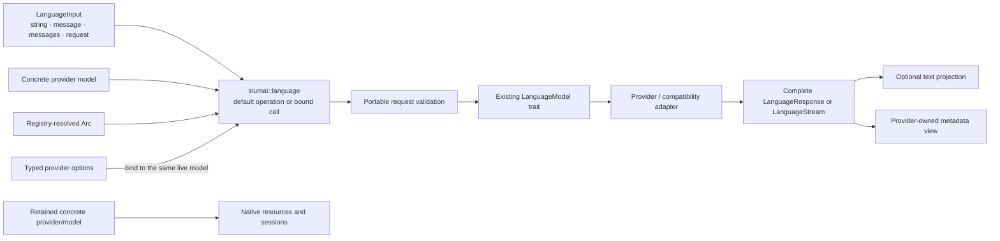

# Unified Facade Ergonomics - Plan

## Goal Capsule

**Objective:** Make `siumai` the clear, low-ceremony entry point for portable model-family calls while preserving provider fidelity, exact call identity, complete responses, and provider-owned native APIs.

**Means:** Replace the current public `families` helper layer with canonical root family modules, shared language input conversion, and per-family bound call builders over the existing model-family traits (KTD1, KTD2, KTD3).

**Authority hierarchy:** Product Requirements and session-settled Key Decisions define behavior. Key Technical Decisions define implementation boundaries. Implementation Units define sequencing and file ownership without overriding those contracts.

**Stop conditions:** Stop and surface a blocker if the implementation requires a universal client, capability inference, `Any` or downcasting, hidden Registry resolution, provider construction from environment state, text-only stream semantics, or a change to provider/protocol wire behavior.

**Execution profile:** Breaking beta API cleanup is authorized. Use serial Cargo validation. Keep provider and protocol production behavior unchanged unless a failing integration contract proves the facade cannot preserve it.

**Tail ownership:** Implementation includes source changes, migration documentation, examples, focused CI coverage, simplification, and review. Pushing a branch or opening a pull request still requires explicit authorization.

---

## Product Contract

### Summary

Siumai will retain two complementary public paths: a provider-neutral facade for the six stable model families and provider-owned APIs for native capabilities. The facade will restore a prompt-first language path, direct-to-Registry model interchangeability, typed provider options on the same call, and concise text inspection without introducing a universal provider client.

This is a convergence release for the primary user journey. It intentionally removes redundant facade paths now, while the crate is in beta, and replaces them with one documented and compile-checked surface.

### Problem Frame

The current architecture preserves provider fidelity and clean ownership, but the primary call path requires callers to know internal layering. The root README constructs a full `LanguageRequest`, manually creates exact-target `CallOptions`, calls `generate_with_options`, and manually searches response parts for text. The same family helpers are exposed through both `siumai::families::*` and the prelude, while runtime also contributes bare `generate` and `stream` exports.

The historical universal client reduced ceremony but mixed provider construction, capability probing, retries, resources, and downcasts. Later beta releases already demonstrated a better product shape: direct and Registry models used the same family call, while typed provider extensions remained available. Current Vercel AI SDK and Rig releases use the same layered principle: a short prompt path sits over a richer request model and concrete provider APIs remain available.

GitHub issue #27 is primarily a stability signal. It reports repeated breaking changes and asks for clearer versioned migration rather than endorsing a specific old abstraction. This plan therefore treats facade ergonomics and public-path convergence as one change, not as another additive alias layer.

### Key Decisions

- **Keep and strengthen the `siumai` facade instead of restoring a universal client.** (session-settled: user-approved — chosen over a stateful `Siumai` provider hub: the existing family traits and Registry already provide the correct execution seam.) Governs R1, R2, R12.
- **Unify the call experience, not unrelated provider capabilities or lifecycle types.** (session-settled: user-approved — chosen over a least-common-denominator request or capability matrix: provider-specific behavior already has typed owners.) Governs R3, R7, R8, R9.
- **Make a breaking convergence cut and delete redundant public paths.** (session-settled: user-directed — chosen over deprecation aliases: the user authorized beta breakage to avoid carrying another compatibility layer.) Governs R10, R11, R13, R17.
- **Keep native resources and sessions on concrete provider APIs.** (session-settled: user-approved — chosen over dynamic native capability recovery from Registry models: Rust type erasure cannot preserve arbitrary concrete methods without enums, `Any`, or downcasts.) Governs R8, R9.
- **Treat the converged root family facade as the next compatibility boundary.** Later beta breaking changes remain possible, but they require an explicit architecture rationale, an exact migration map, synchronized examples and changelog entries, and a release review that names the affected canonical symbols. This is a stability commitment, not a promise to retain deprecated aliases. Governs R11, R12, R18.

### Requirements

#### Primary facade journey

- R1. `siumai` must expose the six stable family modules at the crate root: `language`, `embedding`, `rerank`, `image`, `speech`, and `transcription`.
- R2. A language caller must be able to pass a plain string, one message, a message list, or a complete `LanguageRequest` through the same facade call path.
- R3. The same facade operation must accept both a concrete provider model and a Registry-resolved `Arc<dyn FamilyModel>` without changing application call logic.
- R4. Simple family operations must return the complete existing family response type rather than a text-only, data-only, or facade-wrapped result.
- R5. Language generation and streaming must have concise default-option entry points and a bound call builder for advanced options.
- R6. Each non-language family must retain its honest request type and family-specific operation name; the facade must not invent a universal input or hidden defaults.

#### Provider fidelity and call identity

- R7. Every bound family call must support an existing `CallOptions` baseline and synchronous typed provider-option patches bound against the exact live model handle that will execute the call.
- R8. Complete requests must preserve tools, structured output, typed node annotations, provider-opaque replay content, cancellation, retry intent, deadline semantics, and option patch order.
- R9. Provider metadata extensions and provider-native model/resource/session APIs must remain available through their current typed owners; the facade must not add downcasts or duplicate native methods.

#### API convergence and migration

- R10. The public `siumai::families` path, facade family `*_with_options` helper pairs, and bare root/prelude runtime `generate` and `stream` exports must be removed once their canonical replacements exist. Provider-owned methods with similar names remain unchanged.
- R11. The next-beta migration guide must contain a focused old-symbol-to-new-symbol map for callers starting from `0.11.0-beta.10`.
- R12. The README, facade rustdoc, provider-switching example, and flagship provider examples must teach one coherent path: choose or resolve a model, use the root family module, add typed provider intent when needed, and keep the concrete provider for native operations.
- R13. The canonical facade journey must be protected by compile and behavior contracts across no-default, Registry, provider-only, and provider-plus-Registry feature shapes without adding custom policy scripts.

#### Language output ergonomics

- R14. `LanguageResponse` and `PartialLanguageOutput` must expose a borrowed text-part view and an owned text projection that concatenates canonical text parts in order without separators or normalization.
- R15. The owned text projection must distinguish “no text part” from “one or more text parts whose concatenation is empty.”
- R16. Text projection must exclude reasoning, refusal, tools, citations, media, and provider-opaque state, and it must not replace `project_assistant_history()`.
- R17. Runtime Agent entry points must use the shared `LanguageInput`; the duplicate public `AgentInput` type must be removed with a documented migration path for downstream custom conversions.

#### Post-convergence stability

- R18. After this convergence, the six root family modules, their default operations, bound-call entry points, complete response types, and typed provider-option ownership form the documented facade compatibility boundary. A later beta break to that boundary must include the evidence, exact migration, examples, changelog, and release guidance required by the preceding decision.

### Key Flows

- F1. **Direct prompt call:** construct a concrete model, pass it with a plain prompt to `siumai::language`, receive a complete `LanguageResponse`, and inspect the text projection. Covers R2, R3, R4, R14.
- F2. **Registry switch:** resolve a configured route once, pass that live handle through the same language call path, and preserve canonical route context in options and errors. Covers R3, R7, R8.
- F3. **Provider-specific portable call:** bind typed provider options to the selected live model, execute the ordinary family operation, and inspect provider-owned response metadata without changing the portable request type. Covers R7, R8, R9.
- F4. **Native escape:** retain the concrete provider or model beside Registry, use the facade for portable calls, and call files, batches, WebSocket sessions, or other native APIs directly from the concrete owner. Covers R9, R12.
- F5. **Streaming:** create a language call from a simple or complete input, establish the existing `LanguageStream`, and preserve setup failure plus exactly one terminal outcome. Covers R2, R4, R8.

### Acceptance Examples

- AE1. Given a concrete Anthropic model and a string prompt, the facade creates one user message without trimming or inference, rejects an invalid canonical request before trait dispatch, performs one generate dispatch for a valid request, and returns the complete response. Covers F1 / R2, R4.
- AE2. Given a direct model and a Registry model implementing the same family trait, the same generic application function compiles and produces the same observable request shape. Covers F1, F2 / R3.
- AE3. Given typed OpenAI or Anthropic options, binding succeeds only when the selected live model target matches; a different configured instance or route fails before the model call. Covers F3 / R7.
- AE4. Given a rich request containing tools, structured output, annotations, and provider-opaque content, the facade forwards every node unchanged. Covers F3 / R8.
- AE5. Given content containing empty text, non-empty text, reasoning, refusal, tools, and citations, the text iterator yields only the text nodes and the owned projection returns their exact concatenation. A response with no text nodes returns no projection. Covers R14, R15, R16.
- AE6. Given an established stream that fails, cancels, or reaches unexpected EOF, the facade exposes the same terminal and partial-output contract as the underlying model. Covers F5 / R4, R8.
- AE7. Given a concrete OpenAI or Anthropic provider kept beside Registry, portable calls use the facade and native resources remain callable only from that provider. Covers F4 / R9, R12.
- AE8. Given a beta.10 call site using `families::language::generate_with_options`, the migration guide identifies one canonical replacement and no deprecated alias is required. Covers R10, R11.
- AE9. Given downstream code that passes a local wrapper into Agent through `AgentInput`, the migration guide shows how to implement conversion into `LanguageInput`, and the Agent receives the same canonical request. Covers R17.

### Success Criteria

- The root README’s first language example no longer requires manual message-role construction, manual response-part matching, or a `*_with_options` helper.
- One compile-checked example demonstrates that switching between direct and Registry-selected providers does not change the application’s family call function.
- Every canonical facade module compiles without default features and without pulling runtime, Registry, or a provider crate into the base facade.
- The final public surface contains one canonical family namespace and no universal client, capability-probing, downcast, or untyped provider-parameter escape hatch.
- Documentation records this as the facade convergence point so later changes extend the path instead of renaming it again without migration evidence.
- Release guidance names the converged facade boundary and prevents a later breaking rename from shipping without explicit rationale and synchronized migration material.

### Scope Boundaries

#### In scope

- Core-owned language input conversion shared by facade and runtime.
- Core-owned response and partial-output text inspection.
- Root family modules and bound per-call facade ergonomics.
- Removal of duplicate facade and runtime root exports.
- Direct, Registry, typed-option, annotation, stream, feature, example, and migration contracts.

#### Out of scope

- Provider capability additions or wire-schema changes.
- A universal `Siumai` client, provider enum, capability matrix, `Any`, downcast, or dynamic native-resource recovery.
- Hidden provider construction, credential discovery, Registry lookup, route selection, fallback, middleware, caching, or business routing in the facade.
- Text-only streaming, automatic stream collection, reasoning-tag parsing, JSON-fence extraction, or other heuristic response transforms.
- Unifying files, batches, catalogs, sessions, media jobs, or hosted-tool lifecycles across providers.

#### Deferred to follow-up work

- Ergonomic builders for individual provider-native resource APIs.
- A model-level middleware abstraction; it requires separate evidence and lifecycle design.
- Additional convenience projections for structured output or media responses after multiple consumers prove one portable contract.

### Sources & Research

- Current facade contract: `siumai/src/families.rs`, `siumai/src/lib.rs`, `siumai/src/prelude.rs`, and `siumai/tests/facade_contract.rs`.
- Existing execution seam: `siumai-core/src/model.rs`, `siumai-registry/src/registry.rs`, and `siumai-registry/src/route.rs`.
- Exact typed-option targeting: `siumai-core/src/options.rs` and `docs/architecture/public-api.md`.
- Historical user journey: `v0.11.0-beta.9` README and examples, especially `siumai/examples/01-quickstart/provider-switching.rs` in that tag. The historical universal client remains a rejected implementation precedent.
- Stability signal: [GitHub issue #27](https://github.com/YumchaLabs/siumai/issues/27), verified 2026-08-18.
- External call-shape precedent: [Vercel AI SDK commit 6f43b458](https://github.com/vercel/ai/commit/6f43b458f3591a4d4ad30673c92d37b02a96d998), verified 2026-08-18. Its prompt/full-message dual path and typed provider options shape KTD1 and KTD2; its JavaScript type model does not define Siumai’s Rust ownership.
- Rust precedent: [Rig commit 841d2759](https://github.com/0xPlaygrounds/rig/commit/841d275946d2206e97489bd96b55e6803e258ef1), verified 2026-08-18. Its prompt convenience over provider-specific clients supports the layered facade, while its untyped additional parameters are explicitly rejected.
- Institutional learnings: `docs/solutions/` does not exist, so current architecture documents, source contracts, git history, and external primary sources are the planning authority.

---

## Planning Contract

### Key Technical Decisions

- KTD1. Add one core-owned `LanguageInput` adapter and migrate the runtime’s `AgentInput` semantics to it. The adapter immediately and losslessly normalizes into `LanguageRequest`; it does not store a model, route, options, validation state, or a serialized wire contract. (session-settled: user-approved — chosen over a facade-only conversion trait or second prompt wrapper: facade and runtime are two proven consumers of the same provider-neutral conversion.) Governs R2, R8, R17.
- KTD2. Make bound, single-use family call builders the advanced facade seam. Each builder borrows the selected model and owns the request, one replaceable `CallOptions` baseline, and ordered builder-owned provider patches. Both `with_options` and `with_provider_options` return `Result<Self, ProviderOptionError>`: each assembles and validates a candidate baseline-plus-patch sequence before committing the mutation, so setter order cannot defer a combined bounds error. Terminal preflight defensively repeats the same bounded assembly, while relative timeouts resolve only when execution starts. (session-settled: user-approved — chosen over option-specific function pairs: a call builder preserves typed setup errors without multiplying public entry points.) Governs R5, R7, R8.
- KTD3. Expose six real root modules and remove the public `families` umbrella instead of adding root aliases. (session-settled: user-directed — chosen over keeping both paths: the beta cleanup must leave one canonical namespace.) Governs R1, R10, R13.
- KTD4. Keep separate family call types over a shallow shared private call-state implementation. Shared state may own only the model borrow, request, `CallOptions` baseline, ordered option patches, and common preflight helpers. It must not own a universal execute trait, cross-family validation, error normalization, or result enum. Terminal methods consume the builder; builders do not promise `Clone`, `Copy`, or serialization. Governs R4, R6, R7.
- KTD5. Keep `language::generate` and `language::stream` as the concise default-option operations, but broaden their input to `LanguageInput`. Advanced calls use `language::call`; only the seven facade-family `*_with_options` functions enumerated below are deleted. Provider-owned methods with similar names remain unchanged. Governs R2, R5, R10.
- KTD6. Put text inspection on `LanguageResponse` and `PartialLanguageOutput` in core. The borrowed view identifies exact text nodes; the owned projection returns an optional concatenation and never acts as history projection. Governs R14, R15, R16.
- KTD7. Use one preflight order at the facade boundary: resolve the deadline, validate the portable request, validate exact provider-option selection for the same model, then dispatch once. Builder setup errors remain synchronous `ProviderOptionError` values. Facade-originated generate and stream setup errors keep their existing error classes and gain the model’s canonical route context when present; provider errors and partial output propagate unchanged. Do not add prompt trimming, empty-string policy, model-name checks, or capability heuristics. Governs R2, R4, R7, R8.
- KTD8. Preserve current provider-option target semantics: provider scope, model family, API mode, route, and configured instance identity. Do not add model-ID or requested-alias matching in this facade change. Governs R7, R8.
- KTD9. Remove bare runtime `generate` and `stream` re-exports from the crate root and prelude; runtime execution remains under `siumai::runtime`. This prevents the primary facade from owning two visually identical operations with different defaults. Governs R1, R10, R12.
- KTD10. Treat compile-checked examples and feature-specific Cargo lanes as the stability mechanism. Do not add a custom public-API policy script or mirror Cargo metadata in a second policy file. Governs R11, R12, R13, R18.

KTD2, KTD7, and KTD8 follow the target-inferred call-builder boundary established by `docs/adr/0015-validation-ownership-and-forward-compatibility.md`. The AI SDK and Rig sources justify the product call shape, not the Rust ownership mechanism.

### Canonical API Matrix

| Family | Default operations | Bound entry and public call type | Bound terminal operations |
|---|---|---|---|
| Language | `language::generate`, `language::stream` | `language::call` → `LanguageCall` | `generate`, `stream` |
| Embedding | `embedding::embed` | `embedding::call` → `EmbeddingCall` | `embed` |
| Rerank | `rerank::rerank` | `rerank::call` → `RerankCall` | `rerank` |
| Image | `image::generate` | `image::call` → `ImageCall` | `generate` |
| Speech | `speech::synthesize` | `speech::call` → `SpeechCall` | `synthesize` |
| Transcription | `transcription::transcribe` | `transcription::call` → `TranscriptionCall` | `transcribe` |

Every public call type uses fallible `with_options` for the replaceable baseline and fallible `with_provider_options` for ordered typed patches. Each exposes `request()` plus `base_options()` for read-only inspection; effective option assembly remains private because it is owned, fallible, and includes builder patches. `LanguageResponse` and `PartialLanguageOutput` use the same `text_parts` and `output_text` names defined by KTD6.

The exact removed facade helper paths are:

- `siumai::families::language::{generate_with_options, stream_with_options}`
- `siumai::families::embedding::embed_with_options`
- `siumai::families::rerank::rerank_with_options`
- `siumai::families::image::generate_with_options`
- `siumai::families::speech::synthesize_with_options`
- `siumai::families::transcription::transcribe_with_options`

This deletion list does not apply to provider-owned methods with similar names.

### High-Level Technical Design

The other five family modules follow the same outer shape but accept only their existing request types. Each module exposes one default operation and one bound call builder. The shared private call state stores a borrowed model, an owned request, a replaceable `CallOptions` baseline, ordered provider-option patches, and common preflight helpers; family-specific wrappers own the execution verb and result type.

The facade never accepts a Registry plus a route string. Callers resolve once, then bind options and execute against that same handle. This preserves configured-instance identity and canonical route context.

### Sequencing

1. Establish the shared core input and text projection contracts.
2. After U1, migrate runtime input and build the language facade as independent code units while Cargo validation remains serial.
3. Before replicating the builder across the other families, pass one provider-backed language vertical for OpenAI, Anthropic, and a Registry-resolved handle through the U3 facade.
4. Move the remaining families and existing flagship examples to root modules, then delete duplicate exports.
5. Prove broader provider switching, typed provider fidelity, native escape paths, and feature isolation with a dedicated example.
6. Converge architecture docs, migration notes, changelog, and release checks after both runtime and facade migrations are complete. The public deletions from U2 and U4 are one release-atomic milestone with U6 and must not be merged, published, or released without the corresponding migration material; the final tree contains no compatibility aliases.

### System-Wide Impact

- **Core:** Adds a small provider-neutral input adapter, non-mutating response accessors, and a hidden bounded append seam for validated provider-option patches. It does not change model traits, wire types, or provider ownership.
- **Facade:** Replaces the public namespace and options-function shape. This is the main breaking surface.
- **Runtime:** Reuses the shared language input and loses the duplicate `AgentInput` public type plus bare root function re-exports. External `From<LocalType> for AgentInput` implementations must move to `LanguageInput`. Tool-loop and durable behavior do not change.
- **Registry:** No production change is expected. Integration tests must prove route identity and errors survive the new facade.
- **Providers and protocols:** No production changes are expected. Existing provider fixtures remain the wire-fidelity authority.
- **Features:** The root family modules must exist with no default features. Registry and provider examples remain gated by their owning features.
- **Documentation and release:** README, crate rustdoc, examples, architecture, migration, and changelog change together to reduce another round of naming churn.

### Alternatives Considered

- **Restore a `Siumai` universal client or Registry-backed hub:** Rejected because it duplicates Registry, obscures provider construction, and cannot expose arbitrary native APIs without type erasure escape hatches.
- **Add only `generate_text` and keep all existing paths:** Rejected because it creates another alias while leaving the namespace, options, and migration problem unsolved.
- **Put convenience methods on `LanguageModel`:** Rejected because generic methods would compromise object safety or exclude Registry trait objects.
- **Use one universal call type for all six families:** Rejected because family requests and execution verbs encode different required semantics.
- **Return a string or text-delta stream from the primary language helper:** Rejected because it loses termination, usage, warnings, metadata, provider events, partial output, and stream failure semantics.
- **Keep both `siumai::families::*` and root family modules:** Rejected because two canonical paths repeat the stability problem this plan must close.

### Risks & Dependencies

- **Breaking-change fatigue:** This change can worsen issue #27 if documentation is incomplete. Mitigation: land code, migration mapping, examples, changelog, and compile contracts as one milestone.
- **Generic conversion ambiguity:** Broad input conversions can produce poor inference or accidental ownership costs. Mitigation: limit `LanguageInput` conversions to the existing runtime set and keep complete `LanguageRequest` authoritative.
- **Deadline drift:** A builder created long before execution could consume timeout budget too early. Mitigation: store unresolved options and call the existing idempotent deadline resolver only at execution.
- **Exact-target drift:** Re-resolving a Registry route after option binding can change configured-instance identity. Mitigation: builders borrow the live handle and never own a Registry reference or route string.
- **Option-order loss:** Replacing the baseline options after adding a typed patch could silently discard or reorder intent. Mitigation: store baseline and builder patches separately, then append patches through a bounded core assembly seam at preflight.
- **Lossy text misuse:** Callers may treat text projection as canonical history. Mitigation: document it as display-oriented, return `Option`, and cross-link `project_assistant_history()`.
- **Hidden dependency leakage:** A facade module may accidentally require runtime, Registry, or provider features. Mitigation: no-default and feature-isolated compile contracts are release gates.
- **Over-refactoring providers:** Facade work may tempt provider-specific cleanup. Mitigation: provider and protocol production files are outside active units unless a failing existing contract proves a required adapter correction.

---

## Implementation Units

### U1. Share language input, text projections, and option assembly in core

**Goal:** Establish the provider-neutral input conversion, output inspection, and ordered bounded provider-option assembly contracts used by facade and runtime.

**Requirements:** R2, R7, R8, R14, R15, R16; AE1, AE5.

**Dependencies:** None.

**Files:**

- `siumai-core/src/language/mod.rs`
- `siumai-core/src/options.rs`
- `siumai-core/src/lib.rs`
- `siumai-core/tests/public_contract_compile.rs`

**Approach:**

1. Add the KTD1 input adapter with conversions for string, message, message list, and complete request.
2. Add borrowed text-part accessors and optional owned projections per KTD6.
3. Add a hidden bounded append operation for validated provider-option patches so facade baselines and builder patches compose in order.
4. Keep conversion byte-preserving and policy-free; validation remains an explicit execution-boundary action.
5. Export only the types and accessors needed by downstream facade and runtime users.

**Patterns to follow:** `Message::user`, `LanguageRequest::new`, current `AgentInput` conversions in `siumai-runtime/src/agent.rs`, and the existing bounded `PartialLanguageOutput` representation.

**Test scenarios:**

- Covers AE1. A borrowed string becomes exactly one user message with the original bytes, including leading/trailing whitespace and an empty string.
- A `Message`, `Vec<Message>`, and complete `LanguageRequest` preserve roles, tools, structured output, and annotations.
- Covers AE5. Mixed response parts expose only text parts in order and concatenate without separators.
- Covers AE5. No text parts return no owned projection, while one empty text part returns an empty owned projection.
- Partial output text projection follows the same rules and does not expose reasoning or refusal text.
- Public contract compilation proves the input and projection types are nameable without provider, Registry, or runtime features.
- A baseline containing patches A then B plus a builder patch C assembles as A, B, C and rechecks entry, target, raw, and aggregate bounds.
- Candidate assembly rejects an over-budget baseline-plus-patch composition without mutating the previously valid state; repeating preflight over the accepted state produces the same order and result.

**Verification:** Core tests prove exact conversion, projection, and bounded option-assembly behavior. Public contract tests prove the new surface is provider-neutral and constructible.

### U2. Migrate runtime to the shared language input

**Goal:** Remove the duplicate runtime prompt adapter without changing Agent, ToolLoop, or durable execution behavior.

**Requirements:** R2, R8, R17; AE9.

**Dependencies:** U1.

**Files:**

- `siumai-runtime/src/agent.rs`
- `siumai-runtime/src/lib.rs`
- `siumai-runtime/tests/runtime_contract.rs`
- `siumai-runtime/tests/model_switching_contract.rs`
- `siumai-runtime/tests/tool_loop_contract.rs`
- `siumai-runtime/tests/durable_tool_loop_contract.rs`

**Approach:**

1. Replace `AgentInput` with the shared KTD1 input adapter at public Agent entry points.
2. Delete the duplicate runtime type and conversions rather than retaining a deprecated alias.
3. Keep instruction prepending, validation, tool catalogs, options, projection, and durable fingerprints unchanged.

**Patterns to follow:** Existing `Agent::stream` and `Agent::stream_with` delegation, plus current runtime request validation and tool-loop contracts.

**Test scenarios:**

- Existing string, message, message-list, and complete-request Agent calls produce the same canonical request as before.
- Rich request fields survive instruction prepending and the first tool-loop step.
- Invalid portable requests fail before model invocation with the same typed error category.
- Agent, ToolLoop, and DurableToolLoop preserve equivalent canonical input behavior where each path accepts or consumes the shared request.
- Positive compile contracts prove the shared input works at Agent entry points; a scoped source/re-export deletion check proves `AgentInput` is absent without adding a compile-fail framework.
- An external-style local wrapper can implement conversion into `LanguageInput`, documenting the replacement for downstream custom conversions.

**Verification:** Runtime’s focused Agent, tool-loop, and durable tests pass without duplicate input conversion code or snapshot changes.

### U3. Build the canonical language facade

**Goal:** Provide the concise and advanced language call paths over direct and erased language models.

**Requirements:** R1, R2, R3, R4, R5, R7, R8; F1, F2, F3, F5; AE1, AE2, AE3, AE4, AE6.

**Dependencies:** U1.

**Files:**

- `siumai/src/language.rs`
- `siumai/src/call.rs`
- `siumai/src/lib.rs`
- `siumai/src/prelude.rs`
- `siumai/tests/facade_contract.rs`

**Approach:**

1. Add the KTD2 private call-state implementation and a public single-use language call wrapper.
2. Make default `generate` and `stream` accept the shared input and delegate through the same builder path.
3. Make both option setters fallible, bind typed provider options synchronously to the borrowed live model, and reject invalid combined state before mutating the builder.
4. Run the KTD7 preflight matrix immediately before invoking the model and contextualize facade-originated failures with the canonical route.
5. Keep the complete response and stream types unchanged.

**Patterns to follow:** Current family helper deadline resolution, `CallOptions::with_provider_options_for`, `M: LanguageModel + ?Sized`, and Registry route wrappers.

**Test scenarios:**

- Covers AE1. An invalid plain prompt request never enters trait dispatch; a valid prompt invokes the direct model once even if the provider performs its own validation.
- Covers AE2. The same generic helper accepts a concrete model and `Arc<dyn LanguageModel>`.
- Covers AE3. Typed options bound to the selected direct or routed handle reach that call; different instance or route fails before invocation.
- Existing cancellation, retry intent, and relative timeout survive successive builder mutations; timeout resolution occurs at execution time.
- A baseline with typed patches A and B plus builder patch C reaches the provider in A, B, C order even when the baseline setter occurs after C was added.
- A baseline already bound to another instance or route fails facade preflight with model call count zero.
- Covers AE4. Complete requests preserve every message part, tool, annotation, structured-output field, and provider-opaque item.
- Generate validation errors become `LanguageCallError` without partial output; stream validation errors remain setup `Error` values.
- Routed facade-originated generate and stream setup errors keep those error classes and include canonical route context; provider errors and partial output propagate unchanged.
- Covers AE6. Established stream completion, failure, cancellation, partial output, and unexpected EOF remain observable through the existing stream contract.
- Before U4 begins, deterministic OpenAI and Anthropic language fixtures plus a Registry wrapper exercise the root facade with real typed option types and the same selected live handle.

**Verification:** The facade language contract passes with no default features and with Registry enabled, followed by the provider-backed language vertical gate. No provider or protocol production file is modified.

### U4. Move all stable families to one root facade surface

**Goal:** Complete the namespace and options-shape convergence for all six model families.

**Requirements:** R1, R4, R6, R7, R10, R13; AE8.

**Dependencies:** U3.

**Files:**

- `siumai/src/embedding.rs`
- `siumai/src/rerank.rs`
- `siumai/src/image.rs`
- `siumai/src/speech.rs`
- `siumai/src/transcription.rs`
- `siumai/src/lib.rs`
- `siumai/src/prelude.rs`
- `siumai/src/families.rs` (delete)
- `siumai/tests/facade_contract.rs`
- `siumai/examples/openai_flagship.rs`
- `siumai/examples/anthropic_flagship.rs`

**Approach:**

1. Give each remaining family one root module, one default operation, and one family-specific bound call wrapper over the shared private state.
2. Preserve each existing request and response type; do not add cross-family conversion traits.
3. Migrate the registered flagship examples before removing the seven facade helpers under `siumai::families` and the public umbrella itself.
4. Remove bare runtime `generate` and `stream` re-exports from root and prelude per KTD9.
5. Keep module re-exports curated and available without default features.

**Patterns to follow:** The language call wrapper from U3, existing family operation names, and current family trait objects in `siumai-core/src/model.rs`.

**Test scenarios:**

- Each family’s default operation forwards the exact request once and returns the complete response.
- Each bound call preserves explicit `CallOptions` and binds typed options to the executing model.
- Rerank requires query plus candidates, transcription requires bytes plus media type, and other family constructors retain their existing validation; no hidden defaults are introduced.
- All five non-language families compile with both a concrete fake and an erased Registry-style trait object; representative behavior tests remain sufficient for execution semantics.
- Covers AE8. Scoped deletion checks prove the seven facade helpers under `siumai::families`, `siumai::families` itself, `siumai::{generate, stream}`, and the prelude runtime re-exports are absent. Provider-native methods and `siumai::runtime::{generate, stream}` remain valid.
- The two flagship examples compile against the root family modules before the old paths disappear.
- Root family modules compile under no-default features, while runtime operations remain reachable only through `siumai::runtime` when enabled.

**Verification:** All six family modules have one canonical public path and consistent option ergonomics, with no universal call type or duplicate namespace.

### U5. Prove provider switching and provider fidelity end to end

**Goal:** Demonstrate that the new facade restores provider switching while keeping typed provider capabilities and native escape paths.

**Requirements:** R3, R7, R8, R9, R12, R13; F1, F2, F3, F4; AE2, AE3, AE4, AE7.

**Dependencies:** U4.

**Files:**

- `siumai/tests/facade_contract.rs`
- `siumai/examples/provider_switching.rs`
- `siumai/Cargo.toml`
- `.github/workflows/ci.yml`

**Approach:**

1. Add a compile-checked provider-switching example that keeps application call code independent of concrete versus Registry model selection.
2. Show typed OpenAI and Anthropic options on the ordinary facade call and concrete-provider native resources beside it.
3. Extend the U3 provider-backed language proof with provider switching, typed metadata, annotations, and native escape contracts without repeating route, preflight, or stream lifecycle tests.
4. Add only Cargo-native feature and example checks required to keep the canonical path buildable; do not add repository policy scripts.

**Patterns to follow:** Existing deterministic facade fakes, `openai_direct_registry_and_helper_paths_share_one_wire_pipeline`, and the two flagship examples’ offline construction style.

**Test scenarios:**

- Covers AE2. One application function works with OpenAI, Anthropic, and a Registry-resolved model without provider matching.
- Covers AE3. Real typed option types are constructible from the facade’s curated provider namespaces and bind to the intended model.
- Covers AE4. Real provider annotation types remain constructible on canonical semantic nodes used by the facade example.
- Provider-owned metadata views remain usable on the complete response.
- Covers AE7. Concrete providers still expose native resources while Registry models expose only the family trait.
- The base facade contract compiles with no default features; routed fakes compile with Registry only; U4 flagship examples compile with their individual provider features; provider switching compiles with OpenAI, Anthropic, and Registry together.

**Verification:** The example and facade contracts prove the promised user journey without live credentials or network access. Existing provider/protocol suites continue to own final wire fidelity.

### U6. Converge documentation, migration, stability, and release guidance

**Goal:** Make the new facade the single documented journey and explain the breaking migration precisely.

**Requirements:** R10, R11, R12, R13, R17, R18; AE8, AE9.

**Dependencies:** U2, U5.

**Files:**

- `README.md`
- `siumai/README.md`
- `docs/architecture/public-api.md`
- `docs/architecture/overview.md`
- `docs/architecture/registry.md`
- `docs/adr/0019-facade-family-call-ownership.md`
- `docs/migration/siumai-next.md`
- `CHANGELOG.md`
- `scripts/README.md`
- `docs/releasing.md`

**Approach:**

1. Rewrite the primary journey around root family modules, plain language input, complete results, typed provider options, and concrete native APIs.
2. Add a beta.10-specific migration table for removed modules, functions, runtime exports, and `AgentInput`, including the downstream local-conversion case in AE9.
3. Record the facade as the curated portability layer and the compatibility boundary that future releases extend, including a focused ADR for root family modules, bound-call ownership, and the evidence required for a later beta break.
4. Update release documentation only for Cargo-native gates added by U5; do not create or expand custom validation scripts.
5. Remove stale examples and descriptions instead of preserving contradictory historical layers.

**Patterns to follow:** Current public API architecture ownership rules and the repository convention that facade README is included as crate rustdoc.

**Test scenarios:**

- Covers AE8 and AE9. Every removed beta.10 symbol has one replacement and a short behavioral note.
- The root README links to registered, compile-checked examples instead of owning an independent uncompiled Rust journey; facade README rustdoc examples compile with declared features and no real credentials.
- Documentation distinguishes portable typed options from provider-native resources and does not imply Registry downcasting.
- Documentation does not claim text projection preserves full response or history semantics.
- Architecture and release guidance name the canonical facade boundary and require exact migration evidence before a later beta breaking change can ship.
- Scoped link and symbol checks find no stale canonical references to `siumai::families`, facade family `*_with_options`, root runtime `generate`/`stream`, or `AgentInput` outside migration history. Provider-owned methods and `siumai::runtime::{generate, stream}` remain valid.

**Verification:** User-facing documentation, architecture, changelog, examples, and release guidance describe one coherent facade contract and pass doctest/link/symbol checks.

---

## Verification Contract

Validation runs serially and reuses the workspace target directory.

### Per-unit gates

- U1: focused `siumai-core` tests, public contract compilation, Clippy, and rustdoc.
- U2: focused `siumai-runtime` Agent, tool-loop, and durable contracts plus runtime Clippy.
- U3: no-default and Registry-enabled facade contracts, the OpenAI/Anthropic/Registry language vertical gate, and facade Clippy.
- U4: all-family no-default, Registry-enabled, and all-feature facade tests plus facade Clippy.
- U4: exact provider-only feature checks for the two migrated flagship examples.
- U5: the provider-switching example with OpenAI, Anthropic, and Registry together, plus existing provider fixture suites only when curated exports change.
- U6: facade doctests, documentation link/symbol searches, and package metadata inspection when manifest or feature declarations change.

### Milestone gates

- `cargo fmt --all -- --check`
- `cargo nextest run -p siumai-core --all-features --test-threads 1`
- `cargo nextest run -p siumai-runtime --all-features --test-threads 1`
- `cargo nextest run -p siumai --no-default-features --test facade_contract --test-threads 1`
- `cargo nextest run -p siumai --all-features --test-threads 1`
- `cargo clippy -p siumai-core --all-targets --all-features -j 1 -- -D warnings`
- `cargo clippy -p siumai-runtime --all-targets --all-features -j 1 -- -D warnings`
- `cargo clippy -p siumai --all-targets --all-features -j 1 -- -D warnings`
- `cargo check -p siumai --no-default-features --lib -j 1`
- `cargo check -p siumai --no-default-features --features registry --lib -j 1`
- `cargo check -p siumai --no-default-features --features all-providers --lib -j 1`
- Exact feature checks for `provider_switching`, `openai_flagship`, and `anthropic_flagship`.
- `cargo test --doc -p siumai --all-features -j 1`
- `cargo metadata --locked --no-deps` when U5 changes example or feature declarations.
- `git diff --check` and `git diff --cached --check` when changes are staged.

### Behavioral release gate

The milestone is not complete if all tests pass but any of these remain true:

- A README user must manually construct a one-message prompt for the common language case.
- Direct and Registry models use different application call functions.
- Typed provider options require provider matching, downcasting, or an untyped map.
- A native resource appears on an erased Registry model.
- More than one canonical facade namespace or options-function family remains.
- Text projection hides the complete response or stream terminal contract.
- Release guidance leaves the post-convergence facade boundary undefined or permits another breaking rename without an exact migration contract.

---

## Definition of Done

### Global completion

- All R1-R18 requirements and AE1-AE9 examples are implemented and traceable to tests or compile-checked documentation.
- The facade has one canonical root family surface and no public `families` compatibility layer.
- Prompt-first language calls, complete requests, typed provider options, direct models, and Registry models share one implementation path.
- Complete response, error, deadline, cancellation, stream terminal, route, and provider metadata semantics remain intact.
- Provider-native resources remain concrete-provider APIs and no capability inference or downcast escape hatch is added.
- Beta.10 migration guidance, changelog, architecture, README, rustdoc, and examples are synchronized.
- Verification Contract gates pass serially, or a genuine external blocker is documented with the failing command and evidence.
- Abandoned adapters, aliases, macros, experimental wrappers, stale docs, and dead tests from rejected approaches are removed from the final diff.

### Per-unit completion

- U1 is complete when shared input conversion, text projections, and ordered bounded option-patch assembly are exported or hidden as specified and pass core contracts.
- U2 is complete when runtime no longer owns `AgentInput` and all Agent/tool-loop behavior remains unchanged.
- U3 is complete when language default and advanced calls work for concrete and erased models with exact typed options and unchanged streaming.
- U4 is complete when all six family modules use the root surface and duplicate public helpers/exports are deleted.
- U5 is complete when provider switching, typed extensions, native escape paths, and feature isolation are compile-checked offline.
- U6 is complete when documentation teaches one path, every removed beta.10 symbol has an explicit migration entry, and release guidance records the new facade compatibility boundary.
