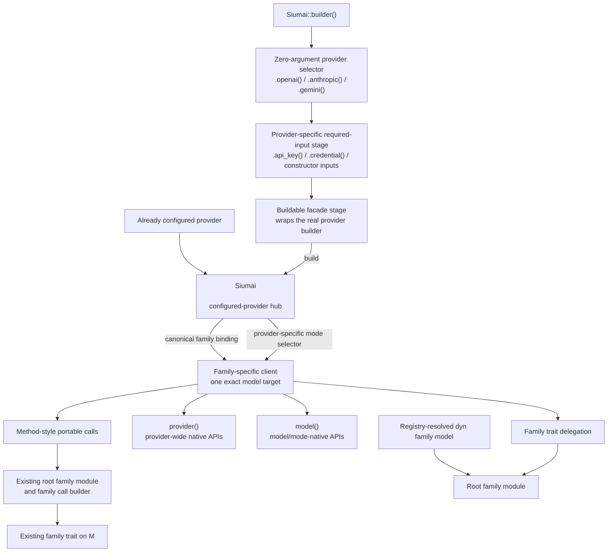

# Typed Siumai Facade and Provider Switching - Plan

## Goal Capsule

**Objective:** Restore a low-ceremony `Siumai::builder()` journey where changing providers does not change portable application calls, while preserving exact provider identity, explicit API modes, complete family responses, and direct access to provider-native capabilities.

**Means:** Restore the historical zero-argument provider selector rhythm through typed provider-specific required-input stages, make `Siumai<P>` the configured-provider hub, return family-bound clients from that hub, and delegate every portable operation to the existing root family modules (KTD1-KTD4).

**Authority hierarchy:** Product Requirements define user-visible behavior. Key Technical Decisions define the facade ownership and type boundaries. Implementation Units define sequencing and file ownership without overriding either contract.

**Stop conditions:** Stop and surface a blocker if implementation requires a universal `LlmClient`, `Any`, downcasting, string capability discovery, model-name inference, hidden Registry lookup, environment credential discovery, provider-option weakening, a second execution pipeline, or provider/protocol wire changes.

**Execution profile:** Breaking beta cleanup is authorized. Reuse the existing target directory and run Cargo serially. Provider construction and model acquisition must remain synchronous and network-free.

**Tail ownership:** Implementation includes the typed facade, all built-in provider adapters, deletion of newly redundant public paths, migration guidance, examples, feature gates, tests, simplification, and review. Pushing or opening a pull request still requires explicit authorization.

---

## Product Contract

### Summary

Siumai will restore `Siumai::builder()` as the primary application entry point without restoring the historical capability-erased universal client.
The builder will preserve the familiar `.openai().api_key(...)` provider-selection rhythm, but each step will be a typed provider-specific stage rather than mutable universal builder state.
The buildable stage will produce a typed `Siumai<P>` hub that owns one configured provider.
The hub will synchronously bind family-specific clients for exact models, and those clients will expose method-style portable calls plus typed access to their concrete provider and model.

The existing root family modules remain the canonical generic execution seam for libraries, dependency injection, trait objects, Registry-resolved models, and runtime integrations.
The new method-style facade delegates to those modules instead of duplicating validation, options, retries, deadlines, response mapping, or stream lifecycle logic.

**Product Contract preservation:** Changed R2, R4, and R7 and added R25-R27 plus AE13-AE15 to restore the historical zero-argument provider selector rhythm without changing the typed hub, family, identity, native-access, or execution boundaries.

### Problem Frame

The completed root-family refactor fixed real architectural problems: it established six narrow family traits, prompt-first language input, complete responses, exact-target typed options, provider-owned native APIs, and explicit Registry resolution.
It did not restore the user experience that made earlier Siumai releases attractive: configure a provider and model once, then call the same method regardless of provider.

The previous facade plan treated every stateful `Siumai` type as equivalent to the old universal client and recorded that rejection as user-approved.
That was an incorrect binary choice.
GitHub issue #27 explicitly says the former facade entry was simple and useful, while the current conversation makes provider switching through one unified capability path the top ergonomic requirement.

Historical releases also show why the old implementation cannot return unchanged.
`v0.8` through `v0.10` used `Box<dyn LlmClient>`, `Any`, provider-name matching, string capability checks, inferred defaults, and runtime `Unsupported` errors for unrelated families.
Later betas retained that erasure while growing a central builder that mixed credentials, provider configuration, retries, middleware, model selection, provider options, and native resources.
The current codebase now has the correct lower layers; the missing piece is typed assembly above them.

### Key Decisions

- **Restore `Siumai::builder()` as the primary direct-provider journey.** (session-settled: user-directed — chosen over a root-family-only primary interface: convenient provider switching through one familiar entry point is the product priority.) Governs R1, R2, R7, R21.
- **Preserve the historical zero-argument provider selector rhythm.** (session-settled: user-directed — chosen over credential-as-argument selectors such as `.openai(credential)`: `.openai().api_key(...)` restores established user muscle memory while typed stages keep incomplete configuration unbuildable.) Governs R2, R4, R7, R21, R25.
- **Restore the old call experience, not the old universal-client implementation.** (session-settled: user-directed — chosen over reviving `LlmClient`, capability probing, or downcasts: provider-native fidelity and compile-time family support must remain intact.) Governs R3, R10, R13, R14.
- **Keep provider-neutral and provider-native capabilities as complementary first-class paths.** (session-settled: user-directed — chosen over a least-common-denominator client: Siumai's differentiator is easy portable calls without losing typed provider-specific APIs.) Governs R9, R12, R13, R17.
- **Use the beta window to remove surfaces made redundant by the restored facade.** (session-settled: user-directed — chosen over carrying another alias and compatibility layer: the user authorized breaking cleanup and deletion of unnecessary code.) Governs R20, R22, R23.

### Requirements

#### Construction and common calls

- R1. `siumai` must expose a zero-state `Siumai::builder()` entry under `--no-default-features`.
- R2. A built-in provider feature must add a zero-argument selector such as `.openai()` that enters a typed provider-specific construction stage and synchronously builds a concrete `Siumai<P>` hub after required inputs are supplied.
- R3. The hub must not contain a universal provider enum, family capability matrix, model slots, `Any`, downcast support, or string capability discovery.
- R4. Provider-specific configuration must remain owned by the real provider builder; the facade may expose canonical credential transitions, arguments required to create that builder, and one consuming configuration closure, but must not mirror optional builder setters.
- R5. A caller must be able to wrap an already configured provider without rebuilding it or losing its configured-instance identity.
- R6. A caller must bind multiple family or same-family model clients from one hub without rebuilding the provider.
- R7. OpenAI, Anthropic, and Gemini language examples must use the historical zero-argument provider selector followed by `.api_key(...)` and identical application call code, with only provider selection and model identifier changing.
- R8. The six stable families must expose honest method-style operations on `LanguageClient`, `EmbeddingClient`, `RerankClient`, `ImageClient`, `SpeechClient`, and `TranscriptionClient` respectively.

#### API modes, identity, and provider intent

- R9. A hub may expose one documented canonical family selector backed by its existing `*ModelProvider` trait, while every alternate API mode remains available through an explicit typed method on that concrete provider hub or through the provider-owned model API.
- R10. The facade must not choose an API mode, capability, default, or validation rule from model-name patterns; unknown future model identifiers use the provider's protocol baseline.
- R11. A bound handle must preserve the inner model's descriptor, configured provider instance, family, API mode, canonical Registry route when present, model identifier, and replay-domain behavior without synthesizing replacement identity.
- R12. Advanced calls must reuse the existing family call builders and exact-target typed provider options, including synchronous failure before network submission for provider, instance, family, mode, or route mismatch.
- R13. `Siumai<P>` must expose its concrete provider through `provider()`, and every family client must expose that same provider plus its concrete model through `provider()` and `model()`, so native resources, sessions, native responses, and model-specific methods remain reachable without downcasting.
- R14. Provider-native files, batches, catalogs, hosted tools, media jobs, Realtime, WebSocket, and resource lifecycles must not be flattened into portable facade methods or a native capability enum.
- R15. Portable method sugar must return the complete existing family response or stream type; it must not normalize missing usage, erase termination, collect streams, or reduce results to text-only values.

#### Generic code, Registry, and runtime switching

- R16. The six root family modules and their free functions must remain the canonical generic path for concrete models, `dyn FamilyModel`, Registry models, and dependency-injected code.
- R17. A family-bound client must implement and faithfully delegate the corresponding `Model` and family trait so generic application code accepts it without a facade-specific trait.
- R18. Registry must remain an explicit caller-configured, family-specific type-erasure boundary; `Siumai::builder()` must not register providers, resolve aliases, inspect global state, or hide business routing.
- R19. Runtime provider switching must use existing family trait objects or Registry handles and must explicitly accept the loss of concrete provider-native APIs after erasure.

#### Convergence, features, and migration

- R20. The restored facade must remove public paths that become shallow duplicates, while retaining the root family modules, family call builders, provider constructors, Registry, and `Runtime` methods that own distinct semantics.
- R21. Root README, facade README/rustdoc, provider-switching example, and flagship examples must teach `Siumai::builder()` first, root family modules for generic/Registry code, and concrete provider/model access for native capabilities.
- R22. The migration guide must map `0.11.0-beta.10` and the current unreleased root-family-only surface directly to the final typed facade without requiring two sequential migrations.
- R23. A new ADR must supersede ADR 0019's rejection of a `Siumai` entry while retaining its rejection of a capability-erased universal client; the prior facade plan remains historical and is explicitly superseded by this plan.
- R24. Provider features must remain additive and independently checkable, and facade coverage must use Cargo, rustdoc, compile contracts, and offline fixtures rather than a custom API-policy script.
- R25. A provider-specific required-input stage must not expose `.build()` until the caller has followed the fixed sequence declared by the Provider Adapter Contract Matrix. Constructor inputs use typed stages. When a real provider builder also requires caller-selected technical configuration that cannot be represented by one honest facade argument, the credential transition creates that real builder and a required `configure_provider(...)` transition must occur before the buildable stage; the provider-owned `build()` remains the authority that validates the closure actually supplied a valid configuration.
- R26. Credential-bearing facade stages, hubs, clients, and provider-build errors must remain sanitized by default. Facade stages must move secrets directly into provider-owned credential and builder types, retain no duplicate plaintext field, and preserve provider-owned redaction through complete `Debug`, `Display`, and error-source chains.
- R27. Each built-in provider selector, family binding method, simple operation, advanced `.call(...)` method, and explicit alternate API-mode selector must use the single spelling frozen in the Public API Vocabulary and Provider Adapter Contract Matrix; the facade adds no historical or feature-name aliases.

### Key Flows

- F1. **Typed provider hub and direct call**
  - **Trigger:** An application configures one provider and one language model.
  - **Steps:** Start at `Siumai::builder()`, enter a zero-argument provider selector, supply every required input in the Provider Adapter Contract Matrix order, use the terminal credential transition to enter the buildable stage, build the hub synchronously, bind the canonical language model, then call `generate` or `stream` on the family client.
  - **Outcome:** Changing providers changes construction only; the application call remains identical.
  - **Covered by:** R1, R2, R7, R8, R15, R25.
- F2. **Reusable provider hub**
  - **Trigger:** An application needs language plus embedding, image, speech, or multiple language models from one configured provider.
  - **Steps:** Build or wrap one configured provider hub, bind independent typed handles, and call each family through its own operation.
  - **Outcome:** All handles preserve one provider configuration without inventing provider-wide default model slots.
  - **Covered by:** R5, R6, R8, R11.
- F3. **Provider-specific API mode**
  - **Trigger:** A caller needs OpenAI Chat Completions instead of Responses, Gemini Generate Content instead of Interactions, or another explicit alternative mode.
  - **Steps:** Select the provider-owned mode method, bind the model, and use the same portable family call or typed provider options.
  - **Outcome:** Mode identity is visible and exact; no model-name inference occurs.
  - **Covered by:** R9, R10, R11, R12.
- F4. **Provider-native access**
  - **Trigger:** A direct caller needs Files, Message Batches, Skills, Veo, Realtime, Responses WebSocket, or native result inspection.
  - **Steps:** Use `provider()` for provider-wide resources or `model()` for model/mode-bound APIs.
  - **Outcome:** Native functionality stays typed and provider-owned without downcast or capability probing.
  - **Covered by:** R13, R14, R15.
- F5. **Generic or runtime-selected model**
  - **Trigger:** A library accepts any language model, or an application selects a route at runtime.
  - **Steps:** Accept the narrow family trait, pass either a direct family-bound client or Registry-resolved model, and call the root family module.
  - **Outcome:** Portable code is shared; type erasure occurs only where requested and native APIs are not falsely recoverable.
  - **Covered by:** R16, R17, R18, R19.
- F6. **Advanced exact-target call**
  - **Trigger:** A caller adds typed provider options or node annotations.
  - **Steps:** Create the existing bound family call from the family client, add typed intent, validate the complete candidate synchronously, and dispatch once.
  - **Outcome:** Provider fidelity and target isolation are unchanged by the ergonomic facade.
  - **Covered by:** R11, R12, R15.

### Acceptance Examples

- AE1. Given `.openai().api_key(key).build()?`, `.anthropic().api_key(key).build()?`, and `.gemini().api_key(key).build()?`, each chain synchronously produces a typed hub; each hub's `.language(model)` produces a typed language client, and the same `client.generate("Hello")` application line returns a complete `LanguageResponse`. Covers F1 / R1, R2, R7, R15, R25.
- AE2. Given an OpenAI hub, `.language(model)` binds the documented canonical Responses mode, while an explicit provider-hub or provider-owned Chat Completions selector binds a distinct descriptor; no model identifier changes that choice. Covers F3 / R9, R10, R11.
- AE3. Given one configured OpenAI provider hub, language, embedding, and image handles share its configured-instance identity while retaining distinct family and API-mode descriptors. Covers F2 / R5, R6, R8, R11.
- AE4. Given an Anthropic language handle, portable generation and `client.provider().files()` or `message_batches()` coexist without `Any`, a provider enum, or downcasting. Covers F4 / R13, R14.
- AE5. Given an OpenAI Responses handle, `client.model()` exposes Responses-native methods, while a Chat Completions handle does not expose them. Covers F3, F4 / R9, R13, R14.
- AE6. Given typed options from a different configured instance, route, family, or API mode, `client.call(...).with_provider_options(...)` fails before model dispatch; matching options use the existing merge and preflight order. Covers F6 / R11, R12.
- AE7. Given a generic function over `LanguageModel`, both a direct `LanguageClient<P, M>` and a Registry-resolved `Arc<dyn LanguageModel>` execute through `language::generate` without different application logic. Covers F5 / R16, R17, R18.
- AE8. Given a provider that lacks embedding support, its provider hub has no callable embedding selector under Rust trait bounds; no runtime `Unsupported` capability check is required. Covers F2 / R3, R8, R14.
- AE9. Given an unknown future model identifier, the facade constructs the provider's protocol-baseline model synchronously and does not infer reasoning, media, caching, or API-mode support from the identifier. Covers F1, F3 / R2, R9, R10.
- AE10. Given an established language stream, method-style `client.stream(...)` preserves outer setup errors, backpressure, cancellation, partial output, and exactly one canonical terminal outcome. Covers F1 / R15.
- AE11. Given one provider feature enabled with no default features, the relevant builder adapter, provider hub, and family handle compile without enabling Registry, runtime, or unrelated providers. Covers R1, R2, R24.
- AE12. Given code written against beta.10 or the current root-family-only surface, the migration guide offers one final target and names every removed shallow helper or re-export. Covers R20, R21, R22, R23.
- AE13. Given `Siumai::builder().openai()`, `.build()` is unavailable until `.api_key(...)` or `.credential(...)` produces the buildable OpenAI stage; both credential paths use the same real `OpenAiProviderBuilder` and provider-owned build error. Covers R2, R4, R25.
- AE14. Given a canary API key or provider credential, no credential-bearing facade stage, hub, client, provider-build error, or complete error-source chain exposes the canary through `Debug` or `Display`, and the facade retains no second plaintext credential copy outside the provider-owned credential/builder. Covers R4, R26.
- AE15. Given each enabled built-in provider feature, its one selector from the Public API Vocabulary compiles with the required-input sequence in the Provider Adapter Contract Matrix, while duplicate historical, feature-name, and canonical-mode aliases remain absent. Covers R2, R24, R27.

### Success Criteria

- The first README example uses `Siumai::builder().openai().api_key(...).build()?.language(...)` and generates from a string without manually building a provider model, `LanguageRequest`, or `CallOptions`.
- The provider-switching example shows OpenAI, Anthropic, and Gemini direct construction followed by the identical `client.generate(...)` line; a separate generic/Registry example proves trait-based runtime switching without obscuring the primary direct-provider journey.
- A multi-family example derives several exact model handles from one provider hub without storing six optional default-model slots.
- Every built-in provider feature exposes a bounded typed builder adapter, and every supported family is available only through trait-backed selectors; `Siumai::from_provider` remains the generic path for third-party and already configured providers.
- No new facade code contains `Any`, downcast, capability strings, provider-name dispatch, model-name inference, raw provider-option maps, hidden Registry access, or copied provider configuration fields.
- All method-style operations delegate the existing root family modules and preserve their observable preflight, response, and stream behavior.
- The final documentation presents one hierarchy: typed `Siumai` for common direct calls, root family modules for generic/Registry code, and provider/model accessors for native APIs.

### Scope Boundaries

#### In scope

- Typed `Siumai<P>` provider hubs, family-bound clients, zero-argument provider selectors, and provider-specific required-input stages in the facade crate.
- Feature-gated construction adapters for every built-in facade provider.
- Canonical family selectors plus explicit provider API-mode selectors.
- Method-style family operations that delegate current root family modules.
- Typed provider/model native accessors and exact identity preservation.
- Removal of shallow call-type re-exports, shallow runtime free-call helpers, and brittle source-text API deletion tests where the restored facade makes them redundant.
- ADR, architecture, README, rustdoc, examples, migration, changelog, feature, and CI alignment.

#### Outside this product's identity

- A universal `LlmClient`, provider enum, family capability matrix, `Any`, downcast, or dynamic native-resource recovery.
- One `Siumai` object containing six optional default models or provider-wide business routing policy.
- Hidden global Registry use, environment credential discovery, remote model catalogs, fallback, load balancing, cost policy, or availability policy.
- Provider-native resource unification across incompatible lifecycles.
- Model-name heuristics, reasoning suffixes, capability allowlists, or silent API-mode selection.
- Middleware, caching, RAG, guardrails, response-tag parsing, simulated streaming, or heuristic transforms.
- Protocol, transport, provider request encoding, response decoding, retry, replay, or stream-state-machine changes.

#### Deferred for later

- A separately evidenced model middleware or semantic observer abstraction.
- New provider-owned typed response extensions where current providers expose only raw metadata.
- Additional third-party provider convenience adapters beyond the generic configured-provider hub.

### Sources & Research

- User report and corrected facade intent: [GitHub issue #27](https://github.com/YumchaLabs/siumai/issues/27), including the 2026-08-18 follow-up that the former `Siumai` facade was simpler to use.
- Historical API evidence: tags `v0.8.0`, `v0.9.0`, `v0.10.1`, `v0.11.0-beta.1`, `v0.11.0-beta.5`, `v0.11.0-beta.6`, and `v0.11.0-beta.9`; especially `src/provider.rs`, `src/client.rs`, provider-switching examples, and migration guides in those tags.
- Current execution and identity seams: `siumai-core/src/model.rs`, `siumai-core/src/provider.rs`, `siumai-core/src/options.rs`, `siumai/src/call.rs`, `siumai/src/language.rs`, and `siumai-registry/src/route.rs`.
- Current facade ownership: `siumai/src/lib.rs`, `siumai/src/prelude.rs`, `siumai/src/providers.rs`, `siumai/tests/facade_contract.rs`, and `siumai/examples/provider_switching.rs`.
- Superseded direction: `docs/plans/2026-08-18-0108-refactor-unified-facade-ergonomics-plan.md` and `docs/adr/0019-facade-family-call-ownership.md`.
- Vercel AI SDK 7.0.68: [provider management](https://ai-sdk.dev/docs/ai-sdk-core/provider-management), [provider options](https://ai-sdk.dev/docs/foundations/provider-options), and [OpenAI provider source](https://github.com/vercel/ai/blob/ai%407.0.68/packages/openai/src/openai-provider.ts), verified 2026-08-19. The plan adopts its model-object call shape and provider-native discoverability, but rejects stringly typed provider options, global Gateway defaults, fallback-native inheritance, and model-name capability inference.
- Rig 0.42.0: [completion client trait](https://docs.rs/rig-core/0.42.0/rig_core/client/completion/trait.CompletionClient.html) and [OpenAI client source](https://github.com/0xPlaygrounds/rig/blob/v0.42.0/crates/rig-core/src/providers/openai/client.rs), verified 2026-08-19. The plan adopts its configured-client/model separation and concrete native methods, but keeps Siumai's narrower family traits and typed options.
- rust-genai 0.7.0-beta.19: [client](https://docs.rs/genai/latest/genai/struct.Client.html) and [model selection source](https://github.com/jeremychone/rust-genai/blob/v0.7.0-beta.19/src/client/model_spec.rs), verified 2026-08-19. Its one-place provider switching is an ergonomic benchmark; its model-name inference, universal option bag, and raw transport escapes are rejected.

---

## Planning Contract

### Key Technical Decisions

- KTD1. **Make `Siumai<P>` the configured-provider hub.** It retains one concrete provider, exposes only trait-backed family selectors and concrete-provider alternate-mode selectors, and owns no model slots, alias map, Registry, or business routing. Governs R3, R5, R6, R8, R13.
- KTD2. **Represent each executable facade value as one family-specific client.** Expose `LanguageClient<P, M>`, `EmbeddingClient<P, M>`, `RerankClient<P, M>`, `ImageClient<P, M>`, `SpeechClient<P, M>`, and `TranscriptionClient<P, M>`. The hub retains `Arc<P>` and each client retains the same `Arc<P>` plus one exact `Arc<M>`, so hubs and clients are cheap to clone, neither borrows the other, dropping the hub does not invalidate an existing client, and third-party `P`/`M` types need not implement `Clone`. A private common binding may remove mechanical duplication, but public family markers and a generic `SiumaiModel<F, P, M>` are not part of the API. Do not overload `Siumai` to mean both the hub and a model client. Governs R6, R8, R11, R17.
- KTD3. **Preserve the historical selector rhythm with typed required-input stages.** (session-settled: user-directed — chosen over `.openai(credential)`: zero-argument provider selection restores the established API outline, while type transitions prevent incomplete configuration from reaching `.build()`.) `Siumai::builder()` is defined on one concrete zero-state facade entry rather than a blanket generic `impl<P>`. `Siumai::builder().openai()` returns an inferred OpenAI required-input stage; `.api_key(...)` or `.credential(...)` moves into the real `OpenAiProviderBuilder`, and `.build()` appears only after the matrix-defined sequence is complete. Other adapters expose only the credentials and constructor inputs their provider actually requires. A provider such as Alibaba whose real builder requires an explicit endpoint selection uses a required `configure_provider(...)` transition after credential entry and before `.build()`; the facade does not mirror its endpoint variants. Intermediate stage type names are public only as unavoidable return types: the compatibility contract covers the documented chain and method availability, not direct construction or exhaustive matching on stage internals. Do not also add argument-taking provider-selector overloads, optional credential storage, a universal missing-credential error, a pre-build model shortcut, or an arbitrary public `(provider, model)` pairing constructor. `Siumai::from_provider` remains the already-configured path, and model binding occurs only from the hub. Governs R1, R2, R4-R7, R11, R25.
- KTD4. **Keep root family modules as the only execution implementation.** Family-client inherent methods call `language::call/generate/stream` or the corresponding family module. They do not access `CallState`, assemble options, validate requests, resolve deadlines, retry, or dispatch directly. Inherent ergonomic methods intentionally shadow the lower-level trait method for dot-call syntax; generic code uses the family trait/root function, and callers that need the low-level trait method use UFCS. Governs R8, R12, R15, R16.
- KTD5. **Use provider-owned builders as configuration and secret-handling authority.** A facade required-input stage may construct a provider-owned credential and collect only the arguments needed to create the real provider builder. Configuration then uses one consuming `configure_provider` closure over that builder; it is optional for ordinary providers and a required stage transition when the provider builder cannot otherwise form a valid configuration. The facade must not repeat endpoint alternatives, transport, project, region, retry, default-option, native-resource setters, or plaintext credential storage. Every stage delegates sanitized diagnostics and build errors to the provider-owned types. Governs R2, R4, R24-R26.
- KTD6. **Expose a canonical family selector and explicit alternatives without heuristics.** Hub `.language(model)` delegates the existing `LanguageModelProvider` contract and has a documented fixed meaning per provider. Alternate modes remain explicit methods on the concrete hub only when they are thin projections of existing provider model constructors; otherwise callers use `hub.provider()` and the root family seam. No selector branches on model text. Governs R9, R10, R11.
- KTD7. **Preserve native capability through typed accessors only.** `provider()` returns `&P`; `model()` returns `&M`. Do not add facade forwarding for files, batches, sessions, hosted tools, Realtime, WebSocket, or media resources, and do not add `native()`, resource enums, extension registries, or downcasts. Governs R13, R14.
- KTD8. **Make erasure explicit and one-way.** Family clients implement the corresponding family trait and can be passed to generic or trait-object code. Registry remains the runtime-erasure path. No API recovers `P` from an erased model, and v1 does not add a detached Registry-backed facade wrapper merely to preserve method syntax. Governs R16, R17, R18, R19.
- KTD9. **Delegate identity verbatim.** `Model::descriptor()` and `route_id()` come from `M`; the wrapper never rebuilds identity or family limits. Model construction must originate from the retained `P`, which prevents the facade itself from attaching an unrelated provider to a model. Built-in adapters must prove exact configured-instance, API-mode, route, and family identity; third-party providers remain responsible for honoring the existing `*ModelProvider` trait contract and are not made more trustworthy by the facade wrapper. Governs R11, R12.
- KTD10. **Keep failure stages separate and calls unchanged.** Missing required credentials, profiles, projects, locations, and equivalent constructor inputs are prevented by the stage type. A buildable provider stage returns the provider-owned configuration error, hub model binding returns `ModelLookupError`, and generate, stream, option, Registry, and native errors remain their current typed errors. Do not add a universal facade error. Governs R2, R12, R15, R25.
- KTD11. **Keep provider adapters local and feature-gated.** The base facade types depend only on core contracts. Built-in provider methods live in feature-gated facade adapter modules. Third-party providers use `Siumai::from_provider` plus the existing `*ModelProvider` traits and need no central capability registration. Governs R1, R2, R5, R24.
- KTD12. **Delete only directly redundant public paths in this convergence.** Remove flat root/prelude `*Call` re-exports, bare runtime `generate/stream` helpers that only instantiate `Runtime::default()`, facade relays for those helpers, and source-text deletion assertions. Retain family modules, module-scoped call types, `Runtime::{generate,stream}`, Registry APIs, provider builders, and call-builder inspection until separate evidence justifies further removal. Governs R20, R22.
- KTD13. **Supersede the prior product conclusion, not its completed foundation.** The new ADR replaces ADR 0019's “no `Siumai` entry” conclusion. The root family modules, `LanguageInput`, response projections, exact-target calls, and provider-switching generic contracts remain accepted implementation foundations. Governs R16, R20, R23.
- KTD14. **Use current external SDKs as ergonomics evidence, not architecture templates.** Match AI SDK's easy model switching and native discoverability, Rig's typed client/model ownership, and genai's one-place switch benchmark while retaining Siumai's Rust-first identities, typed provider intent, explicit modes, and strict transport boundary. Governs R2, R7, R9, R10, R12, R13.
- KTD15. **Freeze one public vocabulary before implementation.** Provider selector names follow product identity rather than feature/module spelling; family binding and operation names follow the Public API Vocabulary; canonical language modes use `.language(...)` and only non-canonical modes receive explicit alternate selectors. No compatibility aliases are added during this beta refactor. Governs R2, R7-R10, R21, R27.

### High-Level Technical Design



The following sketches define the product shape. Public selector and operation names, required-input ordering, and provider-owned builder/error mappings are exact as frozen in the two contract matrices below; private stage type names and internal generic signatures remain implementation details.

```rust
let ai = Siumai::builder()
    .openai()
    .api_key(api_key)
    .build()?;

let client = ai.language(GPT_5_6)?;
let response = client.generate("Hello").await?;
```

The canonical OpenAI language selector has a fixed Responses meaning; alternate mode selection stays visible:

```rust
let ai = Siumai::builder()
    .openai()
    .credential(credential)
    .build()?;

let responses = ai.language("gpt-5.6")?;
let chat = ai.chat_completions("gpt-4.1")?;
```

A provider hub supports multi-family use without six optional slots:

```rust
let ai = Siumai::builder()
    .openai()
    .api_key(api_key)
    .configure_provider(|builder| builder.with_project("project-id"))
    .build()?;

let language = ai.language("gpt-5.6")?;
let embedding = ai.embedding(TEXT_EMBEDDING_3_SMALL)?;
let image = ai.image(GPT_IMAGE_2)?;

let files = language.provider().files();
let websocket = language.model().websocket()?;
```

Generic and runtime-selected code continues to use the family seam:

```rust
async fn answer<M: LanguageModel + ?Sized>(model: &M) -> Result<LanguageResponse, LanguageCallError> {
    language::generate(model, "Hello").await
}

answer(&client).await?;
answer(registry_model.as_ref()).await?;
```

### Migration Shape

| Historical or current surface | Final surface | Reason |
|---|---|---|
| `Siumai::builder().openai().api_key(key).model(model).build().await?` | `Siumai::builder().openai().api_key(key).build()?.language(model)?` | Preserve the familiar provider-selection chain while making provider construction synchronous and model family/API mode explicit |
| A complete provider-owned credential | `.openai().credential(credential).build()?` | Keep advanced authentication typed without adding selector overloads |
| `client.chat(input)` | `client.generate(input)` | Use the portable language operation name across Responses, Messages, Interactions, and compatible APIs |
| `client.chat_stream(input)` | `client.stream(input)` | Preserve established-stream semantics without implying one provider wire format |
| `supports("embedding")` or runtime capability errors | `ai.embedding(model)?` only when the provider implements `EmbeddingModelProvider` | Move family support to Rust trait bounds instead of capability strings |
| `downcast_client::<T>()` | `client.provider()` or `client.model()` before erasure | Keep provider-native access explicit and typed |
| Current `language::generate(&model, input)` | Unchanged | Retain the canonical generic, Registry, and dependency-injected path |

### Public API Vocabulary

The implementation must use one public spelling for each entry below and must not add compatibility aliases during the beta refactor.

| Feature or family | Canonical facade vocabulary |
|---|---|
| OpenAI | `.openai()` |
| Anthropic | `.anthropic()` |
| Gemini (`google` feature) | `.gemini()` |
| OpenAI-compatible profiles | `.openai_compatible()` followed by an explicit profile and credential transition |
| Alibaba | `.alibaba()` |
| Moonshot AI | `.moonshot()` |
| Volcengine | `.volcengine()` |
| Google Vertex Anthropic | `.vertex_anthropic()` |
| Groq | `.groq()` |
| xAI | `.xai()` |
| MiniMax | `.minimax()` |
| DeepSeek | `.deepseek()` |
| Cohere | `.cohere()` |
| Deepgram | `.deepgram()` |
| ElevenLabs | `.elevenlabs()` |
| Language | bind with `.language(model)`; call with `.generate(input)`, `.stream(input)`, or advanced `.call(input)` |
| Embedding | bind with `.embedding(model)`; call with `.embed(request)` or advanced `.call(request)` |
| Rerank | bind with `.rerank(model)`; call with `.rerank(request)` or advanced `.call(request)` |
| Image | bind with `.image(model)`; call with `.generate(request)` or advanced `.call(request)` |
| Speech | bind with `.speech(model)`; call with `.synthesize(request)` or advanced `.call(request)` |
| Transcription | bind with `.transcription(model)`; call with `.transcribe(request)` or advanced `.call(request)` |

OpenAI `.language(model)` is fixed to Responses and exposes `.chat_completions(model)` as the explicit alternative. Gemini `.language(model)` is fixed to Interactions and exposes `.generate_content(model)` as the explicit alternative. No `.responses()`, `.interactions()`, `.google()`, `.moonshotai()`, or other duplicate alias is added.

### Provider Adapter Contract Matrix

The facade preserves the required argument order below and passes the collected values directly to the named real builder. Every `.build()` returns the listed provider-owned configuration error; the facade adds no universal construction error.

| Selector | Required typed chain before `.build()` | Real builder / build error | Trait-backed families and explicit language alternatives |
|---|---|---|---|
| `.openai()` | `.api_key(key)` or `.credential(OpenAiCredential)` | `OpenAiProvider::builder` / `OpenAiConfigError` | language (Responses), embedding, image, speech, transcription; explicit Chat Completions |
| `.anthropic()` | `.api_key(key)` or `.credential(AnthropicCredential)` | `AnthropicProvider::builder` / `AnthropicConfigError` | language (Messages) |
| `.gemini()` | `.api_key(key)` or `.credential(GeminiCredential)` | `GeminiProvider::builder` / `GeminiConfigError` | language (Interactions), embedding, image, speech; explicit Generate Content |
| `.openai_compatible()` | `.profile(OpenAiCompatibleProfile)` then `.api_key(key)` or `.credential(OpenAiCompatibleCredential)` | `OpenAiCompatibleProvider::builder` / `OpenAiCompatibleConfigError` | language according to the supplied provider-owned profile; verified and explicit custom profiles remain available |
| `.alibaba()` | `.api_key(key)` or `.credential(AlibabaCredential)`, then required `.configure_provider(|builder| ...)` selecting at least one provider-owned or caller-controlled endpoint | `AlibabaProvider::builder` / `AlibabaConfigError` | language, embedding |
| `.moonshot()` | `.api_key(key)` or `.credential(MoonshotCredential)` | `MoonshotProvider::builder` / `MoonshotConfigError` | language |
| `.volcengine()` | `.api_key(key)` or `.credential(VolcengineCredential)` | `VolcengineProvider::builder` / `VolcengineConfigError` | language, image |
| `.vertex_anthropic()` | `.project(project).location(location).credential(GoogleVertexCredential)`; `.access_token(token)` is credential sugar, not `.api_key` | `GoogleVertexAnthropicProvider::builder` / `GoogleVertexAnthropicConfigError` | language (Anthropic Messages on Vertex) |
| `.groq()` | `.api_key(key)` or `.credential(GroqCredential)` | `GroqProvider::builder` / `GroqConfigError` | language, speech, transcription |
| `.xai()` | `.api_key(key)` or `.credential(XaiCredential)` | `XaiProvider::builder` / `XaiConfigError` | language, image, speech, transcription |
| `.minimax()` | `.api_key(key)` or `.credential(MinimaxCredential)` | `MinimaxProvider::builder` / `MinimaxConfigError` | language, image, speech |
| `.deepseek()` | `.api_key(key)` or `.credential(DeepSeekCredential)` | `DeepSeekProvider::builder` / `DeepSeekConfigError` | language |
| `.cohere()` | `.api_key(key)` | `CohereProvider::builder` / `CohereConfigError` | embedding, rerank |
| `.deepgram()` | `.api_key(key)` or `.credential(DeepgramCredential)` | `DeepgramProvider::builder` / `DeepgramConfigError` | speech, transcription |
| `.elevenlabs()` | `.profile(ElevenLabsProfile)` then `.api_key(key)` or `.credential(ElevenLabsCredential)` | `ElevenLabsProvider::builder` / `ElevenLabsConfigError` | speech, transcription |

Provider stages may add a private shared implementation for the repeated single-credential pattern, but the public method sequence, provider-owned types, and errors in this matrix are fixed. `configure_provider` becomes available only after the real builder exists; it preserves the current buildability state for ordinary providers and is the explicit transition into the buildable state for Alibaba.

### API Ownership Matrix

| Concern | Public owner after this plan | Explicit non-owner |
|---|---|---|
| Provider configuration | Concrete provider builder | `Siumai` generic types |
| Direct construction ergonomics | `Siumai::builder()` zero-argument provider selectors and typed required-input stages | Registry and runtime |
| Reusable configured provider | `Siumai<P>` | Six-slot universal client |
| Portable execution | Root family modules and family call builders | Provider adapter stages |
| Method-style sugar | Family-bound client | A second validation/dispatch pipeline |
| Runtime route selection | Registry family resolution | `Siumai::builder()` |
| Multi-step orchestration | Runtime | Facade call sugar |
| Provider options and annotations | Provider-owned typed contracts | Generic JSON maps |
| Native resources and sessions | Concrete provider/model | Portable facade methods |
| Retry, replay, endpoint, proxy, bounds | Transport/provider owners | Facade builder |

### Sequencing

1. Freeze the vocabulary and prove the required-input-stage shape against OpenAI, OpenAI-compatible, Google Vertex Anthropic, Alibaba, and ElevenLabs before accepting the superseding ADR.
2. Implement the provider hub and family clients over fake models, with the language path completed first.
3. Add common delegation and exact identity tests before branded provider construction.
4. Complete the OpenAI, Anthropic, Gemini, and OpenAI-compatible language vertical slice, including native access and the direct provider-switching quickstart.
5. Prove native access, generic/Registry interchangeability, exact identity, secret redaction, and feature isolation for that slice before copying the adapter pattern.
6. Migrate the remaining families and built-in provider features using the proven bounded pattern, then delete redundant paths.
7. Complete migration, examples, changelog, architecture, and CI only after the public surface stabilizes.

### System-Wide Impact

- **Facade:** Gains the typed construction and method-style path; loses shallow root/prelude aliases that no longer justify their compatibility cost.
- **Core:** No new universal provider-construction trait or capability type is expected. Existing family, identity, options, annotation, response, and stream contracts remain authoritative.
- **Providers:** Provider crates remain unchanged unless a missing public constructor or clone/access seam prevents the facade from using an already supported capability. Such a need is a blocker to reassess ownership rather than permission to copy provider logic upward.
- **Registry:** Remains explicit and family-specific. Existing route wrappers continue to preserve descriptor and route identity.
- **Runtime:** Keeps `Runtime` methods and orchestration. Shallow free one-call helpers are removed so the runtime does not compete with the direct facade.
- **Transport and protocols:** No planned behavior changes.
- **Features:** Every provider adapter follows the owning provider feature. The base `Siumai` types compile without default features.
- **Documentation:** Quickstart hierarchy changes, the prior ADR is superseded, and migration must cover both beta.10 and the unreleased root-only interim surface.
- **Downstream users:** Direct users gain a concise typed path. Generic and Registry users keep current family functions. Users of removed flat aliases or runtime free helpers receive exact replacements.

### Risks & Dependencies

| Risk | Consequence | Mitigation |
|---|---|---|
| Builder method proliferation | The facade becomes another central provider implementation surface | Limit each adapter to a zero-argument provider selector, required constructor inputs, canonical `.api_key` or `.credential` transitions, one builder configuration closure, family/mode selection, and build; use `from_provider` for third parties |
| Credential-stage type noise | Rustdoc and compiler errors expose provider-specific intermediate types | Keep stage values inferred, give them focused provider-owned rustdoc, share private mechanics where behavior is identical, and expose no typestate after `build()` |
| Uneven provider credential models | A fake universal `.api_key` contract misrepresents providers that require projects, locations, profiles, or non-key auth | Offer `.api_key` only when the provider has that canonical credential; otherwise expose `.credential` and only the arguments required by the real builder constructor |
| Intermediate stage compatibility | A new required provider input could otherwise force callers to name or destructure unstable stage internals | Stabilize the documented method chain and state transitions, keep fields private, discourage naming stage types, and treat direct stage construction or matching as unsupported |
| Credential diagnostics | A facade stage or provider-build error leaks an API key before hub construction completes | Move secrets once into provider-owned credential/builder types and run canary assertions across stage, hub, client, and complete error-source diagnostics |
| Provider/model mismatch | `provider()` could refer to a different configured instance than the executing model | Do not expose an arbitrary pair constructor; construct every model from the retained provider and test descriptor/instance stability |
| API-mode default drift | `.language()` changes meaning over time | Bind it to the existing provider trait's documented canonical mode; keep explicit mode selectors and treat changing the canonical mode as a reviewed breaking change |
| Duplicate execution behavior | `client.generate` diverges from `language::generate` | Make delegation structural and prove request, option, error, response, and stream parity with one fake-model contract per family |
| Feature matrix growth | All-provider builds become slow or adapters activate unrelated crates | Keep adapters under existing features, add no new aggregator, and use serial exact-feature checks plus the existing all-provider lane |
| Another migration churn cycle | Users see the correction as yet another rename | Publish one direct migration map for beta.10 and the current unreleased root-family-only surface, explain that the root family layer remains valid for generic code, and mark this facade as the new primary direct-call boundary |

---

## Implementation Units

### U1. Superseding facade architecture decision and red contract

- **Goal:** Record the corrected product boundary and establish compile-oriented tests for the new journey before implementation expands.
- **Requirements:** R1-R3, R13-R14, R20-R27.
- **Files:** `docs/adr/0019-facade-family-call-ownership.md`, a new ADR under `docs/adr/`, `siumai/tests/siumai_builder_contract.rs`, `siumai/tests/README.md`, `siumai/Cargo.toml`.
- **Approach:** Mark ADR 0019 as superseded instead of deleting it. Before accepting the replacement ADR, validate the Provider Adapter Contract Matrix against OpenAI, OpenAI-compatible, Google Vertex Anthropic, Alibaba, and ElevenLabs so the zero-argument selector is proven across single-credential, profile-plus-credential, and project/location/credential builders. Add a focused explicit test target because `autotests = false`; keep it small and compile/behavior oriented rather than extending the monolithic facade test further.
- **Test scenarios:** Positive compile contracts for the historical `.openai().api_key(...)` chain followed by language binding, `.credential(...)` with a provider-owned credential, provider-hub multi-family use, native provider/model access, generic family acceptance, and no-default facade type construction. Negative method-availability contracts are added only after the corresponding positive surface exists in U2/U4 so they cannot pass for the wrong reason.
- **Verification:** The new positive test target initially fails only because the planned public surface is absent. The provider-shape audit confirms the exact public method sequences in the matrix before the ADR becomes Accepted.

### U2. Typed family clients and configured-provider hub

- **Goal:** Add the deep generic facade types without branded provider construction logic.
- **Requirements:** R1, R3, R5-R8, R11, R13, R17, R26.
- **Dependencies:** U1.
- **Files:** new focused modules under `siumai/src/siumai/`, `siumai/src/lib.rs`, `siumai/src/prelude.rs`, `siumai/tests/siumai_builder_contract.rs`.
- **Approach:** Implement `Siumai<P>` as the `Arc<P>` hub, the six named family-client types from KTD2 with the same provider `Arc` plus `Arc<M>`, `Siumai::from_provider`, read-only `provider()`/`model()`, and descriptor/route/family-limit-preserving trait delegation. Keep family-client constructors private so every `M` originates from the retained `P`.
- **Test scenarios:** All six fake provider-family combinations; cheap clone preserves provider instance and descriptor; a client survives hub drop; third-party provider/model types need not implement `Clone`; unsupported family selector and arbitrary provider/model attachment fail through focused negative compile contracts; sanitized `Debug` exposes no provider internals.
- **Verification:** The base types compile under no-default features and work with fake models without enabling a real provider, Registry, runtime, or transport.

### U3. Canonical family selectors and method-style delegation

- **Goal:** Make the bound handle ergonomic while retaining one execution implementation.
- **Requirements:** R6-R8, R12, R15-R17.
- **Dependencies:** U2.
- **Files:** `siumai/src/siumai/`, `siumai/src/{language,embedding,rerank,image,speech,transcription}.rs`, `siumai/tests/siumai_builder_contract.rs`, focused existing facade tests.
- **Approach:** Add trait-backed provider-hub selectors for the six `*ModelProvider` traits and family-specific inherent methods on the corresponding named client. Fix the signatures to the Public API Vocabulary table. Each inherent method calls the current root module or module-scoped call builder; each family trait implementation delegates its operation to `M` through UFCS and explicitly forwards `Model::{descriptor, route_id}` plus every family `limits()` method. Do not expose `CallState` or duplicate its preflight.
- **Test scenarios:** Simple and advanced operation parity for every family; language input variants; exact typed-option failure; complete response equality; stream setup and terminal parity; custom non-default family limits survive wrapping; route and descriptor survive wrapping; generic functions accept the client; the lower-level trait operation remains callable through UFCS.
- **Verification:** Fake models observe one dispatch with the same request/options from method-style and root-family calls.

### U4. Builder stages and flagship provider adapters

- **Goal:** Restore the primary typed provider-hub journey for OpenAI, Anthropic, Gemini, and generic OpenAI-compatible profiles.
- **Requirements:** R2, R4-R7, R9-R11, R24-R27.
- **Dependencies:** U2, U3.
- **Files:** new feature-gated provider adapter modules under `siumai/src/siumai/`, `siumai/src/providers/{openai,anthropic,google,openai_compatible}.rs` only if curated exports are missing, `siumai/src/lib.rs`, `siumai/Cargo.toml`, `siumai/tests/siumai_builder_contract.rs`.
- **Approach:** Add zero-argument provider selectors and inferred provider-specific required-input stages. OpenAI, Anthropic, and Gemini expose `.api_key(...)` plus `.credential(...)`; `.build()` exists only on the buildable stage that wraps the real provider builder. `configure_provider` consumes and returns that builder before synchronous hub construction. The hub exposes documented canonical `.language` plus bounded explicit OpenAI Chat and Gemini Generate Content alternatives where existing provider constructors permit a thin projection. OpenAI-compatible construction requires an explicit provider-owned `OpenAiCompatibleProfile`; both verified and explicit custom profiles remain available, and neither inherits branded typed options.
- **Test scenarios:** Historical provider quickstarts followed by model binding; credential-incomplete stages have no `.build()` method; `.api_key` and `.credential` converge on the same provider-owned builder and error semantics; OpenAI-compatible verified and custom profiles both pass through unchanged; fully configured provider wrapping; configuration closure reaches the real builder; explicit mode descriptors differ; future model IDs remain open; provider configuration and model lookup failures remain separate and preserve sources; construction performs no network I/O; canary credentials are absent from required-stage, buildable-stage, hub, client, build-error, and complete source-chain diagnostics.
- **Verification:** Exact-feature facade tests and flagship examples compile without Registry or runtime.

### U5. Flagship native capability, Registry, and exact-identity integration

- **Goal:** Prove the flagship ergonomic slice preserves Siumai's provider fidelity and dynamic seam before the adapter pattern is copied across the workspace.
- **Requirements:** R7, R11-R19, R21, R26-R27.
- **Dependencies:** U3, U4.
- **Files:** `siumai/tests/siumai_builder_contract.rs`, `siumai/tests/facade_contract.rs`, `siumai/examples/provider_switching.rs`, a separate focused Registry/generic example, flagship examples, and only the owning provider tests needed for public native access.
- **Approach:** Make the primary provider-switching example compare OpenAI, Anthropic, and Gemini direct construction followed by the identical `client.generate(...)` line. Exercise provider-wide resources through `provider()`, model/mode-native APIs through `model()`, exact option targeting, node annotations, native metadata extensions, generic trait use, and Registry resolution in separate focused contracts. Do not add a detached facade wrapper or downcast path.
- **Test scenarios:** OpenAI Files and Responses WebSocket type access; Anthropic Files or Message Batches; Gemini Veo or Files; cross-instance/mode/route option rejection; exact descriptor, route, family limits, and provider instance survive wrapping; one generic function accepts both a direct client and Registry model; erased models cannot recover native APIs; canary credentials remain redacted throughout the direct path.
- **Verification:** Compile and offline behavior contracts show that direct handles retain native methods, erased handles retain only family semantics and exact call identity, and the primary quickstart proves construction-only provider switching without introducing Registry first.

### U6. Remaining built-in provider adapters and multi-family coverage

- **Goal:** Apply the proven stage and client pattern consistently across every currently curated provider feature.
- **Requirements:** R2, R4, R6, R8-R10, R24-R27.
- **Dependencies:** U5.
- **Files:** new facade adapter modules corresponding to `siumai/src/providers/{alibaba,cohere,deepgram,deepseek,elevenlabs,google_vertex_anthropic,groq,minimax,moonshotai,volcengine,xai}.rs`, plus the provider facade modules only where a required public constructor or mode type is not already re-exported.
- **Approach:** Implement the exact selector, required-input sequence, builder call, error type, families, and modes frozen in the Provider Adapter Contract Matrix. Each adapter names only the families and explicit modes its provider already implements. Do not add capability tables, default-model constants, provider-name matches, facade-owned validation, argument-taking selector aliases, or duplicated secret storage.
- **Test scenarios:** At least one positive required-input and family binding path per provider; API-key providers support `.api_key`; Vertex Anthropic uses project/location/credential without a fake `.api_key`; profile-based providers require profile before credential; credential-incomplete stages cannot build; unsupported families fail focused compile contracts; no unrelated feature activation; unknown model identifiers use baseline construction; branded and compatible option namespaces do not cross; a representative non-key/multi-input provider passes the full canary-redaction matrix.
- **Verification:** Every individual provider feature compiles under `--no-default-features`; the explicit `all-providers,openai-compatible` combination compiles and runs the focused construction contract serially.

### U7. Remove surfaces made redundant by the restored facade

- **Goal:** Leave one primary direct-call path and one canonical generic path instead of three overlapping helper layers.
- **Requirements:** R16, R20, R22-R23.
- **Dependencies:** U3, U5, U6.
- **Files:** `siumai/src/lib.rs`, `siumai/src/prelude.rs`, `siumai/src/runtime.rs`, `siumai-runtime/src/lib.rs`, `siumai-runtime/src/call.rs`, affected runtime/facade tests, and migration documentation.
- **Approach:** Remove flat root/prelude `*Call` re-exports while retaining module-scoped call types. Remove `siumai-runtime` free `generate/stream` and facade relays that only instantiate `Runtime::default()`; retain `Runtime::{generate,stream}`. Delete source-text public-API assertions and replace only load-bearing negative contracts with compile-fail rustdoc or a focused compile harness. Do not remove root family functions, call-builder inspection, Registry APIs, or runtime orchestration.
- **Test scenarios:** Module-scoped call types remain nameable; new direct calls use `Siumai`; generic calls use root family modules; runtime callers use `Runtime`; removed symbols have exact migration entries; positive public paths compile without source parsing.
- **Verification:** Static symbol search and compile contracts show the intended removals, while facade and runtime behavior suites stay green.

### U8. Documentation, examples, migration, and release-facing contract

- **Goal:** Make the corrected facade hierarchy obvious to new and existing users.
- **Requirements:** R7, R13, R16, R19, R21-R23, R27.
- **Dependencies:** U4-U7.
- **Files:** `README.md`, `siumai/README.md`, facade rustdoc, `siumai/examples/provider_switching.rs`, a separate generic/Registry switching example, `siumai/examples/openai_flagship.rs`, `siumai/examples/anthropic_flagship.rs`, `docs/architecture/{overview,public-api,registry}.md`, `docs/migration/siumai-next.md`, `CHANGELOG.md`, support/test READMEs, and the new ADR.
- **Approach:** Teach three ordered journeys: typed direct `Siumai`, root-family generic/Registry code, and provider/model native APIs. Use one migration table covering both beta.10 and the current unreleased root-family-only surface. Explain why the facade returned without reviving the old universal client. Keep credentials synthetic and examples offline/compile-only.
- **Test scenarios:** README and rustdoc examples compile with their declared features; the historical `.openai().api_key(key).model(model).build().await?` path maps directly to `.openai().api_key(key).build()?.language(model)?`; old `.chat` and `.chat_stream` map to `.generate` and `.stream`; the current root-family functions remain documented for generic code; the primary provider-switching example compares OpenAI, Anthropic, and Gemini using identical direct calls; the separate Registry example teaches generic/runtime selection; flagship examples combine portable calls, typed options, complete responses, and native access; deleted paths have one replacement each.
- **Verification:** Doctests and exact-feature example checks pass, and no user-facing document presents the superseded root-only path as the primary quickstart.

### U9. Feature, CI, and public-surface closure

- **Goal:** Lock the new compatibility boundary with authoritative Rust tooling and bounded CI coverage.
- **Requirements:** R1-R27.
- **Dependencies:** U1-U8.
- **Files:** `.github/workflows/ci.yml`, `siumai/Cargo.toml`, focused facade/runtime test manifests, `scripts/README.md` only if maintained commands change.
- **Approach:** Add the focused facade contract to the existing fast lane, retain representative no-default and exact-provider checks, and use the existing all-provider lane for aggregate compilation. Do not create a new API parser, crate-inventory file, or policy script.
- **Test scenarios:** Base no-default facade; credential-incomplete and credential-complete compile contracts; Registry-only; runtime-only where supported; each exact provider feature; OpenAI and Anthropic flagship features; all-providers; removed runtime helper migration; doctests; package metadata inspection.
- **Verification:** CI uses Cargo, nextest, Clippy, rustdoc, and examples as the source of truth, with serial local commands and no duplicated policy engine.

---

## Verification Contract

| Gate | Applies to | Required outcome |
|---|---|---|
| `cargo fmt --all -- --check` | All units | No formatting drift or unrelated rewrites |
| `cargo nextest run -p siumai --all-features --test-threads 1` | U2-U9 | Facade, migration, Registry, provider adapter, and native-access contracts pass |
| `cargo nextest run -p siumai-runtime --all-features --test-threads 1` | U7, U9 | Runtime methods and orchestration remain correct after shallow helper deletion |
| `cargo clippy -p siumai --all-targets --all-features -j 1 -- -D warnings` | U2-U9 | New public API and all adapters are warning-free |
| `cargo clippy -p siumai-runtime --all-targets --all-features -j 1 -- -D warnings` | U7, U9 | Runtime cleanup is warning-free |
| `cargo check -p siumai --no-default-features -j 1` | U2, U3, U9 | Base typed facade compiles without Registry, runtime, transport, or providers |
| Exact-provider `cargo check` matrix under `--no-default-features` | U4, U6, U9 | Every provider adapter compiles without unrelated provider features |
| `cargo check -p siumai --no-default-features --features all-providers,openai-compatible -j 1` | U6, U9 | Aggregate branded and compatible adapters coexist without a central provider enum or method collision |
| `cargo test -p siumai --doc --all-features -j 1` | U8, U9 | Facade rustdoc and README journeys compile |
| Exact-feature example checks for direct provider switching, Registry switching, and flagship examples | U5, U8, U9 | Public construction, portable calls, typed options, generic selection, and native access compile as documented |
| `cargo metadata --format-version 1 --locked` inspection | U4, U6, U9 | Provider features remain narrow and no dependency cycle or unrelated activation is introduced |
| `git diff --check` | All units | No whitespace errors or malformed patches |

The exact-provider matrix covers the provider features declared in `siumai/Cargo.toml`: `openai`, `alibaba`, `moonshotai`, `volcengine`, `openai-compatible`, `anthropic`, `google`, `google-vertex-anthropic`, `groq`, `xai`, `minimax`, `deepseek`, `cohere`, `deepgram`, and `elevenlabs`.

---

## Definition of Done

- The new ADR supersedes ADR 0019 and precisely rejects the universal-client implementation while accepting the typed `Siumai` facade.
- `Siumai::builder()` exposes one zero-argument selector per built-in provider, and `.openai().api_key(...)` is the canonical OpenAI quickstart.
- Provider selectors, family bindings, simple operations, advanced calls, and alternate API modes use exactly the spellings in the frozen vocabulary and adapter matrix, with no duplicate aliases.
- A provider-specific stage has no `.build()` until the frozen matrix sequence is complete; constructor inputs use typed transitions, Alibaba additionally requires one real-builder `configure_provider(...)` transition, provider-owned `build()` validates semantic completeness, and the facade exposes no duplicate `.openai(credential)` path.
- The buildable provider stage constructs a reusable typed provider hub synchronously and without network I/O through the real provider builder.
- A family-bound client represents one exact family/model/API-mode target and faithfully implements the corresponding existing family trait.
- All method-style operations delegate the current root family modules and preserve request, options, error, response, usage, and stream behavior.
- All built-in provider features have a bounded typed builder adapter, with explicit alternative API modes and no model-name heuristics; `Siumai::from_provider` remains the generic path for third-party and already configured providers.
- Direct callers can access provider-wide and model-native APIs through typed accessors without `Any`, downcast, capability strings, or provider enums.
- Credential-bearing stages, hubs, clients, provider-build errors, and complete source chains pass canary-redaction tests, and facade stages retain no duplicate plaintext credential field.
- Generic and Registry code continues to use the root family seam, and runtime switching remains an explicit family trait-object or Registry concern.
- Exact provider-option instance, family, mode, route, and replay contracts remain unchanged and are covered by negative tests before network submission.
- Flat call-type re-exports, shallow runtime free-call helpers, facade relays, and brittle source-text deletion tests are removed with exact migration guidance.
- README, rustdoc, examples, architecture, migration, changelog, and issue-facing explanation describe one coherent API hierarchy.
- No provider, protocol, transport, retry, replay, or stream implementation is duplicated into the facade.
- All Verification Contract gates pass serially, abandoned approaches and dead compatibility scaffolding are removed, and the final diff contains no unrelated user changes.
